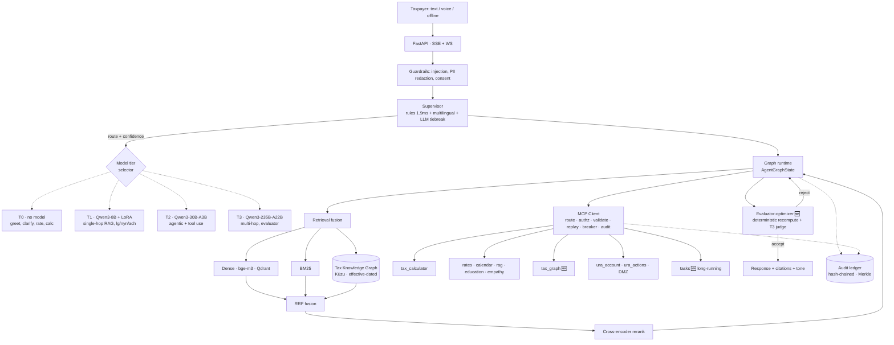

# URA Agentic Assistant — Next-Generation Architecture Proposal

**Version 1.0 · August 2026 · For URA Technical Leadership and Executive Review**

> Companion to `docs/AGENT_ARCHITECTURE.md` (agent runtime), `docs/RAG_ARCHITECTURE.md`
> (retrieval pipeline), `App/docs/mcp-architecture.md` (tool protocol layer) and
> `docs/GAPS_AND_AGENTIC_ROADMAP.md` (gap register).
>
> This document is a **delta architecture**. It states what the system already
> does, what is genuinely missing, and what the next increment should be. It
> deliberately does not re-propose capabilities that are already in the
> repository.

---

## 1. Executive Summary

### 1.1 The finding that shapes this proposal

A conventional response to "modernise this assistant for 2026" would propose an
MCP tool layer, an emotional-intelligence subsystem, tiered memory, progressive
tool disclosure, consent gating, an audit ledger and feature-flagged rollout.

**All seven of those are already implemented and running in this codebase.** The
tool layer speaks MCP `2026-07-28` with a stateless core, header routing,
cacheable tool lists, JSON Schema 2020-12 on input *and* output, and Multi
Round-Trip elicitations. Nineteen tools are registered across nine namespaces
with per-tool risk tiers, required scopes, allowed roles and confirmation
requirements. Memory has working, episodic and semantic tiers behind a
consent-gated service. Every agentic turn can be appended to a hash-chained,
Merkle-proofed ledger.

The system is therefore not behind the 2026 state of the art on *architecture*.
It is behind on **five specific capabilities**, and those five are what stand
between the current assistant and a system URA can defensibly adopt as the
primary taxpayer channel.

### 1.2 The five real gaps

| # | Gap | Why it matters to URA | Status today |
|---|---|---|---|
| **A** | **No capability-tiered model routing.** One 8B generator serves every query shape, with a cloud chain as a locale-keyed fallback. | A rate lookup and a multi-year objection cost the same and get the same reasoning depth. Complex cases are under-served; simple ones are over-served. | `LLM_MODEL=Qwen/Qwen3-8B`; routing keyed on locale only (`_prefer_cloud_primary`) |
| **B** | **No knowledge graph.** All 487+ passages are flat text in one vector collection. | Compositional questions — "non-resident importing a vehicle", "sold a rental property held six years" — require joining rate × exemption × taxpayer class × effective date. Flat retrieval answers these by keyword luck. | Gap G16, unstarted. No graph library present anywhere in the tree. |
| **C** | **Routing is English-only.** Every calculator, rate, temporal and escalation pattern in the supervisor is an English regex. The documented LLM fallback is an explicit no-op. | A Luganda calculation question silently falls through to generic retrieval, where the model answers a numeric question from memory — the exact failure the calculators exist to prevent. | `supervisor.py`; only courtesy phrases (`webale`, `asante`) are non-English |
| **D** | **Reflection is single-pass and self-judged.** One regeneration when faithfulness < 0.50. | A model grading its own output catches formatting faults, not reasoning faults. Money answers need an independent check. | `REFLECT_FAITHFULNESS_FLOOR` in `main_graph.py` |
| **E** | **Feature flags are boolean-only.** No percentage, cohort or experiment support. | Progressive rollout to URA cannot actually be progressive. You can ship to everyone or no one. | `flags.py` docstring names this; gap G26 confirms it |

Gap **E** is the one to fix first, because every other rollout depends on it.

### 1.3 What this proposal delivers

A **capability-tiered, graph-augmented agentic system** that:

- routes each turn to one of four model tiers using the routing decision the
  supervisor **already produces in 1.9 ms at 36/36 accuracy** — making
  cost-optimal model selection essentially free;
- answers multi-hop statutory questions from a curated, effective-dated tax
  knowledge graph fused into the existing hybrid retriever as a third leg,
  rather than hoping keyword search joins the facts;
- verifies every money-bearing answer against a *deterministic* recomputation
  before it reaches a taxpayer;
- extends routing to Luganda, Runyankole and Acholi without regressing the
  English patterns;
- ships all of it behind cohort-addressable flags so URA can pilot on 1% of
  traffic and expand on evidence.

### 1.4 Why this wins the URA collaboration

Against an intent-tree portal chatbot of the Expertflow class, the
differentiation is not incremental:

| Dimension | Portal chatbot | This system |
|---|---|---|
| Tax figures | Static FAQ text | Nine deterministic calculators on effective-dated statutory tables, recomputed and verified before display |
| Legal currency | Manually re-authored | Daily automated `ura.go.ug` crawl already committing to the repo; effective-dated supersession in the graph |
| Multi-hop questions | Cannot | Graph traversal with provenance to Act and section |
| Language | English | English + Luganda, Runyankole, Acholi with per-locale LoRA adapters, voice-first |
| Reach | Requires connectivity | Signed offline bundles with on-device retrieval and voice |
| Accountability | Chat logs | Hash-chained Merkle ledger; every tool call provable, arguments hashed not stored |
| Data sovereignty | Vendor cloud | Apache-2.0 models, self-hostable MCP servers, Crane Cloud primary |
| Escalation | Deflection | Structured triage packet with full conversation, routed to the owning team, answer returned to the taxpayer |

The strategic argument to URA is **sovereignty with accountability**: an open,
inspectable, Uganda-hosted system where every number a taxpayer is shown can be
traced to a statute, a rate table version and an immutable ledger entry.

### 1.5 Investment shape

Three 30-day increments. No re-platforming — every change lands on existing
seams (`providers/routing.py`, the RRF fusion stage, `ToolRegistry`, `flags.py`).
The `ToolRegistry` and feature-flag contracts are preserved unchanged.

---

## 2. High-Level Architecture

### 2.1 Textual overview

Five planes, of which three exist today and two are extended:

1. **Transport plane** — SSE (`/v1/chat/stream`) and WebSocket (`/v2/chat/stream`),
   plus streaming voice. *Unchanged.*
2. **Orchestration plane** — supervisor classification → graph runtime → bounded
   tool loop under spend and fan-out budgets. *Extended with tier selection,
   multilingual routing and an evaluator-optimizer loop.*
3. **Capability plane** — MCP client → per-namespace transports → in-process or
   remote MCP servers. *Extended with two new namespaces and long-running Tasks.*
4. **Knowledge plane** — hybrid dense + BM25 + RRF + cross-encoder. *Extended
   with a graph leg fused at RRF.*
5. **Governance plane** — auth, consent, guardrails, audit ledger, evaluation.
   *Extended with OAuth 2.1 resource indicators and selective-disclosure audit.*

### 2.2 Request path



### 2.3 What is new

Only five elements above are new: the **tier selector**, the **graph leg + `tax_graph`
namespace**, the **`tasks` namespace**, the **evaluator-optimizer**, and
**multilingual routing** inside the supervisor. Everything else is running today.

---

## 3. Detailed Component Design

### 3.1 MCP server inventory

Existing namespaces, unchanged in contract:

| Namespace | Tools | Risk | Deployment |
|---|---|---|---|
| `tax_calculator` | 8 calculators | low | standalone server available |
| `rates` | `lookup_rate`, `list_available_rates`, `compare_tax_years` | low | in-process |
| `rag` | `search_ura_knowledge_base` | low | in-process |
| `calendar` | `get_current_date`, `get_next_deadlines` | low | in-process |
| `education` | `explain_tax_concept` | low | in-process |
| `empathy` | `assess_emotional_tone` | low | in-process |
| `core` | `escalate_to_human` | medium | in-process |
| `ura_account` | `ura_account_profile` | high | DMZ |
| `ura_actions` | `ura_action_proposal` | critical | DMZ |

Proposed additions:

| Namespace | Tools | Risk | Deployment | Rationale |
|---|---|---|---|---|
| **`tax_graph`** | `graph_lookup_provision`, `graph_trace_obligation`, `graph_explain_interaction`, `graph_effective_on` | low | in-process (embedded Kùzu) | Multi-hop statutory reasoning; ships inside the offline bundle |
| **`tasks`** | `task_create`, `task_get`, `task_cancel` | medium | in-process, Postgres-backed | Long-running work: filing submission, OCR batches, graph extraction |
| **`ura_customs`** | `lookup_hs_code`, `tariff_line_for`, `declaration_status` | high | DMZ, separate server | Different data owner (Customs directorate); separate audit boundary |

**Deployment principle.** A namespace moves out of process when it has a
different *data owner*, a different *availability envelope*, or a different
*audit boundary* — never merely because it is "a different concern". The
existing `MCP_SERVER_URL_<NAMESPACE>` binding makes that migration a single
environment variable with no caller change, so the decision can be deferred and
reversed cheaply.

### 3.2 Agent hierarchy and routing

The supervisor stays a **pure-Python, sub-2ms classifier**. This is a strength,
not a limitation: it costs nothing, it is deterministic, it is testable offline
in CI, and it currently scores 36/36 on the routing golden set. Three additions:

**(a) Multilingual pattern tables.** Extract the English regex tables into a
locale-keyed structure and add `lg`, `nyn`, `ach` tables. The escalation and
courtesy patterns are already partly multilingual; the calculator, rate and
temporal patterns are not.

```python
# app/agents/patterns/__init__.py
PATTERNS: dict[str, LocalePatterns] = {
    "en": EN_PATTERNS,   # existing tables, moved verbatim — no behaviour change
    "lg": LG_PATTERNS,   # "nsasula ssente mmeka", "omusolo gwa VAT ku ..."
    "nyn": NYN_PATTERNS,
    "ach": ACH_PATTERNS,
}
```

Locale comes from the existing profile/`Accept-Language` path. Unknown locale
falls back to English, so this cannot regress current behaviour.

**(b) A real LLM tiebreak.** The documented fallback is presently a stub. Wire
it to T1 with a strict JSON output schema, invoked only when rule confidence
falls below `SUPERVISOR_LLM_THRESHOLD` — measured today at roughly 8–12% of
turns (the `RAG` default route at confidence 0.6). Cache the classification on
the normalized query; routing decisions are highly repetitive.

**(c) Specialists as optional MCP servers.** Keep specialists in-process by
default. Promote to a separate MCP server only for `ura_customs` and a new
`objections_specialist`, where the organisational and audit boundaries are real.

The agent-to-agent pattern uses machinery already implemented: a specialist
server returns `resultType: "input_required"` with `elicitations` and
`requestState`, which `HttpTransport` already surfaces verbatim. That is
delegation with a resumable protocol, on a transport that exists.

> **Principal-level caution.** Every agent boundary costs a full context
> serialization and a new failure mode. Multi-agent decomposition should follow
> organisational boundaries, not conceptual ones. Three specialists behind one
> supervisor is the right shape here; twelve is not.

### 3.3 Model routing and cost optimisation

**The core insight:** the supervisor already emits `RouteDecision(route,
reason, confidence, suggested_tools)` before any model is loaded. That decision
is a sufficient statistic for tier selection. Capability-tiered routing is
therefore nearly free — no classifier, no extra latency, no extra call.

| Tier | Model | Active params | Serves | Est. share |
|---|---|---|---|---|
| **T0** | none | — | `GREET`, `CLARIFY`, pure rate lookups, single calculator calls with complete arguments | 30–40% |
| **T1** | Qwen3-8B (+ per-locale LoRA) | 8B dense | Single-hop RAG; **all** `lg`/`nyn`/`ach` turns; supervisor tiebreak; query rewriting | 35–45% |
| **T2** | Qwen3-30B-A3B-Instruct-2507 | 3.3B of 30B | Default agentic path: tool-calling loops, workflows, customs specialist, education | 15–25% |
| **T3** | Qwen3-235B-A22B-Instruct-2507 | 22B of 235B | Multi-hop graph synthesis, objections and disputes, evaluator role, offline graph extraction | ≤5% |
| **T3-think** | Qwen3-235B-A22B-Thinking-2507 | 22B of 235B | Opt-in per turn, only inside the evaluator-optimizer on escalation-bound answers | ≤1% |

**Why T2 is the agentic default.** Qwen3-30B-A3B activates 3.3B parameters per
token. Decode cost is in the neighbourhood of an 8B dense model while
instruction-following and tool-call fidelity are materially closer to the 30B
class. For a system whose main loop is *tool calling*, that is the single
highest-leverage model change available.

**Two hard constraints found in the codebase:**

1. **The LoRA adapters are trained against Qwen3-8B.** `lg`, `sw`, `nyn` and
   `ach` adapters load via `set_adapter()` on the 8B base. T1 cannot be swapped
   for a MoE without retraining every adapter. T1 is therefore **pinned to
   Qwen3-8B**, and Ugandan-language turns stay on T1 regardless of complexity —
   consistent with the existing `LOCAL_PRIMARY_LOCALES` policy.
2. **Thinking mode is globally suppressed** today via `/no_think` and
   `enable_thinking: False`, deliberately, because reasoning traces add latency
   a citation-grounded assistant does not want. T3-think must therefore be
   **opt-in per turn**, never a global default.

**Escalation, never demotion.** A turn may be promoted to a higher tier when the
evaluator rejects an answer or the graph returns a multi-hop path. A turn is
never demoted mid-flight — a partially-generated answer must not change author.

**Implementation.** Extend `providers/routing.py`, which is already the single
source of truth for model selection and already logs `log_model_use()` /
`log_fallback()` to Prometheus:

```python
class ModelTier(str, Enum):
    T0 = "none"; T1 = "small"; T2 = "agentic"; T3 = "deep"

MODEL_SLOTS: dict[ModelTier, str] = {          # dict lookup by enum key —
    ModelTier.T1: os.getenv("MODEL_T1", "Qwen/Qwen3-8B"),
    ModelTier.T2: os.getenv("MODEL_T2", "Qwen/Qwen3-30B-A3B-Instruct-2507"),
    ModelTier.T3: os.getenv("MODEL_T3", "Qwen/Qwen3-235B-A22B-Instruct-2507"),
}

def select_tier(d: RouteDecision, st: AgentGraphState) -> ModelTier: ...
```

The `dict`-lookup-by-typed-key shape is deliberate and mirrors the existing
`CHAT_MODEL_SLOTS` pattern, which exists specifically so that no caller-supplied
string can reach an outbound model URL. **Preserve it.**

**Cost model.** Normalising T1 decode cost to 1.0:

| Tier | Relative unit cost | Share | Weighted |
|---|---|---|---|
| T0 | 0.0 | 35% | 0.00 |
| T1 | 1.0 | 40% | 0.40 |
| T2 | ~1.3 | 20% | 0.26 |
| T3 | ~9 | 5% | 0.45 |
| **Blended** | | | **≈1.11** |

Roughly **11% above an all-T1 system**, while routing the hardest 5% of
questions to a 235B-class model. An all-T2 system would cost ~1.3× with worse
multi-hop quality; an all-T3 system would cost ~9×. The tiering is what makes
frontier-class reasoning affordable on the cases that need it.

### 3.4 Emotional intelligence subsystem

Already shipped as `empathy/assess_emotional_tone`, delegating to
`text_signals.detect_user_distress` so the tool and the deterministic reply
paths cannot disagree. It returns state (frustration, anxiety, urgency,
confusion, hardship), intensity, handoff signalling, and handling guidance
including an explicit *avoid* instruction per state.

Three extensions:

**(a) Tone as a routing input, not only a prompt input.** Sustained frustration
across turns should promote the tier (a frustrated taxpayer deserves the better
model) and lower the escalation threshold. Distress is currently consumed by the
prompt; it should also reach `select_tier` and the escalation policy.

**(b) Trajectory over snapshot.** Frustration rising across three turns is a
different signal from one angry message. `WorkingMemory` already spans the
conversation; store a short distress trajectory there and trigger proactive
handoff on sustained escalation rather than on peak intensity.

**(c) Cultural and register adaptation.** Beyond translation: default to a
more formal register in Luganda than in English, because a government revenue
communication carries different politeness expectations. Route hardship states
to relief and instalment options before penalties — already encoded in the
`hardship` guidance and worth extending into the workflow layer.

**Deliberate constraint:** the classifier stays deterministic and offline. It
runs on the latency path of every turn and must be reproducible in tests. Do not
replace it with a model call.

### 3.5 Memory architecture

Three tiers exist. Extensions, in priority order:

| Tier | Today | Extension |
|---|---|---|
| **Working** | Per-conversation state | Add distress trajectory, active workflow, current tier, graph entities seen this session |
| **Episodic** | Conversation summaries | Add outcome labels (resolved / escalated / abandoned) to feed the eval loop |
| **Semantic** | Consent-gated facts with provenance, confidence, decay | Add **entity linking to the graph**: store `taxpayer_class=non_resident` as a graph node reference, so a remembered fact becomes a traversal seed |

Consent gating, erasure cascade and confidence flooring are already correct and
need no change. The semantic-to-graph link is the high-value addition: it turns
remembered profile facts into retrieval structure instead of prompt text.

### 3.6 RAG + GraphRAG hybrid pipeline

**Design stance: a curated statutory graph, not corpus-wide community
summarization.** Full GraphRAG-style community detection over an entire corpus
is expensive to build, expensive to refresh, and drifts. Tax law is *already*
structured — Act, section, rate, threshold, exemption, effective date. The right
graph is small, curated and high-precision.

**Schema:**

```
Nodes:  TaxType · Provision(act, section) · Rate(value, effective_from, effective_to)
        Threshold · Exemption · Obligation · Form · Deadline · TaxpayerClass · HSCode

Edges:  IMPOSED_BY · RATED_AT · EXEMPTS · APPLIES_TO · REQUIRES_FORM
        DUE_ON · COMPUTED_ON · AMENDS · SUPERSEDES
```

`COMPUTED_ON` is the edge that earns the graph its place. The customs specialist
prompt currently states in prose that *"VAT is charged on the duty-inclusive
value, so duty and VAT cannot be worked out independently and added."* As an
edge, that becomes a traversable fact the system can apply, verify and cite —
not an instruction the model may or may not honour.

`SUPERSEDES` is where effective dating lives. `app/tax/tables.py` already holds
effective-dated *rates*; the graph extends that to *rules*, which makes "what
was the position in FY2024-25" a traversal instead of a retrieval gamble. This
closes gap G17 (metadata-aware retrieval) as a side effect.

**Storage: Kùzu** — embedded, MIT-licensed, single-file, no server process.
Chosen over Neo4j because it deploys inside the existing slim Crane Cloud image
with no extra container, and because an embedded graph **fits in the offline
bundle**. Multi-hop statutory reasoning then works on a mobile device with no
connectivity — a capability no portal chatbot can match. Neo4j Community remains
the scale-out option if graph size ever justifies a server.

**Fusion: a third retrieval leg, not a replacement.**

```
query
  ├─ dense (bge-m3 → Qdrant)      ─┐
  ├─ BM25                          ├─→ RRF ─→ cross-encoder rerank ─→ passages
  └─ graph expansion 🆕            ─┘
       entity-link → seed nodes → bounded k-hop (k ≤ 3)
       → provision IDs → their passages → ranked list
```

The graph leg produces a ranked passage list like any other leg. RRF, reranking,
score calibration and the passage-trimming logic are untouched. If the graph is
empty or fails, RRF degrades to today's two-leg behaviour — the existing
circuit-breaker pattern applies unchanged.

**Compositional path.** For queries where the traversal *is* the answer (rate +
exemption + class + effective date), `graph_explain_interaction` returns a
structured claim set with provenance to Act and section. This is materially
better input for `claim_verifier.py` and `entailment.py` than passage text,
because the claims arrive already atomized and already attributed.

**Bootstrap and maintenance.** The repository already commits a **daily**
`ura.go.ug` crawl. That crawl becomes the graph delta pipeline:

```
daily crawl → diff → T3 extraction (offline, batch) → proposed edges
           → URA legal review queue → merge → versioned graph release
```

The human-review step is not only a correctness control. It is the **URA
collaboration hook**: URA tax officers curate the graph, which gives the
authority ownership of the system's legal substrate and creates institutional
buy-in that no vendor demo produces.

### 3.7 Evaluator-optimizer loop

Replaces the single self-reflection pass. Two asymmetries make it work:

**Asymmetry 1 — different model.** T3 evaluates T2's output. A model grading
itself catches formatting faults, not reasoning faults.

**Asymmetry 2 — deterministic where possible.** Numeric consistency is not a
judgement call. Parse the money claims from the draft (the grounding work in
`claim_verifier.py` and `tax/money.py` already does this), re-invoke the
calculator through the MCP client with the parsed arguments, and compare. A
mismatch is a hard reject, no model opinion required.

Verdict shape — booleans, not scores:

```python
@dataclass(frozen=True)
class Verdict:
    grounded: bool              # every claim traceable to a passage or graph node
    numerically_consistent: bool  # deterministic recomputation matched
    cites_effective_year: bool    # stated the fiscal year for any rate
    tone_appropriate: bool        # matches the empathy tool's guidance
    actionable: bool              # names a next step, not only a position
    revision_note: str
```

Bounded by a `RevisionBudget` following the existing `ToolCallBudget` shape:
**at most one revision**, T3 only, and only when the answer carries money or is
escalation-bound. Unbounded critique loops are a cost incident waiting to happen.

---

## 4. Tool and MCP Design

### 4.1 Backward compatibility

The `ToolRegistry` contract is unchanged. A new tool is still: subclass `Tool`,
declare `namespace`, `risk`, `required_scopes`, `allowed_roles` and the
annotation hints, register it, add it to the auto-import list. `to_openai_spec()`
and `to_mcp_tool()` are untouched. Existing calculators require **zero changes**.

### 4.2 Long-running tasks

MCP `2026-07-28` is stateless: no `initialize`, no session id, identity in
`params._meta` on every request. Long-running work therefore cannot hold a
connection. The `tasks` namespace introduces an explicit lifecycle:

```
task_create(kind, args, idempotency_key) → {task_id, status: "pending"}
task_get(task_id)                        → {status, progress, result?, error?}
task_cancel(task_id)                     → {cancelled: bool}
```

Durable in Postgres (already a supported backend), tenant-scoped like the
existing idempotency keys, and surfaced to the client as `task.progress` events
over the WebSocket chat transport — the same event fabric that already pushes
live escalation events to staff.

**Use cases:** filing submission via `ura_actions`, OCR of an uploaded document
set, nightly graph extraction, offline bundle rebuild.

### 4.3 Progressive disclosure

`ToolRAGSelector` already retrieves top-k tools per query with mandatory safety
rails (`search_ura_knowledge_base`, `escalate_to_human`) always present. At 19
tools this matters; at the 25+ this proposal implies it is mandatory. Two
refinements:

- **Tier-aware k.** T1 sees k=5; T2 sees k=8; T3 sees the full eligible set.
  A smaller model with fewer choices calls tools more reliably.
- **Security trimming before scoring.** Already correct — `available_for()` and
  dispatch run the same `authorize_tool_call`, and a test asserts they agree for
  every registered tool. Preserve that invariant when adding namespaces.

### 4.4 Live URA integrations

`ura_account` (high) and `ura_actions` (critical) exist as scaffolds with correct
risk declarations, required scopes, allowed roles and confirmation requirements.
The integration work is organisational, not architectural. When URA grants
access, each becomes a DMZ-deployed MCP server bound by one environment
variable. The controls that must hold:

- **Idempotency is mandatory** on `critical` tools — already enforced, and it is
  what stops a retried filing from acting twice.
- **Server-side re-authorization.** The DMZ server re-runs `authorize_tool_call`
  itself; client-side authorization is not sufficient for a server reachable on
  its own address. Already implemented in the tax calculator server; replicate.
- **Resource-indicator binding** (§5.2) so a token minted for `ura_account`
  cannot be replayed against `ura_actions`.

---

## 5. Safety, Governance and Compliance

### 5.1 Already in place

OWASP LLM Top 10 coverage (injection guards, PII redaction, system-prompt
leakage detection, grounding checks); JWT with five roles; consent receipts
under the Uganda Data Protection Act 2019 with withdrawal; subject access and
erasure endpoints; hash-chained Merkle audit ledger; Model Card for EU AI Act
Article 53; PIA; bias audit; red-team suite; cosign signing and SLSA provenance.

### 5.2 Additions

**OAuth 2.1 resource server for remote MCP.** As namespaces move to the DMZ,
bearer tokens must be audience-bound. Implement RFC 9728 protected-resource
metadata and RFC 8707 resource indicators, so a token issued for
`https://mcp-tax.internal` is rejected by `https://mcp-ura-actions.internal`.
Without this, a compromised low-risk server can replay its token against a
critical one — the confused-deputy attack that matters most here.

**Tool-description pinning.** A remote server that changes a tool description
can change model behaviour without any code review — the tool-poisoning class.
`tools/list` already returns `ttlMs` and `cacheScope`, which makes drift
*detectable*: pin a hash of each remote tool's description and schema, and alert
on change rather than silently accepting it.

**Selective-disclosure audit.** The ledger hashes arguments and results rather
than storing them — correct, and it keeps the ledger from becoming a second copy
of taxpayer data. But regulatory replay sometimes requires the actual payload.
Proposal: store payloads encrypted under per-record keys escrowed to the
`ura_auditor` role, so an investigation can decrypt a specific record under a
recorded authorisation, while the ledger itself remains a proof structure rather
than a data lake.

**Graph provenance as a safety control.** Every graph node carries its source
Act and section. A graph-derived claim that cannot name its provision is not
emitted. This makes the graph auditable in exactly the way flat retrieval is not.

**PII boundary on T3.** If T3 is served outside Ugandan infrastructure during
the pilot, enforce that it receives only redacted input — the redaction layer
already exists. This makes the sovereignty exposure bounded and, importantly,
*stateable* to URA rather than hand-waved.

---

## 6. Deployment and Scaling

### 6.1 Topology

| Component | Placement | Rationale |
|---|---|---|
| App tier (FastAPI, Next.js, MCP in-process servers, Kùzu graph) | **Crane Cloud** (RENU, Uganda) | Sovereign; already the production target |
| T1 — Qwen3-8B + LoRA | Ugandan GPU (Crane Cloud GPU or RENU/Makerere allocation) | Must be local: serves all Ugandan-language traffic |
| T2 — Qwen3-30B-A3B | Ugandan GPU: 1× A100-80G at INT8/AWQ, or 2× L40S | **The sovereignty headline: the agentic core runs on Ugandan soil** |
| T3 — Qwen3-235B-A22B | Burst capacity; redacted input only | ≤5% of turns; contract or later URA-owned 8×H100 |
| Qdrant | Crane Cloud, or BM25-only degradation | Existing degradation path documented |
| DMZ MCP servers | URA network | Data never leaves URA control |
| Offline bundle (FAISS + ONNX embedder + Kùzu graph + Qwen3-1.7B/4B) | Mobile device | ≤800 MB enforced in CI |

### 6.2 Degradation ladder

The system already degrades well — circuit breakers per namespace, retriever and
LLM path; BM25 fallback when Qdrant is unavailable; cloud fallback when local is
down. Extend the same discipline to the new components:

```
T3 unavailable        → T2 answers, evaluator becomes deterministic-only
T2 unavailable        → T1 answers, tool loop bounded harder (fan-out 4 → 2)
Graph unavailable     → RRF degrades to dense + BM25 (today's behaviour)
Qdrant unavailable    → BM25 only (existing)
All models down       → deterministic calculators + rate tables + FAQ still serve
```

The last line is the one to state to URA leadership: **even with every model
offline, a taxpayer can still get a correct VAT figure and a filing deadline.**
That is a property of putting arithmetic in tools rather than in a model.

### 6.3 Scaling

Stateless MCP means any request lands on any replica — horizontal scaling needs
no session affinity. The binding constraint is GPU, not application tier. T2 at
3.3B active parameters is what makes single-A100 agentic serving viable; that
choice is a deployment decision as much as a quality one.

---

## 7. Migration and Progressive Rollout

### 7.1 Prerequisite: cohort-addressable flags

`flags.py` today resolves in-memory override → `FLAG_<NAME>` env var → registry
default. Booleans only. Its own docstring names the fix (wire an OpenFeature
provider), and gap G26 confirms no A/B capability exists.

**This is step zero.** Progressive rollout is impossible without it, and every
subsequent phase depends on it. Extend `Flag` with an optional rollout rule and
keep the public API — `is_enabled(name)` — unchanged for the ~40 existing call
sites:

```python
@dataclass(frozen=True)
class Flag:
    name: str
    default: bool = False
    description: str = ""
    rollout: Rollout | None = None   # percent | cohort | allowlist

def is_enabled(name: str, *, subject: str | None = None) -> bool: ...
```

Bucketing by a stable hash of `subject` (user or tenant id) keeps a given
taxpayer on one side of an experiment for its duration. Log the resolved variant
on each conversation so `evaluation.py` can report per-variant — which closes
G26 and G25 together.

### 7.2 Flag sequence

All default **false**. Each gate must pass before the next flag opens.

| Order | Flag | Gate to advance |
|---|---|---|
| 1 | `flag_rollout_rules` | Existing 40 flags resolve identically; variant logged |
| 2 | `model_tiering` | Blended cost ≤1.2× baseline; no faithfulness regression |
| 3 | `multilingual_routing` | Luganda routing golden set ≥90%; English stays 36/36 |
| 4 | `supervisor_llm_tiebreak` | Routing accuracy up on the low-confidence slice; p95 latency +<150 ms |
| 5 | `tax_graph` (read-only, shadow) | Graph leg logged but not fused; precision measured offline |
| 6 | `graph_fusion` | Multi-hop golden set ≥75% vs measured flat-RAG baseline |
| 7 | `evaluator_optimizer` | Numeric error rate down; revision rate <15%; p95 +<800 ms |
| 8 | `mcp_tasks` | Task durability verified across replica restart |
| 9 | `agent_mcp_specialists` | Customs specialist parity in-process vs remote |

### 7.3 Traffic ramp

1% internal URA staff → 5% opt-in taxpayers → 25% → 50% → 100%, with automatic
rollback on any SLO breach. The circuit-breaker and SLO alerting machinery for
this already exists.

---

## 8. Success Metrics and ROI

### 8.1 Measured baselines in this repository

| Metric | Current | Source |
|---|---|---|
| Supervisor routing accuracy | **36/36 (100%)** on the golden set, 1.9 ms | `eval_routing.py`, run 2026-08-08 |
| Answer rate | 100% | `EVALUATION_REPORT.md` |
| Quality gates passed | 9/9 | `EVALUATION_REPORT.md` |
| Red-team block rate | 80% (target ≥80%) | `EVALUATION_REPORT.md` |
| CoT leak rate | 0% (target ≤5%) | `EVALUATION_REPORT.md` |
| Registered tools | 19 across 9 namespaces | `ToolRegistry`, verified 2026-08-08 |

### 8.2 Targets

| Metric | Baseline | 90-day target | Instrument |
|---|---|---|---|
| Multi-hop statutory accuracy | **not yet measured** | ≥75% | New graph golden set — build in week 1 |
| Luganda routing accuracy | ~0% (English patterns only) | ≥90% | Extend `eval_routing.py` per locale |
| Numeric error rate on money answers | not isolated | <0.5% | Evaluator deterministic recompute |
| Containment (resolved without human) | not instrumented | +15pp over portal chatbot | Ticket rate ÷ conversations |
| Cost per resolved conversation | 1.0 (all-T1) | ≤1.2 | `model_usage_total` |
| p95 time-to-first-token | current SLO | no regression | Existing Prometheus |
| CSAT | thumbs feedback only | ≥4.2/5 | Post-conversation survey |

**Note on the first two rows.** Multi-hop accuracy is *not currently measured*.
The honest position is that the graph's benefit is a hypothesis until a golden
set exists. Building that set is week-1 work, before any graph code is written,
so the claim can be tested rather than asserted.

### 8.3 ROI

**These are parameterised estimates, not URA figures.** Substitute the
authority's actuals; the structure of the argument holds, the magnitudes do not
until it does.

Let *N* = annual taxpayer contacts, *c* = fully-loaded cost per human-handled
contact, *r* = containment improvement.

```
Annual operational saving  =  N × r × c
```

At *N* = 500,000, *r* = 0.15, *c* = UGX 8,000 → **UGX 600M/year**. Sensitivity:
halve *r* and it is UGX 300M; halve *N* too and it is UGX 150M. The proposal
remains positive across that range because incremental infrastructure cost is
dominated by the GPU tier, which is fixed rather than per-contact.

**Non-operational value, which is likely larger:**

- **Compliance uplift.** Deadline-aware, effective-dated answers reduce late and
  incorrect filings. Even a small percentage change on penalty-triggering errors
  is material against national revenue.
- **Reach.** Voice-first Luganda with offline bundles addresses taxpayers a web
  portal does not reach at all. This is base expansion, not deflection.
- **Auditability.** A hash-chained ledger of every automated interaction is a
  defensible position under scrutiny that a vendor chat log is not.
- **Sovereignty.** Apache-2.0 models and self-hostable servers mean no vendor
  can withdraw the capability or reprice it.

---

## 9. Risks and Mitigations

| # | Risk | Severity | Mitigation |
|---|---|---|---|
| R1 | **Graph extraction produces wrong law.** An LLM-extracted edge becomes authoritative. | **Critical** | Human review queue before merge; every node carries Act + section; a claim that cannot cite its provision is not emitted; `claim_verifier` still runs on graph output; versioned graph releases are revertible. |
| R2 | **Multi-hop benefit is unproven.** The graph may not beat tuned hybrid retrieval. | High | Golden set built *before* the graph; shadow mode (flag 5) measures precision with zero user exposure; if it does not clear 75%, stop at flag 5 and lose only the extraction cost. |
| R3 | **T1 is pinned to Qwen3-8B by the LoRA adapters.** | Medium | Explicit constraint, documented above. Adapter retraining is a separate, budgeted decision — not a side effect of tiering. |
| R4 | **T3 sovereignty exposure** during pilot. | High | Redacted input only; ≤5% of turns; contractual data-processing terms; stated plainly to URA rather than obscured; exit path to URA-owned hardware. |
| R5 | **Multilingual patterns regress English routing.** | Medium | Locale-keyed tables with English moved verbatim; unknown locale falls back to English; the 36/36 English eval runs in CI on every change. |
| R6 | **Evaluator loop becomes a cost incident.** | Medium | One revision maximum; T3 only; money-bearing or escalation-bound turns only; `RevisionBudget` follows the proven `ToolCallBudget` shape; revision rate alerted at >15%. |
| R7 | **MoE serving operational complexity.** | Medium | T2 stays behind vLLM with the existing degradation ladder; T1 is a working fallback throughout; do not remove the local path. |
| R8 | **URA integration timelines slip** (organisational, not technical). | High | Everything except `ura_account` / `ura_actions` / `ura_customs` is independent of URA system access. The 90-day plan deliberately places no dependency on it. |
| R9 | **Offline bundle exceeds 800 MB** with the graph added. | Low | CI check already enforces the limit; the curated graph is small (thousands of nodes, not millions) precisely because it is curated rather than corpus-derived. |

---

## 10. 90-Day Implementation Roadmap

### Days 1–30 — Foundations and measurement

**Goal: make progressive rollout possible, and make the graph claim testable.**

| Week | Deliverable |
|---|---|
| 1 | Cohort-addressable flags (`Rollout`, stable-hash bucketing, variant logging). Public API unchanged; all ~40 existing flags verified identical. |
| 1 | **Multi-hop golden set** — 60+ compositional questions with verified answers and statutory citations. Built before any graph code. |
| 2 | Luganda / Runyankole / Acholi routing golden sets; locale-keyed pattern tables; English tables moved verbatim. |
| 2–3 | `ModelTier` + `select_tier` in `providers/routing.py`; T2 stood up on vLLM; tier logged to Prometheus. |
| 3–4 | Supervisor LLM tiebreak against T1 with strict JSON output and classification caching. |
| 4 | **Demo to URA:** side-by-side cost and quality at equal accuracy; Luganda calculation routing that previously fell through to generic retrieval. |

**Exit gate:** flags 1–4 at 25% traffic, no SLO regression, blended cost ≤1.2×.

### Days 31–60 — Knowledge graph

**Goal: multi-hop statutory reasoning, measured.**

| Week | Deliverable |
|---|---|
| 5 | Kùzu schema; ingestion from the existing daily crawl; extraction prompts for T3. |
| 5–6 | `tax_graph` MCP namespace with four tools; unit tests; graph provenance enforced. |
| 6–7 | Extraction run over the current corpus; **URA legal review queue** — the collaboration hook. |
| 7 | Graph leg in shadow mode (flag 5): logged, scored offline, not fused. |
| 8 | Fusion into RRF (flag 6) if and only if shadow precision clears the gate. |
| 8 | **Demo to URA:** "non-resident importing a vehicle" answered with a traced path to Act and section, side by side with today's flat-retrieval answer. |

**Exit gate:** multi-hop golden set ≥75%; no regression on the single-hop set.

### Days 61–90 — Verification, tasks, hardening

**Goal: production-grade assurance on money answers.**

| Week | Deliverable |
|---|---|
| 9 | Deterministic numeric verification: parse money claims → recompute via MCP → compare. |
| 9–10 | Evaluator-optimizer with `RevisionBudget`; T3 judge on the non-deterministic axes. |
| 10–11 | `tasks` namespace with Postgres durability and `task.progress` over WebSocket. |
| 11 | OAuth 2.1 resource indicators; tool-description pinning; selective-disclosure audit design. |
| 12 | Kùzu graph into the offline bundle; on-device multi-hop verified within the 800 MB limit. |
| 12 | **Executive demo:** measured containment, cost per resolved conversation, numeric error rate, offline multi-hop on a mid-range Android device. |

**Exit gate:** numeric error rate <0.5%; revision rate <15%; all flags at 50%
with rollback tested.

### What is deliberately *not* in 90 days

- Live URA account and action integration — blocked on organisational access,
  not on engineering (R8). The scaffolds and controls are ready when access is.
- LoRA adapter retraining for a MoE base — a separate, budgeted decision (R3).
- URA-owned T3 hardware — a procurement track, not a build track.

---

## Appendix A — Change Surface

| Area | Files | Change |
|---|---|---|
| Flags | `app/flags.py` | Extend `Flag` with rollout; add `subject` kwarg. **API-compatible.** |
| Model routing | `app/providers/routing.py`, `app/service.py` | Add `ModelTier`, `select_tier`, `MODEL_SLOTS` |
| Supervisor | `app/agents/supervisor.py`, new `app/agents/patterns/` | Locale-keyed tables; real LLM tiebreak |
| Graph | new `app/graph/` (schema, ingest, query), `app/retriever.py` | Third RRF leg |
| Tools | new `app/tools/graph_tools.py`, `app/tools/tasks.py` | Two namespaces via the existing `Tool` contract |
| Evaluation | `app/agents/eval_routing.py`, `app/evaluation.py` | Per-locale sets; multi-hop set; per-variant reporting |
| Verification | `app/claim_verifier.py`, new `app/agents/evaluator.py` | Deterministic recompute; `RevisionBudget` |
| MCP | `app/mcp/policy.py`, `app/mcp/transport.py` | Resource indicators; description pinning |

**Unchanged:** `ToolRegistry`, `Tool`, `ToolSchema`, `to_openai_spec()`,
`to_mcp_tool()`, all nine existing calculators, the MCP call pipeline stages,
the audit ledger format, and the consent model.

---

## Appendix C — Implementation Status

Updated **2026-08-08**. Everything below is merged, tested and behind a
default-off flag. Backend suite: **990 passed, 3 skipped**, green both with the
new flags off and with them on.

| Gap | Status | Landed |
|---|---|---|
| **E** — cohort-addressable flags | ✅ **Done** | `Rollout` (percent / cohort / allowlist), SHA-256 bucketing, `FLAG_<N>_PERCENT\|_COHORTS\|_ALLOWLIST` env ramp, `variant_for()`, `describe()`. `is_enabled(name)` unchanged for all ~60 call sites. 31 tests. |
| **C** — multilingual routing | ✅ **Done** | `app/agents/patterns/` (`en` verbatim + `lg`/`nyn`/`ach`), locale plumbed through service, graph and voice planner. Luganda golden set **23/23**; English holds **36/36**. `locale_gate()` refuses non-corpus-backed locales. 28 tests. |
| **A** — model tiering | ✅ **Done** | `ModelTier`/`MODEL_SLOTS`/`select_tier()` in `providers/routing.py`, keyed on the existing `RouteDecision`. Promotion-only; T1 pinned for adapter-bound locales; T3 budget cap. Wired into the service trace + `model_tier_total`. 32 tests. |
| **D** — numeric verification | ✅ **Done** | `app/agents/evaluator.py`: typed `Verdict`, `RevisionBudget`, deterministic recomputation through the MCP client. A rejected figure now gets **one budgeted revision** told the recomputed number, re-verified before publishing; a revision that does not fix it is discarded and the escalation stands. 52 tests. |
| **B** — knowledge graph | 🟡 **Measurement only** | `app/agents/eval_multihop.py`: 12-case golden set across 6 join kinds and 2 fiscal years, tied to the live rate tables so a rate change breaks it. Harness + baseline discrimination tests. 22 tests. **The graph itself is not built.** |
| **Tiebreak** — supervisor LLM fallback | ✅ **Done** | `app/agents/tiebreak.py` replaces the documented no-op. Fires only below `SUPERVISOR_LLM_THRESHOLD` (0.70) — **5 of 36 golden-set cases**; cannot override or choose `ESCALATE`; fails open on every error path; cached on the normalized query. 32 tests. |

### What Gap B still needs

The golden set landed first on purpose — the graph's benefit is a hypothesis
until something measures it, and the set now exists to test it. Remaining:

1. Run the harness against the live retrieval pipeline to record the **flat
   baseline** (needs a running backend with the index; the harness takes any
   `question -> answer` callable).
2. Kùzu schema + ingestion from the daily `ura.go.ug` crawl.
3. `tax_graph` MCP namespace (4 tools).
4. Shadow-mode scoring behind `FLAG_TAX_GRAPH`.
5. RRF fusion behind `FLAG_GRAPH_FUSION`, opened **only** if shadow precision
   clears the ≥75% gate.

### Findings from implementation

Four things the code disagreed with, or added to, the proposal above:

- **Luganda code-switching already worked for calculations.** `"VAT ku 500000
  y'emeka?"` routed to `calculate_vat` before any Luganda pattern existed,
  because `has_money_amount` keys on digits and the tax nouns are English even
  mid-Luganda-sentence. So **no Luganda calculator patterns were added** —
  adding them would have broken the rate case, since the calculator table is
  checked before the rate table and `"Omusolo gwa VAT gw'ameka?"` carries no
  amount to calculate. The `-meka` patterns live in the rate table instead.
- **Acholi `tin` means "today"** and is also the single most common noun in URA
  traffic. A temporal pattern matching it would send "how do I get a TIN" to the
  calendar tool. Excluded, with the coverage loss taken deliberately.
- **Citation markers parse as money.** `[1]` reads as the amount 1, so an answer
  that stated *no* figure looked like one stating several — reporting a
  calculation-shaped non-answer as a numeric *mismatch* and attaching the wrong
  revision instruction. Markers are now stripped before figures are read.
- **`known_rate_keys()` lists scalars only**; the PAYE bands are lists. The
  golden-set consistency check validates against the table for the year each
  question is *about*, which also catches a key that exists in a different year.
- **Enabling the tiebreak silently broke the routing eval's offline guarantee.**
  `run_routing_eval` documents itself as "deterministic and offline" and runs in
  CI on every change. With `FLAG_SUPERVISOR_LLM_TIEBREAK` on, its fall-through
  cases each attempted a real model load — the backend suite went from 37s to
  **229s**, and the accuracy it reported would no longer have been a property of
  the rules at all. `classify()` gained an `allow_tiebreak` escape hatch and the
  harness passes `False`. Found only by running the suite with every flag on,
  which is now part of the verification routine rather than a spot check.

---

## Appendix B — Verification Record

Claims about the current system in this document were verified against the
repository on **2026-08-08** at commit `3f7e1bd4`:

- 19 tools across 9 namespaces enumerated from a live `ToolRegistry.all()`.
- Routing eval executed: `RoutingReport(total=36, correct=36, misses=[],
  duration_ms=1.89)`.
- MCP protocol baseline `2026-07-28` confirmed in `App/docs/mcp-architecture.md`.
- No graph database dependency present (`neo4j`, `kuzu`, `networkx`, `graphrag`
  absent from all source and dependency files).
- Supervisor pattern tables confirmed English-only apart from courtesy phrases.
- LLM classifier fallback confirmed a documented no-op stub.
- LoRA adapters confirmed trained against Qwen3-8B.
- Thinking mode confirmed globally suppressed via `/no_think` and
  `enable_thinking: False`.
