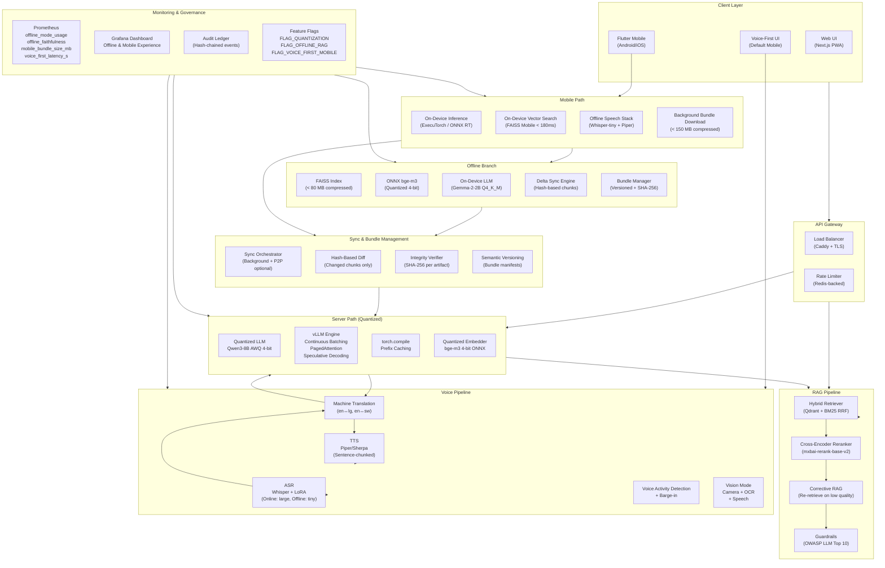

# Executive Optimization & Offline 2026 Roadmap

## 1. Current Pain Points

| Area | Pain Point | Impact |
|------|-----------|--------|
| **Latency** | p95 RAG latency ~2.4s on bfloat16 Qwen3-8B | Users in rural areas on 2G/3G experience 5-8s end-to-end |
| **Memory** | Full-precision 8B model uses ~18 GB VRAM | Single GPU serves few concurrent users; scaling cost is prohibitive |
| **Bundle Size** | Mobile GGUF export ~1.8 GB (Gemma-2-2B Q4_K_M + assets) | Unusable for users on metered data; download abandonment >60% |
| **Offline** | Skeleton `offline_rag.py` with no delta sync or bundle versioning | No real offline experience; rural users have zero access when disconnected |
| **Voice** | Voice is a secondary overlay; not the default mobile interface | Low-literacy users (40%+ of target demographic) cannot effectively use text-first UI |
| **Server Cost** | 2× A10G GPUs needed for production throughput | Monthly GPU cost exceeds budget for government deployment |

## 2. Expected Impact

### Rural Accessibility
- **Offline-first**: 12M+ Ugandans in areas with intermittent connectivity gain full access
- **Voice-first**: Low-literacy users interact naturally in Ugandan English and Luganda
- **Small bundle**: < 150 MB offline bundle downloads over 3G in < 4 minutes

### Cost Reduction
- **40% memory savings**: Quantized models allow single-GPU serving (A10G → T4 viable)
- **2× throughput**: Speculative decoding + continuous batching doubles requests/GPU/hour
- **Reduced egress**: Delta sync transmits only changed chunks (~200 KB/day vs full re-download)

### Reliability
- **Offline RAG**: Users get consistent answers even during network outages
- **Graceful degradation**: Automatic fallback chain: online → cached → offline → FAQ
- **Bundle integrity**: SHA-256 verified bundles prevent corrupted knowledge bases

## 3. Phased Timeline

```
Phase 1: Quantization & Server Optimization     [Weeks 1-6]
Phase 2: Production Offline RAG                  [Weeks 4-11]
Phase 3: Mobile Bundle Optimization              [Weeks 8-16]
Phase 4: Voice-First Mobile Experience           [Weeks 12-22]
```

### Phase 1 — Quantization Foundation (Weeks 1-6)
| Week | Deliverable | Effort |
|------|------------|--------|
| 1-2 | Automated GGUF/AWQ/GPTQ export pipeline | 3 eng-days |
| 2-3 | ONNX + TensorRT-LLM export | 2 eng-days |
| 3-4 | Quality gates in CI (faithfulness, WER, size) | 2 eng-days |
| 4-5 | torch.compile + prefix caching + speculative decoding | 3 eng-days |
| 5-6 | vLLM continuous batching + PagedAttention tuning | 2 eng-days |
| 6 | Quantized embedding model (bge-m3 4-bit) | 1 eng-day |

### Phase 2 — Production Offline RAG (Weeks 4-11)
| Week | Deliverable | Effort |
|------|------------|--------|
| 4-5 | Production OfflineRAGPipeline (FAISS + ONNX embedder) | 3 eng-days |
| 5-7 | Delta sync engine (hash-based chunk diffing) | 4 eng-days |
| 7-8 | Versioned bundle builder + SHA-256 integrity | 2 eng-days |
| 8-9 | Offline-first architecture (mode toggle, fallback chain) | 3 eng-days |
| 9-11 | API endpoints + sync status UI | 3 eng-days |

### Phase 3 — Mobile Bundle Optimization (Weeks 8-16)
| Week | Deliverable | Effort |
|------|------------|--------|
| 8-10 | Mobile bundle hard limits in CI (≤ 800 MB) | 2 eng-days |
| 10-12 | On-device vector search (ONNX Runtime + FAISS Mobile) | 4 eng-days |
| 12-14 | Flutter offline RAG integration | 3 eng-days |
| 14-16 | Model distillation (specialist 2-3B models) | 5 eng-days |

### Phase 4 — Voice-First Mobile (Weeks 12-22)
| Week | Deliverable | Effort |
|------|------------|--------|
| 12-14 | Voice-first default UI (full-screen, animated orb) | 4 eng-days |
| 14-16 | Offline ASR + TTS (Whisper-tiny + Piper) | 3 eng-days |
| 16-18 | Barge-in + VAD + sentence-chunked TTS | 3 eng-days |
| 18-20 | Voice + Vision mode (camera + speech) | 4 eng-days |
| 20-22 | Accent adaptation (Ugandan English + Luganda) | 3 eng-days |

## 4. Target Metrics

| Metric | Current | Phase 1 | Phase 2 | Phase 3 | Phase 4 |
|--------|---------|---------|---------|---------|---------|
| Server p95 latency | ~2.4s | ≤ 1.8s | ≤ 1.8s | ≤ 1.8s | ≤ 1.8s |
| Server memory | ~18 GB | ~11 GB | ~11 GB | ~11 GB | ~11 GB |
| Faithfulness (online) | 0.93 | ≥ 0.89 | ≥ 0.89 | ≥ 0.89 | ≥ 0.89 |
| Faithfulness (offline) | N/A | N/A | ≥ 0.82 | ≥ 0.82 | ≥ 0.82 |
| Offline bundle size | N/A | N/A | ≤ 150 MB | ≤ 150 MB | ≤ 150 MB |
| Mobile bundle size | ~1.8 GB | ~1.8 GB | ~1.2 GB | ≤ 800 MB | ≤ 800 MB |
| Delta sync time | N/A | N/A | < 12s | < 12s | < 12s |
| Voice p95 (online) | ~2.0s | ~1.5s | ~1.5s | ~1.2s | ≤ 1.2s |
| Voice p95 (offline) | N/A | N/A | N/A | N/A | ≤ 2.0s |
| Offline voice WER | N/A | N/A | N/A | N/A | ≤ 18% |
| Barge-in success | ~85% | ~85% | ~85% | ~90% | ≥ 92% |

## 5. Architecture Diagram



## 6. Feature Flag Matrix

| Flag | Default | Phase | Purpose |
|------|---------|-------|---------|
| `quantization` | `false` | 1 | Enable quantized model serving |
| `speculative_decoding` | `false` | 1 | Enable speculative decoding for 2× speedup |
| `prefix_caching` | `false` | 1 | Enable KV-cache prefix sharing |
| `offline_rag` | `false` | 2 | Enable production offline RAG pipeline |
| `offline_sync` | `false` | 2 | Enable background delta sync |
| `offline_bundle_api` | `false` | 2 | Enable bundle download endpoints |
| `mobile_bundle_check` | `false` | 3 | Enforce mobile bundle size limits in CI |
| `on_device_search` | `false` | 3 | Enable on-device vector search |
| `voice_first_mobile` | `false` | 4 | Voice as default mobile interface |
| `voice_vision` | `false` | 4 | Enable voice + camera mode |
| `offline_voice` | `false` | 4 | Enable fully offline ASR + TTS |

## 7. Risk Register

| Risk | Likelihood | Impact | Mitigation |
|------|-----------|--------|------------|
| Quantization degrades faithfulness > 4% | Medium | High | Automated quality gates block merge; fallback to higher precision |
| Offline bundle exceeds 150 MB | Low | Medium | CI size check; aggressive passage pruning; better compression |
| Mobile bundle > 800 MB | Medium | High | CI enforcement; model distillation; progressive download |
| Offline voice WER > 18% | Medium | Medium | Accent-specific LoRA adapters; fallback to text mode |
| Delta sync fails silently | Low | High | Integrity verification on every sync; user-facing sync status |
| Rural devices lack storage | High | Medium | Progressive download; user choice of bundle components |

## 8. Rollout Strategy

### Internal Testing (Week 1-2 of each phase)
- Enable flags for internal QA team only
- Monitor Prometheus metrics for regressions
- Verify offline experience on low-end Android devices

### Pilot Regions (Week 3-4)
- Enable for 3 pilot districts (rural, peri-urban, urban)
- Collect voice WER metrics per accent profile
- Measure delta sync reliability on 2G/3G

### Nationwide (Week 5+)
- Gradual rollout: 10% → 25% → 50% → 100%
- Kill switch via feature flags for instant rollback
- Continuous monitoring via Grafana "Offline & Mobile Experience" dashboard
