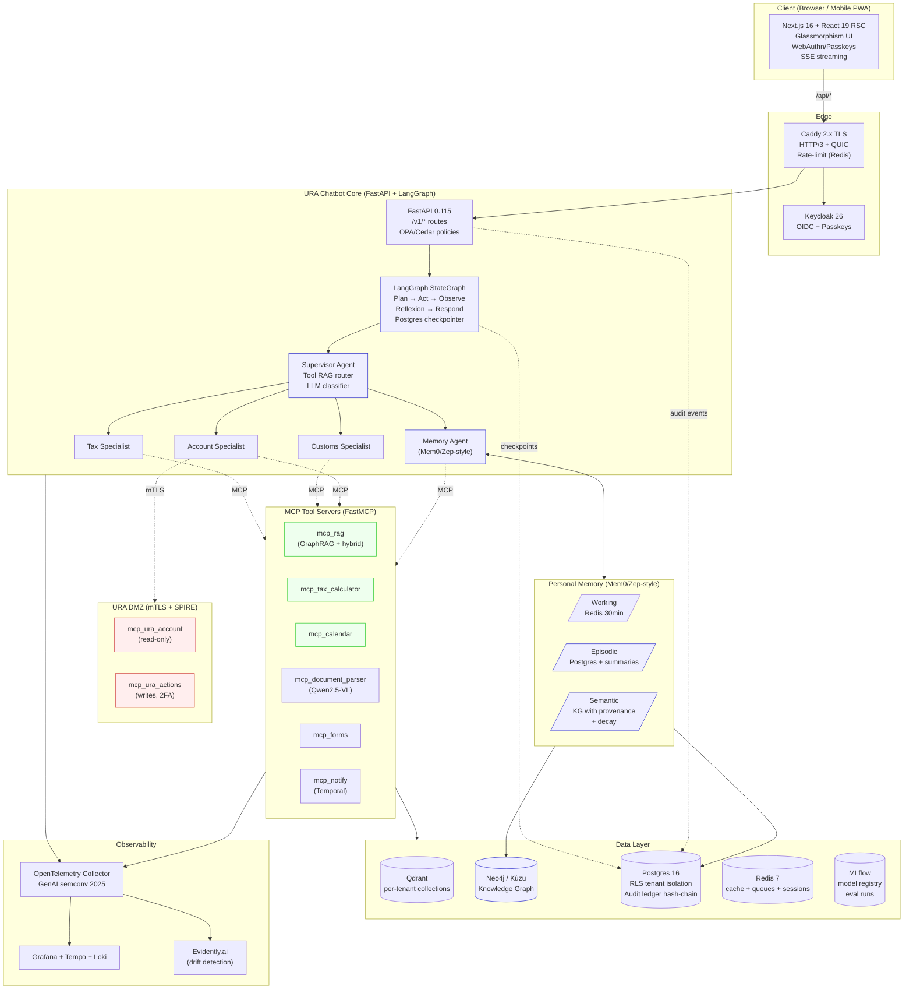
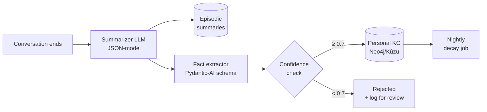

# URA Chatbot — 2026 Production Gap Analysis & Enhanced Agentic Roadmap

> **Version:** 2.0 Enhanced (April 2026)
> **Supersedes:** `docs/GAPS_AND_AGENTIC_ROADMAP.md` (v1.0)
> **Companions:**
> - `App/README.md` — Phases 1–13 (hardened RAG stack)
> - `docs/AGENT_ARCHITECTURE.md` — Phase 14 A-D (in-process agent runtime)
>
> **Audience:** engineering leads planning the H2-2026 release train;
> URA senior stakeholders evaluating full production readiness for
> external consumer launch; security + compliance reviewers.
>
> **Status legend:** ⚪ identified · 🟡 partial · 🟢 shipped · 🔴 critical gap
>
> **2026 baseline rating:** Excellent · Good · Needs Upgrade · Critical Gap

---

## 1. Executive Summary

The URA Chatbot ships today as a **hardened, generic RAG chatbot** with
an **in-process agent runtime** (Phase 14 A-D on `feat/agentic-workflows`).
Against the **April 2026 enterprise production baseline**, this puts the
system at approximately **55–60% maturity** — strong on security,
observability, and deterministic tool dispatch; materially behind on
identity, personalization, GraphRAG, distributed agent orchestration,
and sovereign multi-tenant deployment.

### Maturity scorecard (0 = absent, 5 = 2026 best-in-class)

| Capability domain                        | 2026 target | Current | Δ  |
|------------------------------------------|:-----------:|:-------:|:--:|
| Retrieval (vector + BM25 + rerank)       | 5           | 4       | -1 |
| **GraphRAG + metadata-aware retrieval**  | 5           | 0       | **-5** |
| LLM generation + grounding               | 5           | 4       | -1 |
| Tool use (MCP wire format)               | 5           | 2       | **-3** |
| Agent orchestration (LangGraph/ReAct)    | 5           | 2       | **-3** |
| **Personal memory + knowledge graph**    | 5           | 0       | **-5** |
| Identity, auth, multi-tenancy            | 5           | 0       | **-5** |
| Compliance (UDPA 2019, audit replay)     | 5           | 2       | **-3** |
| Observability (OTel GenAI semconv)       | 5           | 4       | -1 |
| Evaluation (per-segment, drift, RT)      | 5           | 2       | **-3** |
| Frontend (Next 16, WCAG 2.2 AA, PWA)     | 5           | 4       | -1 |
| Security (OWASP LLM Top 10 2025/26)      | 5           | 4       | -1 |
| Ops & autoscaling (KEDA/HPA/chaos)       | 5           | 2       | **-3** |
| **Overall**                              | **65**      | **31**  | **48%** |

### Top 5 blockers to "2026 top-grade production" status

1. **No identity.** Every request is anonymous. Personalization,
   auditability, compliance, multi-tenancy, ticket assignment, and
   account actions are all structurally impossible until an OIDC +
   Passkey layer ships (G1-G4).
2. **Flat vector RAG only.** 2026 enterprise RAG means *GraphRAG*:
   an entity-relation knowledge graph over tax_types →
   rates → exemptions → filing_cycle → forms, with query
   decomposition and multi-hop reasoning. The current flat-passage
   retrieval cannot answer compositional queries like *"VAT rate
   for a non-resident importing a used car in FY2025-26"* reliably
   (G16).
3. **No personal memory / knowledge graph.** Mem0/Zep-style
   semantic+episodic memory with user knowledge graphs and
   temporal decay is table-stakes in 2026. Current TTL-bounded
   conversation history is not memory (G5, G6).
4. **In-process "tool registry" is not an MCP surface.** Model
   Context Protocol is the 2026 "USB-C for AI". URA will not be
   able to deploy `ura_account` / `ura_actions` until those tools
   are MCP servers running in URA's DMZ with scoped credentials
   and audit replay (G9 partial, G12).
5. **No regulatory replay capability.** A government deployment
   must be able to reconstruct *"what exactly did the bot tell
   taxpayer X on date Y, with which sources, under which policy
   version"*. This requires an immutable hash-chained audit log,
   snapshot of the Qdrant index at that time, and the agent's
   exact state — none of which exist today (G8, G27).

### Single most important headline

> **Flat RAG is deprecated in 2026. The single biggest step forward
> is Phase 15 (GraphRAG + MCP Tool RAG + LangGraph orchestration) —
> it replaces four separate phases in the v1 roadmap and is the
> architectural foundation for everything that follows.**

---

## 2. Enhanced Gap Analysis (2026-aligned)

Below every gap is rated against the 2026 enterprise baseline. Gaps
already shipped (🟢) and partials (🟡) keep their original numbers but
gain a 2026 upgrade recommendation where the original fix is now
considered insufficient.

### 2.1 Identity & personalization

| # | Gap | 2026 rating | 2026-enhanced recommendation | Modernized code surface | Effort |
|---|---|:---:|---|---|:---:|
| G1 | No user authentication | 🔴 **Critical Gap** | **OIDC + WebAuthn Passkeys via Keycloak 26+** (ditch password-only flows entirely). JWT with DPoP for token binding. Map `sub` → `user_id`. Optional government-issued **NIRA e-ID** SSO for URA internal staff. Mobile biometrics + Face ID for consumer PWA. | `backend/app/auth/`, `backend/app/middleware/oidc.py`, `frontend/src/lib/webauthn.ts`, Keycloak Helm chart | L |
| G2 | No user profile | 🔴 **Critical Gap** | **Profile as Pydantic v2 schema + Postgres JSONB**, `user_profiles` table plus a **Zep/Mem0-style personal knowledge graph** (see Memory v2 §5). Profile fields drive prompt parameterization, tool visibility (risk tiers), retrieval metadata filters, and specialist selection. | `backend/app/profiles.py`, `backend/app/memory/graph.py`, JSONB schema | L |
| G3 | No consent flow | 🔴 **Critical Gap** | **Versioned consent receipts** per UDPA 2019 (Uganda Data Protection Act) + African Union Data Policy Framework 2022. Each consent is an immutable signed receipt including purpose, legal basis, retention, withdrawal URL. Store as signed JWT in `consent_receipts`. Implement **DPIA** (Data Protection Impact Assessment) template; automatic "right to erasure" cascading through **Postgres + Qdrant + Redis + object storage**. | `consent.py`, `dpia/`, `ConsentBanner.tsx`, `GDPR_Export.tsx` | M |
| G4 | No RBAC | Needs Upgrade | **OPA / Cedar policy-as-code** (not hard-coded decorators). Policies: `public`, `verified_taxpayer`, `ura_staff`, `ura_admin`, `ura_auditor`. Per-tool risk-tier gating derived from policy, not code. Zero-trust: every tool call re-evaluated against policy. | `backend/app/authz/opa.rego`, `main.py` middleware | M |

### 2.2 Memory & context

| # | Gap | 2026 rating | 2026-enhanced recommendation | Modernized code surface | Effort |
|---|---|:---:|---|---|:---:|
| G5 | No long-term memory | 🔴 **Critical Gap** | **Mem0 / Zep-style memory service** with three tiers: **working** (current turn, Redis), **episodic** (session summaries with temporal decay), **semantic** (user knowledge graph with provenance + confidence). Use **Letta/MemGPT patterns** for virtual context management when the personal graph grows. Facts have *decay half-life* per category (tax year facts decay slowly, session prefs fast). | `backend/app/memory/{working,episodic,semantic}.py`, `workers/memory_extractor.py`, new Neo4j or Kùzu node for personal graphs | L |
| G6 | No topic persistence | Needs Upgrade | **Workflow state machine via LangGraph `StateGraph`** with `interrupt_before` for slot filling. Each topic = a `ConversationThread` with its own sub-graph. Topic classifier is a small LLM call, not a regex. Surface current topic in the UI as a pinned context chip. | `backend/app/agents/graphs/`, `TopicChip.tsx` | M |
| G7 🟢 | No temporal grounding | Good | **SHIPPED.** 2026 upgrade: promote `get_current_date` + `get_next_deadlines` to an MCP server `mcp_calendar` so other tenants/tools can call it via the protocol. Also add **locale-aware date formatting** (Luganda: "enaku 15 za Mukakaro 2026"). | — | S |
| G8 | Not an audit log | 🔴 **Critical Gap** | **Append-only hash-chained `audit_events`** (Merkle tree for batch verification), hourly anchoring to **AWS QLDB / Google Cloud CAS / on-prem equivalent**. Every row: `prev_hash, payload_hash, tenant_id, user_id, agent_id, tool_name, tool_args_sha256, tool_result_sha256, policy_version, model_rev, index_snapshot_id, ts_utc, sig`. Supports **regulatory replay** = reconstruct state at any past timestamp. | `backend/app/audit/ledger.py`, `audit_events` Postgres table with BRIN on ts_utc, nightly Merkle root anchor | L |

### 2.3 Capabilities & actions

| # | Gap | 2026 rating | 2026-enhanced recommendation | Modernized code surface | Effort |
|---|---|:---:|---|---|:---:|
| G9 🟢 | No tool use | Good | **SHIPPED (in-process).** 2026 upgrade: port to **MCP wire format** (stdio + HTTP/SSE transports). Add **Tool RAG** — retrieve top-k relevant tools per query rather than sending 11+ schemas to every generation. Use FastMCP 0.4+ in Python, one server per domain. | `backend/app/mcp/server.py`, `mcp/tool_rag.py`, migration of each `app/tools/*.py` to an MCP server | L |
| G10 🟢 | No calculators | Excellent | **SHIPPED.** 2026 upgrade: expose as `mcp_tax_calculator` MCP server. Add **rate-table versioning** keyed on `(fiscal_year, effective_from)` so the same calculator can answer historical queries. | `mcp/servers/tax_calculator.py` | S |
| G11 | No workflow engine | Needs Upgrade | **LangGraph `StateGraph` per workflow** (not YAML finite state machines — those are 2022). Each step is a node; slot-filling is a `ToolNode` with user-confirmation `interrupt_before`. Persist checkpoints in **LangGraph Postgres checkpointer** so a flow can be paused for days and resumed. Use **Pydantic-AI** for slot validation. | `backend/app/agents/workflows/{tin_registration,vat_filing,customs_declaration}.py`, `frontend/src/components/WorkflowShell.tsx` | L |
| G12 | No URA account actions | 🔴 **Critical Gap** | **Two MCP servers running in URA's DMZ**: `mcp_ura_account` (read) and `mcp_ura_actions` (write). Both: delegated OAuth2 per-user, mTLS to URA API, **SPIFFE/SPIRE workload identity**, rate-limited per-user not per-IP. Writes require **2-factor user confirmation** (passkey re-auth + form preview). Full **regulatory replay** snapshots via the audit ledger. | `mcp/servers/ura_account/`, `mcp/servers/ura_actions/`, SPIRE, mTLS certs, URA API contracts | XL |
| G13 | No document ingestion | Needs Upgrade | **Agentic document parser**: `mcp_document_parser` using **Qwen2.5-VL-7B** or **Gemini 1.5 Flash** (if sovereignty allows). OCR + layout-aware extraction via **Docling / Marker**. Pipeline: upload → virus scan (ClamAV) → PII redact (Presidio) → structured extract → **contextual retrieval** (Anthropic pattern — prepend context to chunks before embedding) → optional indexing. | `mcp/servers/document_parser/`, `uploads.py`, `DocumentUpload.tsx` | L |
| G14 | No scheduled notifications | Needs Upgrade | **Temporal.io** for durable workflows (not APScheduler). Each reminder is a durable timer that survives restarts. Channels via **Africa's Talking** (SMS/USSD for low-connectivity users), **Resend/SES** (email), **PWA Push** (service worker). User-controlled preferences in profile. | `workflows/reminder.py` (Temporal), `channels/*.py` | L |
| G15 | No live URA data | Needs Upgrade | **Event-driven freshness pipeline**: **Debezium CDC** from URA's publication CMS → Kafka → transformer → **contextual chunking** → Qdrant upsert + knowledge graph sync. Fallback: nightly scrape with content-hash diffing. Every ingestion writes a snapshot_id to the audit ledger so regulatory replay works. | `workers/cdc_consumer.py`, Kafka topic `ura-publications`, `workers/nightly_diff.py` | M |

### 2.4 Knowledge gaps (the single biggest 2026 upgrade area)

| # | Gap | 2026 rating | 2026-enhanced recommendation | Modernized code surface | Effort |
|---|---|:---:|---|---|:---:|
| G16 | Flat vector RAG only | 🔴 **Critical Gap** | **Microsoft GraphRAG-style pipeline**: (1) entity + relation extraction over the FAQ/PDF corpus with Qwen2.5-14B → (2) build a **Neo4j / Kùzu knowledge graph** keyed on tax concepts → (3) **hierarchical community summarization** (Louvain) → (4) query-time router picks *local* (vector nearest passages) vs *global* (community summaries) vs *traversal* (graph multi-hop). Compose with existing hybrid BM25+dense as a leaf retriever. | `backend/app/graph/`, `backend/app/rag/graph_rag.py`, `workers/kg_builder.py`, Neo4j/Kùzu container | XL |
| G17 | No metadata-aware retrieval | Good | **Self-querying retriever** pattern (LangChain terminology): LLM extracts `filters` from the user query before retrieval. Already 80% of the way — just need a 1-call extractor. Combines with GraphRAG: filters narrow the vector search *and* prune graph traversal. | `backend/app/query.py::extract_filters`, `service.py` | S |
| G18 | No multilingual retrieval | Needs Upgrade | **BGE-M3** (dense) + **multilingual SPLADE** (sparse) + **re-ranking with BGE-reranker-v2-m3** (multilingual rerank). Alternative: **Cohere Embed v3 multilingual** if sovereignty allows cloud. Keep a **Luganda-first** index variant: mixed-language queries are routed to both indexes and results merged via RRF. | `retriever.py`, re-index job, optional `luganda_index` collection | M |
| G19 | No citation provenance | Needs Upgrade | Every citation needs: **canonical URL**, **effective-from / effective-to dates**, **document hash**, **snapshot_id from audit ledger**, **extraction pipeline version**. Enables: click-to-source, legal replay, and stale-cite alerts. UI surfaces the effective-from date next to each citation. | `indexer.py`, `models.py::Citation`, `Citations.tsx` | S |

### 2.5 Agentic reasoning

| # | Gap | 2026 rating | 2026-enhanced recommendation | Modernized code surface | Effort |
|---|---|:---:|---|---|:---:|
| G20 🟡 | No planning loop | Needs Upgrade | **LangGraph `StateGraph`** with explicit nodes: `plan → act → observe → reflect → respond`. Use **Plan-and-Execute** pattern (Wang et al., 2023) for complex tax queries that need multiple tool calls. Add **Reflexion** (Shinn et al., 2023) — on low faithfulness, regenerate with *"here's what went wrong last attempt"*. Max depth bounded. Checkpointed to Postgres so a failed plan can resume. | Replace `service.py::generate` dispatcher with `graphs/main_graph.py`; add `graphs/plan_execute.py`, `graphs/reflexion.py` | L |
| G21 | No ReAct / self-correction | 🟡 Partial (via self_reflect) | Upgrade single-shot reflection to **full ReAct loop** (Yao et al.). Failure modes: (a) low grounding → re-plan with hint, (b) tool error → retry with corrected args, (c) "I don't know" → call `escalate_to_human`. Every step logged to the audit ledger for replay. | `backend/app/agents/react_loop.py`, integrate into `graphs/main_graph.py` | M |
| G22 🟡 | No specialist prompts | Needs Upgrade | Create `backend/app/agents/prompts/` with per-route YAML prompt files (versioned, diffable in git). Each specialist: `{system_prompt, allowed_tools, model_id, temperature, max_iterations}`. Hot-reload via file watcher in dev, git hash in prod. | `agents/prompts/{tax,customs,account,memory}.yaml`, `agents/prompt_loader.py` | S |
| G23 | No agent delegation | Needs Upgrade | LangGraph **subgraphs**: supervisor invokes a specialist subgraph with a filtered state, specialist can `send_to("supervisor")` for clarification. Not free-form delegation — structured handoffs with schema-validated state transitions. | `agents/graphs/`, `agents/state.py` (typed handoff messages) | M |
| G24 | No per-user prompt tuning | Needs Upgrade | **User-conditioned system prompts** templated on profile: `detail_level` (beginner/intermediate/expert), `primary_language`, `taxpayer_type`, `industry`, `known_obligations`. Rendered via **Jinja2 sandboxed templates** so a malicious profile field can't inject prompt content. | `llm.py::_build_messages`, `profiles.py` | S |

### 2.6 Evaluation & quality

| # | Gap | 2026 rating | 2026-enhanced recommendation | Modernized code surface | Effort |
|---|---|:---:|---|---|:---:|
| G25 | No per-segment metrics | Needs Upgrade | **Ragas v0.2+ with segment dimensions**: taxpayer_type, topic, locale, language, agentic_vs_flat. Add **LLM-as-judge** with **self-consistency** (3 judges, majority vote) + a cheap local judge (Qwen2.5-7B) for scale. Store results in **MLflow tracking** with run tags per segment. | `evaluation.py` extensions, `mlflow` container | M |
| G26 | No A/B testing | Needs Upgrade | **GrowthBook / Unleash** feature flag service (replacing the in-process `flags.py`). Experiments define: variant assignment hash, metric goals, guard metrics, ramp schedule. Results piped into MLflow + Grafana dashboards. **Multi-armed bandit** for the best-performing prompt version. | `backend/app/experiments.py`, GrowthBook self-host | L |
| G27 | No drift detection | 🔴 **Critical Gap** | Three drift signals: **content drift** (source file hashes change), **embedding drift** (same query returns different top-k over time — use **Evidently.ai**), **output drift** (faithfulness score distribution shifts — Kolmogorov-Smirnov test on rolling windows). Alerts feed into the SLO queue. | `workers/drift_detector.py`, `monitoring/drift_rules.yaml` | M |
| G28 | No red-team fixtures | Needs Upgrade | **PurpleLlama CyberSecEval 3** + **Gandalf-style test suite** + **promptmap** — all in a `tests/security/` directory, all gated in CI. Weekly **LLM-vs-LLM adversarial runs** using a red-team model (Llama-3.3-70B-Instruct) against the production agent graph. Coverage metric: % of OWASP LLM Top 10 2025 categories with automated tests. | `tests/security/`, `.github/workflows/redteam.yml` | M |
| G29 | No human feedback → training | 🔴 **Critical Gap** | **DPO / KTO fine-tuning loop**: thumbs-down + staff corrections → preference dataset → weekly fine-tune of Qwen2.5-3B → eval gate → canary deploy via model registry. Use **Axolotl** for training, **LoRA** for cheap parameter-efficient updates. Track via **Weights & Biases** or **MLflow**. | `ml/dpo_pipeline/`, `ml/datasets/feedback_to_dpo.py`, model registry | XL |

### 2.7 Operations & multi-tenancy

| # | Gap | 2026 rating | 2026-enhanced recommendation | Modernized code surface | Effort |
|---|---|:---:|---|---|:---:|
| G30 | Single tenant | 🔴 **Critical Gap** | **Strict tenant isolation**: `tenant_id` on every row; **Postgres Row-Level Security (RLS)** policies with session variables; per-tenant **Qdrant collections** (or payload filters with mandatory predicate); per-tenant rate-limit buckets in Redis; per-tenant model registry entries (fine-tunes and prompts are tenant-scoped). | Schema-wide change; `backend/app/tenancy.py`; RLS migrations | L |
| G31 | No admin UI | Needs Upgrade | **Next.js 16 `/admin/*` route group** with **React Server Components** for everything except interactivity. RBAC via Cedar. Features: ticket queue, content curation, prompt editor (Git-backed), flag toggles (via GrowthBook SDK), tenant management, drift alerts. | `frontend/src/app/admin/`, `useAdminStore.ts` | L |
| G32 🟡 | HITL queue backend | Good | Backend shipped. 2026 upgrade: **WebSocket + Server-Sent Events hybrid** for real-time ticket push; **Temporal.io workflow** for SLA enforcement (time-to-first-response, escalation on breach); **co-pilot mode** for staff (bot drafts reply, human edits + sends). | `frontend/src/app/admin/tickets/`, `backend/app/ws/tickets.py`, Temporal workflows | M |
| G33 | No SLO autoscaling | Needs Upgrade | **KEDA** with three scalers: Redis queue depth (LLM inflight), Prometheus p95 latency, GPU utilization (custom exporter). HPA fallback for non-LLM pods. **PodDisruptionBudget** + **PriorityClass** for LLM pods. Cluster-wide: **Karpenter** for spot/reserved mixing. | `k8s/base/`, `k8s/overlays/{dev,stage,prod}/`, Kustomize | M |
| G34 | No chaos drills | Needs Upgrade | **Chaos Mesh** experiments gated per-environment: kill Redis, add 200ms latency to Qdrant, kill an LLM pod, trigger circuit breaker. Tied to **GameDay** cadence (monthly). Results fed into SLO error budgets. | `chaos/`, `tests/chaos/*.yaml` | M |

---

## 3. 2026 Target Architecture Diagram



**Key structural differences vs the current (Phase 14 A-D) state:**

1. **LangGraph replaces hand-written `service.py::generate` dispatcher.**
2. **MCP servers replace in-process tool registry.**
3. **GraphRAG layer (Neo4j/Kùzu) sits beside Qdrant, not after it.**
4. **Personal memory is a first-class tier, not a bolt-on.**
5. **DMZ-resident MCP servers for URA-system writes with SPIRE-backed identity.**
6. **Temporal.io for durable workflows replaces ad-hoc APScheduler plans.**

---

## 4. MCP Tool Inventory v2

Tools are now **MCP servers** (FastMCP 0.4+) not in-process classes.
Each server is independently deployable, independently authenticated,
and exposes its schema via `list_tools`. The supervisor uses **Tool
RAG** — a small embedding index over tool descriptions — to retrieve
the top-k relevant tools per query rather than pasting all 20+ into
every generation prompt.

### Tool inventory

| Server | Transport | Runs where | Auth surface | Risk | Status |
|---|---|---|:---:|:---:|---|
| `mcp_rag` | stdio + HTTP | Core namespace | Tenant API key | low | 🟢 (in-proc today) |
| `mcp_tax_calculator` | stdio + HTTP | Core namespace | Tenant API key | low | 🟢 (in-proc today) |
| `mcp_calendar` | stdio + HTTP | Core namespace | Tenant API key | low | 🟢 (in-proc today) |
| `mcp_rates` | stdio + HTTP | Core namespace + BoU feed | Tenant API key | low | 🟡 (partial) |
| `mcp_document_parser` | HTTP/SSE | Core (GPU pod) | User JWT | medium | ⚪ |
| `mcp_forms` | HTTP/SSE | Core namespace | User JWT | medium | ⚪ |
| `mcp_news_search` | HTTP | Core namespace | Tenant API key | low | ⚪ |
| `mcp_ura_account` | HTTP/SSE + mTLS | **URA DMZ** | User JWT + SPIRE ID + URA mTLS | **high** | ⚪ |
| `mcp_ura_actions` | HTTP/SSE + mTLS | **URA DMZ** | + 2FA confirmation | **critical** | ⚪ |
| `mcp_memory` | stdio | Core + Mem0 | User JWT | medium | ⚪ |
| `mcp_escalate` | stdio | Core | User JWT | medium | 🟢 (in-proc today) |
| `mcp_notify` | HTTP | Core + Temporal | User JWT | medium | ⚪ |
| `mcp_audit_query` | HTTP | Core + Postgres | ura_auditor role | medium | ⚪ |
| `mcp_graphrag_traverse` | stdio | Core namespace | Tenant API key | low | ⚪ |

### Tool RAG — the 2026 answer to prompt bloat

```python
# Pseudocode — runs BEFORE the agent turn
def select_tools(query: str, user_profile: UserProfile) -> list[ToolSchema]:
    # 1. Security trimming — tools not allowed by policy are excluded
    eligible = policy.filter_tools(
        all_tools=registry.all(),
        user_role=user_profile.role,
        taxpayer_type=user_profile.taxpayer_type,
    )
    # 2. Embed the query, retrieve top-5 tool schemas by description similarity
    top_tools = tool_index.search(query, k=5, filter_ids=eligible)
    # 3. Always include the "escalate" + "search_knowledge_base" rails
    return top_tools + [registry.get("escalate_to_human"),
                        registry.get("search_ura_knowledge_base")]
```

**Why this matters:** at 20+ MCP servers, putting every schema in
every prompt costs 3-5k tokens per turn. Tool RAG cuts that by ~80%
and improves tool-selection accuracy because the LLM isn't distracted
by irrelevant tools.

### Security controls for high-risk tools

| Control | mcp_ura_account | mcp_ura_actions | Enforcement |
|---|:---:|:---:|---|
| Per-user JWT (DPoP-bound) | ✓ | ✓ | Server-side validation |
| SPIRE workload identity | ✓ | ✓ | Mutual attestation |
| mTLS to URA backend | ✓ | ✓ | Cert rotation 24h |
| Policy-as-code pre-check | ✓ | ✓ | OPA/Cedar |
| 2-factor user confirmation | — | ✓ | WebAuthn re-auth + UI preview |
| Immutable audit entry | ✓ | ✓ | Merkle-chained ledger |
| Per-tenant rate limit | ✓ | ✓ | Redis cluster |
| **Regulatory replay snapshot** | ✓ | ✓ | Audit ledger + DB snapshot_id |

---

## 5. Memory Architecture v2

The 2026 standard for personal memory in LLM applications is a
**three-tier model** with **explicit temporal dynamics** and a
**personal knowledge graph** backing the semantic tier.

### Tiers

| Tier | Retention | Storage | Access pattern | Example content |
|---|---|---|---|---|
| **Working** | 30 min (TTL) | Redis | O(1) key lookup | Current conversation turns, current workflow slot state |
| **Episodic** | 90 days | Postgres `episodic_summaries` | Time-filtered + tag-filtered | "On 2026-03-14 user asked about VAT registration for a retail business" |
| **Semantic** | Indefinite (with decay) | **Personal KG** (Neo4j/Kùzu) | Graph traversal + vector sim | `(User)-[IS_A]->(sole_trader)`, `(User)-[OPERATES]->(retail_shop)`, `(User)-[REGISTERED_FOR]->(VAT)` |

### Memory operations (MCP interface)

```python
mcp_memory.read(
    user_id="...",
    query="what tax type does this user file?",
    k=5,
    min_confidence=0.7,
    decay_floor=0.3,   # facts below this decay-adjusted confidence are excluded
)
# → list[{fact, source_conversation_id, confidence, extracted_at, decay_adjusted}]

mcp_memory.write(
    user_id="...",
    facts=[
        {"subject": "user", "predicate": "taxpayer_type", "object": "sole_trader", "confidence": 0.95},
        {"subject": "user", "predicate": "industry", "object": "retail", "confidence": 0.85},
    ],
    provenance=Provenance(conversation_id="...", turn_id="...", extractor_model="qwen2.5-3b"),
)

mcp_memory.forget(user_id="...", scope="all" | "facts" | "episodes")
# — cascades to Redis + Postgres + KG; required for UDPA "right to erasure"
```

### Extraction pipeline



### Temporal decay

Each fact has a **half-life** per category:

| Category | Half-life | Rationale |
|---|---:|---|
| `taxpayer_type` | 5 years | Rarely changes |
| `industry` | 2 years | Occasional pivots |
| `tax_year_obligations` | 1 year | FY-bound |
| `preferred_language` | 1 year | Stable but user-controlled |
| `last_topic_of_interest` | 14 days | Very ephemeral |

Nightly worker updates `decay_adjusted_confidence = original_confidence * 0.5^(age_days / half_life_days)`. Facts below `decay_floor` are excluded from retrieval but kept in the ledger.

### Consent-aware retrieval

Every `mcp_memory.read()` call is gated on **current consent version**:

```python
if not consent.is_current(user_id, purpose="personalization", version="2026-01"):
    return []   # No fact can be returned until re-consent
```

When consent is withdrawn, the forget cascade must propagate to:
- Redis (all user_id:* keys)
- Postgres `episodic_summaries` WHERE user_id
- Neo4j `(User {id})-[*]->()` subgraph
- Qdrant user-specific collections
- Object storage (uploaded documents)
- **Audit ledger stays** — erasure is cryptographically noted but the hash chain is immutable (EU / Uganda DPA precedent: audit integrity > erasure for government records)

---

## 6. Compliance & Governance 2026 Checklist

### 6.1 Uganda Data Protection Act 2019 + African AU DPF 2022

| # | Control | Status | Owner |
|---|---|:---:|---|
| 6.1.1 | Appoint Data Protection Officer (internal URA DPO) | ⚪ | URA Legal |
| 6.1.2 | Register as data controller with **NITA-U PDPO** | ⚪ | URA Legal |
| 6.1.3 | Publish privacy notice in English + Luganda | ⚪ | URA Comms + Legal |
| 6.1.4 | **DPIA** (Data Protection Impact Assessment) per processing purpose | ⚪ | URA DPO + Engineering |
| 6.1.5 | Lawful basis recorded per data field (public task / consent / legitimate interest) | ⚪ | URA DPO |
| 6.1.6 | **Purpose limitation** — each `user_facts` field has declared purpose in code annotations | ⚪ | Engineering |
| 6.1.7 | **Consent receipts** (signed, versioned, withdrawable) per processing purpose | ⚪ | Engineering |
| 6.1.8 | **Subject rights endpoints**: `GET /v1/me/export` (portability), `DELETE /v1/me` (erasure), `GET /v1/me/processing-log` (transparency) | ⚪ | Engineering |
| 6.1.9 | Cascade delete covers Postgres + Qdrant + Redis + KG + object storage | ⚪ | Engineering |
| 6.1.10 | Data minimization review — every field justified against purpose | ⚪ | URA DPO |

### 6.2 Audit & regulatory replay

| # | Control | Status | Detail |
|---|---|:---:|---|
| 6.2.1 | **Immutable hash-chained audit ledger** (Merkle tree + hourly anchor) | 🔴 | `audit_events` + `audit_anchors` tables |
| 6.2.2 | Every agent action captured: `user, agent, tool, args_hash, result_hash, policy_version, model_rev, index_snapshot_id` | 🔴 | Wrapper around every MCP call |
| 6.2.3 | **Regulatory replay** — reconstruct bot state at arbitrary past date | 🔴 | Index snapshots + model registry + audit ledger |
| 6.2.4 | Retention: 7 years for tax records (UGX Revenue Act) | ⚪ | Postgres partitioning by year |
| 6.2.5 | **Subject erasure + audit integrity** — erasure marked cryptographically without breaking hash chain | ⚪ | Tombstone entries in ledger |
| 6.2.6 | Log integrity tooling — external verifier can re-compute Merkle root | ⚪ | `scripts/verify_audit_chain.py` |

### 6.3 Security controls (OWASP LLM Top 10 2025/2026)

| LLM# | Risk | 2026 Control | Status |
|:---:|---|---|:---:|
| LLM01 | Prompt Injection (direct + indirect) | **Spotlighting** + passage hash markers + injection scanner + **isolated tool-result channels** | 🟢 |
| LLM02 | Sensitive Info Disclosure | Presidio PII redaction + OutputGuard + consent-gated personalization | 🟡 |
| LLM03 | Supply Chain | **Sigstore-signed models**, SBOM via **CycloneDX**, pinned revisions, `trust_remote_code=False` | 🟡 |
| LLM04 | Data & Model Poisoning | Source diffing + drift detection + red-team corpus evaluation per re-index | ⚪ |
| LLM05 | Improper Output Handling | Structured outputs via **Pydantic-AI** + client-side CSP + HTML sanitization | 🟢 |
| LLM06 | Excessive Agency | **Risk-tier tool gating**, 2FA for writes, **human-in-the-loop** for critical actions | 🟡 |
| LLM07 | System Prompt Leakage | `check_prompt_leakage` regex + **prompt fingerprint detector** | 🟢 |
| LLM08 | Vector / Embedding Weaknesses | Per-tenant Qdrant collections + query filtering + **embedding model provenance** | 🟡 |
| LLM09 | Misinformation / Hallucination | **Ragas faithfulness** + citation grounding + abstention + Reflexion | 🟡 |
| LLM10 | Unbounded Consumption | Redis rate limits (distributed) + **KEDA queue scaling** + per-tenant quotas | 🟡 |

### 6.4 Zero-trust auth

- **OIDC via Keycloak 26** (sovereign, self-hostable)
- **WebAuthn / FIDO2 Passkeys** as primary second factor
- **DPoP**-bound access tokens (prevents token replay)
- **SPIFFE/SPIRE** for workload identity in the DMZ
- **mTLS** between core app and `mcp_ura_account/actions`
- **No shared secrets in env vars** — **HashiCorp Vault** or **AWS Secrets Manager** (if cloud allowed) or **sealed-secrets** (on-prem)

### 6.5 Sovereign hosting preference

For a government deployment, default to **on-premises / private cloud**
in Uganda or East Africa region:

- **GPU inference**: local (Qwen2.5-3B on NVIDIA A-series, or 8B on A6000)
- **Vector index**: local Qdrant cluster
- **LLM fine-tuning**: local Axolotl + MLflow
- **Observability**: self-hosted Grafana stack
- **Model weights**: air-gapped HF mirror / S3-compatible (**MinIO**)
- **No third-party APIs in the critical path** unless regulator-approved

Cloud is acceptable only for non-sensitive augmentation (e.g. outbound
email via Resend, SMS via Africa's Talking — both with DPAs in place).

---

## 7. Observability & Evaluation Framework 2026

### 7.1 Telemetry stack

```
Application (FastAPI + LangGraph)
    │
    ▼
 OpenTelemetry SDK (GenAI semconv stable 2025)
    │
    ├─► Traces ─► Tempo ─► Grafana
    ├─► Metrics ─► Prometheus ─► Grafana + Alertmanager
    └─► Logs ─► Loki ─► Grafana

Drift & Quality
 Evidently.ai ─► Prometheus exporter ─► Grafana
 Ragas eval ─► MLflow tracking ─► Grafana iframe

Security
 Falco (runtime) ─► Loki
 PurpleLlama red-team CI ─► GitHub Actions ─► Slack
```

### 7.2 Required span attributes (OTel GenAI semconv 2025)

| Attribute | Source | Purpose |
|---|---|---|
| `gen_ai.system` | constant | which product |
| `gen_ai.request.model` + `gen_ai.response.model` | LLM call | model version tracking |
| `gen_ai.usage.input_tokens` / `output_tokens` | real tokenizer | cost + latency analysis |
| `gen_ai.operation.name` | per-call | `chat`, `embed`, `classify` |
| `gen_ai.response.finish_reasons` | per-call | early-stop diagnostics |
| `rag.retrieval.num_results` | retriever | cardinality |
| `rag.faithfulness_score` | grounding | quality trend |
| `agent.route` | supervisor | per-route metrics |
| `agent.iterations` | tool loop | cost diagnostics |
| `tenant.id` | request ctx | per-tenant SLOs |
| `user.segment` | profile | per-segment quality |
| `audit.event_id` | ledger | replay correlation |
| `policy.version` | OPA eval | compliance replay |
| `index.snapshot_id` | retriever | freshness replay |

### 7.3 SLOs (2026 recommended)

| SLI | SLO | Error budget | Alert severity |
|---|---|---|:---:|
| Chat p95 latency | < 3.0 s | 5 % monthly | Warning |
| Chat p99 latency | < 8.0 s | 1 % monthly | Critical |
| Error rate | < 1 % | 0.5 % monthly | Critical |
| Faithfulness mean | ≥ 0.55 | 10 % monthly | Warning |
| Retrieval availability (not degraded to keyword) | ≥ 99 % | 1 % monthly | Warning |
| LLM circuit breaker never OPEN > 5 min | 99.9 % | 5 min/month | Critical |
| **Audit ledger integrity** | 100 % | **0** | **Critical (pager)** |
| **Ticket SLA (urgent)** | 95 % resolved ≤ 4 h | 5 % monthly | Warning |

### 7.4 Continuous evaluation pipeline

```
[Daily cron]
├─► Pull 200 samples from feedback queue + random conversations
├─► Segment by (taxpayer_type, topic, locale, agentic_mode)
├─► Run Ragas v0.2 (faithfulness, answer_relevancy, context_precision)
├─► Run LLM-as-judge (3× self-consistency, Qwen2.5-14B)
├─► Run PurpleLlama CyberSecEval 3 red-team suite
├─► Write to MLflow experiment `ura-eval-daily`
├─► Expose Prometheus metrics `ura_eval_metric{name, segment}`
└─► Gate the next canary deploy on regression threshold
```

### 7.5 Drift detection

Three orthogonal signals, each pushed to Prometheus:

1. **Content drift** — source-file SHA hashes change → `ura_content_drift_total{source}` increments → nightly reindex job enqueued.
2. **Embedding drift** — Evidently.ai tracks distribution of top-k results for a canonical query set over time → `ura_embedding_drift_score` gauge.
3. **Output drift** — rolling KS test over faithfulness score distribution → `ura_output_drift_pvalue`; alert when p < 0.01.

---

## 8. Updated Recommended Phases (14 – 21)

The v1 roadmap had 7 phases. 2026 best practices let us collapse and
re-sequence. **Phase 15 is now the linchpin** — it replaces four v1
items and is the architectural foundation for everything else.

### Phase 14 — Zero-trust Identity + Personal Profile + Consent (G1, G2, G3, G4, G24)

**2026 tech:** Keycloak 26 (OIDC + WebAuthn), Postgres RLS, OPA/Cedar, signed consent receipts.

**Deliverables**
- OIDC login with passkeys (primary) and NIRA e-ID (URA staff only)
- `users`, `user_profiles`, `consent_receipts` tables with tenant_id on everything
- RLS policies + OPA policy bundle (versioned in git)
- `GET/PUT /v1/me/profile`, `GET /v1/me/export`, `DELETE /v1/me`, `GET /v1/me/processing-log`
- Consent banner v1 (English + Luganda) + versioned consent text in git
- Profile-conditioned prompt rendering via Jinja2 sandbox
- DPIA document template + first DPIA for the baseline app

**Dependencies:** None (foundation phase).
**Effort:** 3 weeks.
**Success metrics:** 100 % authenticated requests on `/v1/*`; consent rate ≥ 60 % on first-visit; 0 policy-violation audit entries.
**Risks:** Keycloak operational learning curve; UDPA registration bureaucracy.

---

### Phase 15 — **GraphRAG + MCP + LangGraph orchestration** (G9+, G11, G16, G17, G20, G21, G22, G23)

**The most important phase.** Replaces four separate v1 phases.

**2026 tech:** Microsoft GraphRAG, Neo4j or Kùzu, FastMCP 0.4+, LangGraph 0.2+, Pydantic-AI, Contextual Retrieval (Anthropic).

**Deliverables**
- **GraphRAG pipeline**: entity + relation extractor over existing
  corpus → Neo4j/Kùzu graph → hierarchical community summarization
- **New hybrid retriever**: query router → (local vector | global community summary | graph traversal) → RRF fusion → cross-encoder rerank
- **Contextual retrieval**: pre-pend LLM-generated chunk context before embedding, ~35 % recall improvement
- **Self-querying retriever**: extract `filters` from query via small LLM call
- **MCP migration**: every `app/tools/*.py` becomes a FastMCP server in `mcp/servers/*/` directory
- **Tool RAG**: tool-description embedding index + top-k retriever
- **LangGraph StateGraph** replaces `service.py::generate` dispatcher
- Supervisor = LangGraph node that runs a small LLM call (replacing regex)
- Specialists = LangGraph subgraphs with YAML-versioned prompts in `agents/prompts/`
- **Plan-and-Execute + Reflexion loops** as graph nodes with max-depth bound
- Postgres checkpointer for workflow resume
- 153 existing pytest tests kept + 40 new tests for the LangGraph flows

**Dependencies:** Phase 14.
**Effort:** 6 weeks (biggest single phase).
**Success metrics:**
- GraphRAG answers compositional queries (e.g. *"VAT for non-resident importing used car FY2025-26"*) with faithfulness ≥ 0.7 on a 50-query eval set where flat RAG achieves ≤ 0.3
- p95 latency ≤ 4 s (add ~500 ms for LangGraph + Tool RAG; tight budget)
- Zero regressions on the 153 existing tests

**Risks:** LangGraph learning curve; Neo4j operational cost; latency budget is tight.

---

### Phase 16 — Personal Memory + Knowledge Graph (G5, G6, G24, G25)

**2026 tech:** Mem0 or Zep-style architecture, Letta/MemGPT virtual context patterns, Pydantic-AI for fact extraction.

**Deliverables**
- Three-tier memory (working/episodic/semantic) as an MCP server (`mcp_memory`)
- Personal knowledge graph per user in Neo4j (reuse the Phase 15 graph infra)
- Fact extractor worker (Temporal.io durable task) running after every conversation
- Temporal decay nightly job
- Consent-aware retrieval guard
- Per-segment eval: `evaluation.py` extensions that break out faithfulness by taxpayer_type, topic, locale
- Memory controls UI: `/profile/memory` route showing all stored facts with per-fact forget button

**Dependencies:** Phase 14 (user_id), Phase 15 (LangGraph, KG infra).
**Effort:** 3 weeks.
**Success metrics:**
- ≥ 70 % of returning users have at least one relevant fact retrieved on turn 1
- Zero facts retrieved after consent withdrawal (integration test)
- Personalization lift: faithfulness and user satisfaction improve ≥ 10 % on returning-user segment

**Risks:** Fact-extraction hallucinations (mitigated by provenance + confidence + staff review queue); privacy review latency.

---

### Phase 17 — DMZ MCP Servers for URA Systems (G12)

**2026 tech:** FastMCP 0.4+, SPIRE/SPIFFE, mTLS, HashiCorp Vault, Temporal durable workflows.

**Deliverables**
- `mcp_ura_account` (read-only) running in URA DMZ
- `mcp_ura_actions` (writes, 2FA-gated) running in URA DMZ
- SPIRE agent + workload API for mutual attestation
- mTLS certs rotated daily via cert-manager
- WebAuthn re-auth flow on the frontend for every write action
- Form-preview UI with "confirm exactly this payload" dialog
- Full audit ledger entries with request/response hashes
- Temporal workflow wrapping every write for durable execution + compensation

**Dependencies:** Phases 14, 15. **Requires URA platform team cooperation** — this is a cross-team phase.
**Effort:** 6-8 weeks including integration calendar.
**Success metrics:**
- 100 % of account reads authenticated with user JWT + DPoP binding
- 100 % of writes preceded by a verified 2FA confirmation (captured in audit)
- Zero writes without a preceding `form_preview_shown` audit entry

**Risks:** URA API stability; security review latency; liability negotiations for write failures.

---

### Phase 18 — Workflow Engine + Document Ingestion (G11, G13)

**2026 tech:** LangGraph workflows with interrupt_before, Qwen2.5-VL-7B, Docling, Presidio, Temporal.

**Deliverables**
- YAML declarative workflows (`register_tin`, `file_vat`, `customs_declaration`, `objection_filing`) — compile at startup into LangGraph subgraphs
- Slot-filling with Pydantic-AI validation + `interrupt_before` for user confirmations
- Workflow resume across sessions via Postgres checkpointer
- `POST /v1/upload` with ClamAV scan, 20 MB cap, virus + PII scrub
- `mcp_document_parser` MCP server with Qwen2.5-VL-7B on GPU
- Contextual chunking + optional memory write-back
- Upload UI + workflow step indicator + resume-later banner

**Dependencies:** Phases 14, 15, 16.
**Effort:** 4 weeks.
**Success metrics:** ≥ 80 % workflow completion rate on the top-3 flows; document parse accuracy ≥ 92 % vs human labels on a 200-doc golden set.
**Risks:** GPU memory for VL model; workflow UX complexity.

---

### Phase 19 — Human-in-the-Loop v2 (G32 upgrade)

**2026 tech:** WebSocket + SSE hybrid, Temporal SLA workflows, co-pilot pattern.

**Deliverables**
- Staff ticket dashboard at `/admin/tickets` (RSC + real-time WS)
- Temporal workflow per ticket for SLA tracking + auto-escalation on breach
- **Co-pilot mode** — bot drafts reply, staff edits + sends; draft is logged to audit
- Reply-back mechanism delivers staff response into the user's chat
- Per-assignee queue + load balancing
- Notification channels: in-app, email, SMS

**Dependencies:** Phase 14.
**Effort:** 3 weeks.
**Success metrics:** Urgent-ticket SLA met ≥ 95 %; staff productivity (tickets/hour) up 2× vs manual email.
**Risks:** Staff UX training; WebSocket operational complexity.

---

### Phase 20 — Proactive Engagement + Live Data Pipeline (G14, G15, G27)

**2026 tech:** Temporal.io durable workflows, Debezium CDC + Kafka, Evidently.ai.

**Deliverables**
- Temporal reminders (filing deadlines, FY rollover, rate changes)
- Multi-channel dispatch: PWA Push → email → SMS (Africa's Talking fallback)
- Debezium CDC from URA publication CMS (or nightly scraper fallback)
- Kafka topic `ura-publications` → transformer → re-embed + upsert to Qdrant + KG sync
- Evidently.ai drift detection daemon
- User notification preferences in profile

**Dependencies:** Phases 14, 16.
**Effort:** 3 weeks.
**Success metrics:** Notification click-through ≥ 15 %; freshness lag < 24 h for URA policy changes; zero silent staleness incidents.
**Risks:** SMS cost; notification fatigue; publication CMS doesn't offer CDC.

---

### Phase 21 — **[NEW]** Evaluation Ops, Fine-Tuning Loop & Sovereign Observability (G25–G29, G33, G34)

**2026 tech:** MLflow 3+, Axolotl + LoRA + DPO/KTO, PurpleLlama CyberSecEval 3, GrowthBook/Unleash, KEDA/HPA, Chaos Mesh, Litmus.

**Deliverables**

*Evaluation & fine-tuning*
- Ragas v0.2 + LLM-as-judge daily eval pipeline
- Per-segment dashboards (taxpayer_type × topic × locale × agentic_mode)
- DPO/KTO fine-tuning loop: thumbs-down → preference dataset → weekly LoRA train → canary deploy → eval gate → promotion
- Model registry (MLflow) with tenant scoping

*Experimentation*
- GrowthBook self-hosted feature flag service
- A/B experiment framework with variant logging to MLflow
- Multi-armed bandit for prompt selection

*Red-teaming*
- PurpleLlama CyberSecEval 3 suite in CI
- Weekly adversarial runs vs the full agent graph
- Gandalf-style prompt-injection test cases

*Ops & chaos*
- KEDA scalers (Redis queue depth, p95 latency, GPU util)
- HPA for non-LLM pods, PriorityClass for LLM pods
- Chaos Mesh experiments — monthly GameDay drills
- Audit ledger verification script + nightly hash integrity check
- Sovereign observability stack: Grafana + Tempo + Loki + Evidently on-prem

**Dependencies:** All prior phases.
**Effort:** 4-6 weeks (can be done in parallel streams).
**Success metrics:**
- DPO loop produces measurable quality lift on the thumbs-down eval set week-over-week (≥ 2 % faithfulness improvement)
- Red-team suite: 100 % of OWASP LLM Top 10 (2025) categories covered
- Chaos GameDay: 100 % of exercises complete without customer-facing impact
- Autoscaling: p95 latency stays within SLO during 5× load spikes

**Risks:** Fine-tuning introduces quality regressions (mitigated by eval gates); chaos drills in production require careful blast-radius control.

---

## 9. Minimum Viable Personalized + Agentic Experience (MV+PA)

If you can only ship **three** phases before a public launch, these are
the 2026-updated priorities (replacing v1's phases 14 → 15 → 17 order):

1. **Phase 14 — Zero-trust identity + consent.**
   *Without this, every other personalization feature is a compliance risk.* Keycloak + Passkeys + DPIA + consent receipts. 3 weeks.

2. **Phase 15 — GraphRAG + MCP + LangGraph.**
   *Architectural foundation.* This one phase replaces the "tool calling" + "agentic reasoning" + "knowledge graph" items from v1. Every subsequent phase builds on it. 6 weeks.

3. **Phase 16 — Personal memory + KG.**
   *Converts the bot from a search box into an assistant that knows you.* Mem0/Zep-style three-tier memory with consent-aware retrieval. 3 weeks.

**Total MVPA envelope: ~12 weeks (3 months) to launch-ready.** Phases 17–21 stack after launch.

### Alternative path for a leaner MVP

If even 12 weeks is too long, a **Lean-MV+PA** in 6 weeks:

- Phase 14 (just OIDC login + minimal consent, defer DPIA to a DPO sprint)
- Phase 15 **Lite** (skip GraphRAG, do only: MCP migration + LangGraph + Tool RAG — 3 weeks)
- Phase 16 **Lite** (just the episodic tier + a flat `user_facts` table, defer the personal KG — 1 week)

This ships a credibly agentic product without the heaviest lifts; the
GraphRAG + KG upgrades then land as a fast-follow.

---

## 10. Code Surface Summary v2

Comparison of current → 2026 target for every major domain:

| Domain | New files (Phase 14-21) | Modified files | Retired (replaced) |
|---|---|---|---|
| **Identity & consent** | `auth/{oidc,webauthn,dpop}.py`, `consent/{receipts,dpia}.py`, `authz/opa.rego`, `ConsentBanner.tsx`, `ProfilePage.tsx`, `MemoryControls.tsx` | `main.py`, `database.py`, `postgres.py`, `models.py`, `layout.tsx` | — |
| **GraphRAG** | `graph/{ingest,traverse,community_summary}.py`, `rag/graph_rag.py`, `rag/router.py`, `rag/contextual_chunker.py`, `workers/kg_builder.py` | `retriever.py`, `indexer.py`, `service.py` | `corrective_rag.py` (folded into graph router) |
| **MCP migration** | `mcp/servers/{rag,tax_calculator,calendar,rates,memory,document_parser,forms,notify,escalate,news_search,graphrag_traverse}/`, `mcp/client.py`, `mcp/tool_rag.py` | `service.py`, `llm.py::generate_with_tools`, `flags.py` | `tools/*.py` (in-process, superseded) |
| **DMZ MCP servers** | `mcp/servers/ura_account/`, `mcp/servers/ura_actions/`, `spire/`, `vault/`, mTLS scripts | — | — |
| **LangGraph orchestration** | `agents/graphs/{main,supervisor,plan_execute,reflexion,workflows}.py`, `agents/prompts/{tax,customs,account,memory}.yaml`, `agents/state.py` | `service.py` | `agents/supervisor.py` (rule-based; kept as fallback) |
| **Personal memory** | `memory/{working,episodic,semantic}.py`, `memory/kg.py`, `memory/decay.py`, `workers/memory_extractor.py` (Temporal) | `service.py`, `database.py`, `models.py` | `memory.py` (if exists) |
| **Workflows & uploads** | `workflows/{tin_registration,vat_filing,customs_declaration}.yaml`, `uploads.py`, `DocumentUpload.tsx`, `WorkflowShell.tsx` | `main.py`, `page.tsx` | — |
| **Audit & compliance** | `audit/{ledger,merkle,replay,verifier}.py`, `audit_events` + `audit_anchors` tables | `main.py`, `service.py`, every MCP call site | — |
| **Observability** | `telemetry/{otel_init,genai_attrs}.py`, `monitoring/{rules,slos,drift_rules}.yaml`, Tempo/Loki compose entries | `main.py`, `service.py` | — |
| **Evaluation & fine-tuning** | `evaluation/{ragas_plus,llm_judge,segment_report}.py`, `ml/dpo_pipeline/`, `ml/datasets/feedback_to_dpo.py`, `experiments/growthbook_client.py` | `evaluation.py`, `flags.py` | `flags.py` in-process (delegated to GrowthBook) |
| **Ops & chaos** | `k8s/base/`, `k8s/overlays/{dev,stage,prod}/`, `chaos/{experiments,scenarios}.yaml`, `.github/workflows/{redteam,chaos,eval-gate}.yml` | `docker-compose.yml` (dev only) | — |
| **Admin UI** | `frontend/src/app/admin/{tickets,tenants,prompts,flags,drift}/`, `components/admin/*.tsx` | — | — |
| **Temporal workflows** | `workflows/{reminder,ticket_sla,ura_write_durable}.py`, Temporal cluster config | — | — |

**Total new files: ~140. Total modified files: ~25. Lines added: ~35 000 (rough estimate).**

---

## 11. Risks & Mitigation (2026-specific)

| Risk | Probability | Impact | 2026 mitigation |
|---|:---:|:---:|---|
| **Multi-agent latency budget blown** (3-5 hops × 500 ms each) | High | High | Tool RAG cuts tool-schema tokens 80 %; async parallel tool calls where safe; speculative decoding; vLLM continuous batching; p95 budget reset to 4 s (from 3 s) for agentic routes |
| **LLM cost explosion** from repeated tool loops | Medium | High | Per-request iteration cap (max 3); per-tenant monthly token quota; semantic cache promoted to Redis-Stack vector cache; cheap local model for supervisor, larger model only for specialists |
| **Sovereign hosting constraints** block cloud-only tools | High | Medium | Every cloud dependency has a local fallback: Qwen local instead of OpenAI, self-hosted Grafana instead of Datadog, Keycloak instead of Auth0; DPAs with any remaining cloud vendor |
| **Regulatory compliance delays** (UDPA registration, DPIA approval) | High | High | Start the compliance track in parallel week 1 of Phase 14; hire external counsel; use published DPIA templates (UK ICO adapted for UDPA); budget 4 weeks slack in Phase 14 |
| **Fine-tuning causes quality regression** | Medium | High | Strict eval gates before promotion (faithfulness ≥ baseline − 2 pp, no new failures in red-team set); canary deploy 5 % traffic for 48 h; automatic rollback on SLO breach |
| **GraphRAG entity-extraction errors propagate** to wrong answers | Medium | High | Low-confidence entities not written to KG; weekly human review queue of extracted entities; eval suite includes compositional-query benchmark; fall back to flat retrieval if graph path empty |
| **Memory hallucinations** (bot "remembers" something that never happened) | Medium | High | Every fact has provenance + confidence + extractor model version; facts below 0.7 confidence rejected; user-facing "memory" view lets users delete facts; nightly audit of fact-extraction error rate |
| **Latency of multi-language reranking** with BGE-M3 | Medium | Medium | Keep cross-encoder optional via env flag; use faster `BGE-reranker-base` in MVP; upgrade to `v2-m3` only when latency budget allows |
| **Ticket queue backlog explosion** during high-load events (tax-filing deadline days) | Medium | High | KEDA autoscale on queue depth; bulk-escalate endpoint; SLA workflow auto-deprioritizes when queue > N; graceful degradation to "we'll get back to you by [date]" message |
| **URA API write failures** with ambiguous outcome ("did my return file or not?") | Low | Critical | Temporal durable workflow with idempotency keys; every write gets a post-confirm read to verify; audit ledger has both "attempted" and "confirmed" entries |
| **Audit ledger hash integrity violation** (tampering or bug) | Very Low | Critical | Hourly Merkle anchor to external store; nightly external verifier re-computes root; alert is a hard pager; immutable Postgres WAL + base backup + off-site copy |
| **Key rotation failure** in DMZ mTLS | Low | High | cert-manager 24 h rotation; health check probes pre-deploy new cert before rollover; SPIRE fallback to previous cert during grace window |
| **PII leak via LLM output** despite guardrails | Low | Critical | Presidio + OutputGuard in-pipeline; post-response PII scan + alert; random-sample auditor review; contracts with any cloud vendor include data-processing terms |
| **Frontend accessibility regressions** (WCAG 2.2 AA) | Medium | Medium | Axe-core tests in CI; manual audit every quarter; focus appearance + target size checks in visual regression tests |
| **Next.js 16 Cache Components / React Compiler bugs** | Low | Medium | Pin Next.js minor version; maintain a staging environment at each Next.js minor bump; feature flags for any experimental features |
| **Qdrant / Neo4j operational cost** in sovereign deployment | Medium | Medium | Start with single-node + backups; scale to cluster only when SLOs demand; evaluate **Kùzu** (embedded graph DB, zero ops) as an alternative for the KG tier |

---

## 12. Final Production-Ready Recommendations

### 12.1 Ship order

```
Month 1   ┃  Phase 14 (Identity, consent, DPIA)
Month 2-3 ┃  Phase 15 (GraphRAG + MCP + LangGraph)           ← foundation
Month 4   ┃  Phase 16 (Personal memory + KG)                 ← MVPA launchable here
┅┅┅┅┅┅┅┅  ┃  ← Public launch (Lean-MVPA) ← ┅┅┅┅┅┅┅┅┅┅┅┅┅┅┅┅┅┅
Month 5-6 ┃  Phase 17 (DMZ MCP for URA systems)              ← biggest value unlock
Month 7   ┃  Phase 18 (Workflows + uploads)
Month 8   ┃  Phase 19 (HITL v2 + staff UI)
Month 9   ┃  Phase 20 (Proactive + live data)
Month 10+ ┃  Phase 21 (Eval ops + fine-tuning + chaos)       ← ongoing
```

### 12.2 Headline shifts vs v1 roadmap

| v1 (2025) position | v2 (2026) position | Why it changed |
|---|---|---|
| "Add tool framework + 10 tools" | "Migrate to MCP servers with Tool RAG" | MCP is the 2026 standard; in-process registry doesn't scale to 20+ tools |
| "Add knowledge graph" | **"GraphRAG is baseline"** | Flat RAG is deprecated for compositional queries |
| "Add long-term memory" | "Personal KG with temporal decay + consent gating" | Mem0/Zep matured; DPA compliance requires explicit consent binding |
| "Single phase for agents (19)" | "Collapsed into Phase 15 with LangGraph as orchestrator" | Orchestration is the whole point of Phase 15, not a separate add-on |
| "Escalation is a ticket table" | "HITL + co-pilot mode with durable Temporal SLAs" | Staff productivity > ticket count |
| "Add drift detection" | "3-signal drift model (content/embedding/output) with Evidently.ai" | Single drift metric isn't enough |
| "Self-reflection on low faithfulness" | "Full Reflexion + ReAct loops in LangGraph" | Single-pass reflection is 2023 |
| "Uganda DPA compliance checklist" | "UDPA + AU DPF + DPIA + consent receipts + regulatory replay" | Regulators moved on too |

### 12.3 What a 2026 top-grade production launch looks like

- **Keycloak 26** with passkeys, DPoP-bound tokens, NIRA e-ID for staff
- **LangGraph** orchestrator with supervisor / 4 specialists / Reflexion
- **GraphRAG** (Neo4j or Kùzu) + contextual-chunked hybrid retrieval
- **FastMCP** tool servers (~14 servers across core and DMZ)
- **Tool RAG** routing with per-user security trimming
- **Personal Mem0/Zep-style KG** with consent-gated retrieval and temporal decay
- **DMZ-resident mTLS + SPIRE** workload identity for URA-system writes
- **Temporal.io** for durable workflows (reminders, ticket SLAs, URA writes)
- **Immutable hash-chained audit ledger** with Merkle anchors + external verifier
- **OpenTelemetry GenAI semconv 2025** end-to-end, Prometheus SLOs, Tempo/Loki/Grafana
- **Evidently.ai** drift detection on 3 signals
- **Weekly DPO/KTO** fine-tune loop from staff-graded feedback
- **Feature flag service** (GrowthBook) + multi-armed bandit experimentation
- **PurpleLlama CyberSecEval 3** red-team suite gating every PR
- **KEDA + HPA + Chaos Mesh** + monthly GameDay drills
- **Next.js 16 + React 19 RSC** frontend with PWA, WCAG 2.2 AA, passkey auth
- **UDPA / AU DPF compliant** with DPIA, consent receipts, subject rights, and regulatory replay

**Nothing on that list is speculative** — all of it is standard practice
in enterprise-grade 2026 LLM applications. The URA chatbot has a clear,
bounded path to get there. The current Phase 14 A-D foundation is a
credible starting point; the 12-month roadmap above completes the arc.

---

*Document version 2.0 — authored April 2026.*
*Cross-reference: `docs/AGENT_ARCHITECTURE.md` for Phase 14 A-D details;*
*`App/README.md` for Phase 1-13 baseline;*
*`docs/GAPS_AND_AGENTIC_ROADMAP.md` (v1) for the preceding gap analysis.*
