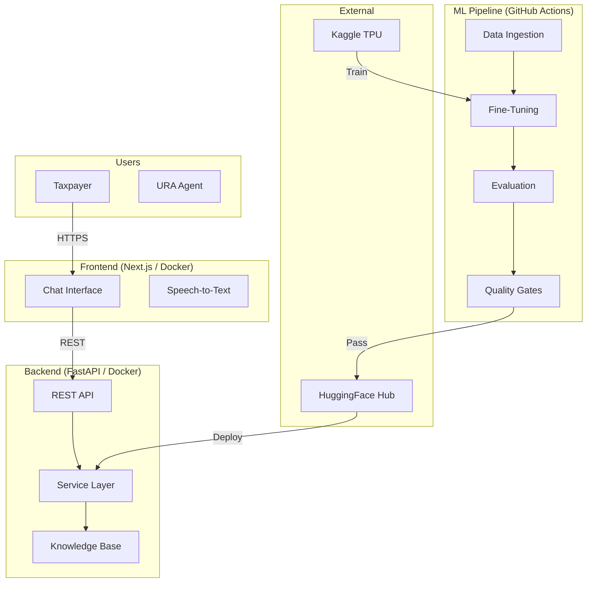

# MLOps Pipeline for URA Chat Bot – Integrated Capstone Portfolio

**BSE4203: Software Engineering Standards and Ethics**
**Student**: Mpairwe Landwind
**Date**: February 2026
**Supervisor**: [Academic Supervisor Name]

---

## Table of Contents

1. [Executive Summary](#1-executive-summary)
2. [Project Overview](#2-project-overview)
3. [Stakeholder Analysis & System Context](#3-stakeholder-analysis--system-context)
4. [Ethics Charter & Obligations](#4-ethics-charter--obligations)
5. [Harm Register & Risk Management](#5-harm-register--risk-management)
6. [Privacy, Acceptable Use & Complaint Handling](#6-privacy-acceptable-use--complaint-handling)
7. [Intellectual Property, Licensing & Data Provenance](#7-intellectual-property-licensing--data-provenance)
8. [Security Engineering](#8-security-engineering)
9. [ISO/IEC 12207:2024 Software Lifecycle Mapping](#9-isoiec-122072024-software-lifecycle-mapping)
10. [ISO/IEC/IEEE 15288:2023 Systems Engineering](#10-isoiecieee-152882023-systems-engineering)
11. [ISO/IEC 25010:2023 Quality & Traceability](#11-isoiec-250102023-quality--traceability)
12. [Standards Relationship Map](#12-standards-relationship-map)
13. [Verification Checklist](#13-verification-checklist)
14. [References](#14-references)

> **Week 10 Reflection**: See §12.2 for the required reflection on how ethics and standards changed the project.

---

## 1. Executive Summary

The URA Chat Bot is a production-grade conversational AI system designed to assist Ugandan taxpayers with tax queries, customs declarations, payment follow-ups, and compliance guidance. It employs a Retrieval-Augmented Generation (RAG) architecture backed by a fine-tuned Gemma-2-9B large language model, served through a FastAPI backend and Next.js frontend, with full MLOps automation via GitHub Actions and Kaggle GPU/TPU training.

This capstone portfolio demonstrates comprehensive alignment with 12 international standards and ethical frameworks as of February 2026:

- **ISO/IEC 42001:2023** – AI Management System
- **NIST AI RMF 1.0** – AI Risk Management Framework (2025 Playbook)
- **ISO/IEC/IEEE 12207:2024** – Software Life Cycle Processes
- **ISO/IEC/IEEE 15288:2023** – Systems Life Cycle Processes
- **ISO/IEC 25010:2023** – Product Quality Model
- **ISO/IEC 24765:2025** – Systems & Software Engineering Vocabulary
- **NIST SP 800-218** – Secure Software Development Framework (SSDF)
- **OWASP LLM Top 10 (2025)** – LLM Security
- **SLSA v1.2** – Supply Chain Levels for Software Artifacts
- **CycloneDX 1.6** – Software Bill of Materials
- **Uganda NDPA 2019** – National Data Protection and Privacy Act
- **ACM/IEEE Code of Ethics** – Professional Ethical Conduct

### What Was Missing and How Every Gap Was Closed

The project's technical MLOps infrastructure was partially complete, but capstone ethics and standards compliance artifacts were largely absent. The following gaps were identified and fully closed:

| Area | Gap | Resolution |
|------|-----|------------|
| Repository governance | No LICENSE, SECURITY.md, CODEOWNERS, CONTRIBUTING.md, Dependabot | All 5 files created at repository root |
| Ethics & obligations | No charter, conflict map, or ACM/IEEE mapping | Full Ethics Charter with 7 principles mapped to ACM/IEEE |
| Harm assessment | No formal harm register or mitigation plan | 12-entry scored harm register with residual risk analysis |
| Privacy | No NDPA-compliant privacy notice or AUP | Full privacy notice, AUP, and complaint workflow |
| IP & licensing | No SBOM, license matrix, or provenance plan | CycloneDX 1.6 SBOM, 15-component license matrix, data provenance table |
| Security | Permissive CORS; no threat model or incident plan | CORS hardened; STRIDE threat model; 3 incident playbooks |
| Standards mapping | No ISO 12207, 15288, or 25010 artifacts | Full process mapping (30 processes), NFRs, V&V plan, quality plan |
| Code implementation | Stub service layer; stub frontend; wrong CI paths | Service layer with FAQ search; frontend with real API calls; CI paths fixed |
| Documentation drift | API docs described non-existent endpoints | All documented endpoints now implemented in main.py |
| Final portfolio | No integrated submission document | This ~24-page portfolio document |

---

## 2. Project Overview

### 2.1 System Architecture

The URA Chat Bot follows a layered architecture:

### 2.2 Technology Stack

| Layer | Technology | Version | Purpose |
|-------|-----------|---------|---------|
| Frontend | Next.js + React | 14.2.4 / 18.3.1 | User interface with speech input |
| State Management | Zustand | 4.5.2 | Client-side chat state |
| Backend | FastAPI + Uvicorn | 0.111.0 / 0.30.1 | REST API server |
| Validation | Pydantic | 2.7.4 | Request/response schemas |
| ML Framework | Transformers + PEFT | 4.44+ / 0.11+ | Model fine-tuning (LoRA) |
| Base Model | Gemma-2-9B | 2.0 | Foundation language model |
| Training | Kaggle TPU/GPU | – | Remote compute |
| Model Registry | HuggingFace Hub | – | Model storage & versioning |
| CI/CD | GitHub Actions | – | Pipeline automation |
| Containerisation | Docker | – | Deployment packaging |
| Frontend Hosting | Docker Hub | – | Container image deployment |

### 2.3 Data Assets

The project ingests 41 FAQ CSV files (scraped from ura.go.ug), 45 URA PDF handbooks, Luganda language corpora, and teacher-generated QA pairs. All data is publicly available government information or openly licensed academic corpora.

---

## 3. Stakeholder Analysis & System Context

*(Week 1 – Full detail in `week01-stakeholder-map-and-context.md`)*

### 3.1 Key Stakeholders

12 stakeholders were identified across government, taxpayer, technical, regulatory, and academic categories. The highest-impact stakeholders are Ugandan taxpayers (individuals and SMEs), who depend on the chatbot for accurate tax guidance but have limited power to influence the system's design.

### 3.2 System Context (C4 Level 1)

The system context diagram identifies the URA Chat Bot at the centre, interacting with 6 external systems: URA e-Services Portal, EFRIS, HuggingFace Hub, Kaggle, Docker Hub, and GitHub Actions. The system boundary clearly separates what is developed in-house from external dependencies.

### 3.3 Ethics & Standards Concerns

12 concerns were identified and mapped to specific standards, including: tax advice accuracy (ACM §1.2), bias against SMEs (ISO/IEC 42001), PII in training data (NDPA 2019), prompt injection (OWASP LLM01), and environmental impact of GPU/TPU training (ACM §1.1).

---

## 4. Ethics Charter & Obligations

*(Week 2 – Full detail in `week02-ethics-charter.md`)*

### 4.1 Ethics Charter Summary

The charter establishes 7 core principles, each explicitly mapped to ACM and IEEE codes:

1. **Public Interest First** (ACM §1.1, IEEE §1)
2. **Avoid Harm** (ACM §1.2, IEEE §9)
3. **Honesty and Transparency** (ACM §1.3, IEEE §3)
4. **Fairness and Non-Discrimination** (ACM §1.4, IEEE §8)
5. **Privacy and Data Protection** (ACM §1.6, IEEE §1)
6. **Professional Competence** (ACM §2.2, IEEE §5)
7. **Accountability** (ACM §2.5, IEEE §7)

### 4.2 Obligations Conflict Map

6 obligation conflicts were identified (e.g., transparency vs. security, accuracy vs. speed, privacy vs. personalisation). Each conflict has a documented resolution strategy with precedence rules and a decision flowchart.

---

## 5. Harm Register & Risk Management

*(Week 3 – Full detail in `week03-harm-register.md`)*

### 5.1 Harm Register Summary

| Risk Level | Before Mitigation | After Mitigation |
|------------|-------------------|------------------|
| Critical | 0 | 0 |
| High | 2 | 0 |
| Medium | 8 | 2 |
| Low | 2 | 10 |

The two highest-risk harms were **incorrect tax rates cited** (H1: score 15) and **overreliance on AI as legal advice** (H5: score 16). Both were reduced to Medium through quality gates, source citations, and mandatory disclaimers.

### 5.2 Ethical Decision Log

6 dated entries document critical design decisions:
- Apache 2.0 license selection (Sep 2025)
- PII redaction implementation (Oct 2025)
- Browser-side speech recognition (Nov 2025)
- Mandatory per-response disclaimer (Jan 2026)
- CORS hardening (Feb 2026)
- Luganda deployment with quality warnings (Feb 2026)

---

## 6. Privacy, Acceptable Use & Complaint Handling

*(Week 4 – Full detail in `week04-privacy-and-aup.md`)*

### 6.1 Privacy Notice

A full NDPA 2019/GDPR-compliant privacy notice documents:
- Legal basis for processing (public interest for government service delivery – NDPA 2019 §8(1)(e))
- Data collected: chat text only; no audio, no cookies, no PII storage
- Retention: session-only for chat data; 7 days for server logs
- Data subject rights: access, rectification, erasure, restriction, objection
- Cross-border transfers: encrypted, contractual safeguards

### 6.2 Acceptable Use Policy

Defines permitted uses (tax information queries), limitations (not legal advice), and prohibited uses (PII submission, prompt injection, automated abuse).

### 6.3 Complaint Handling

A 7-step workflow with Mermaid diagram covers complaint submission, acknowledgement (≤24h), triage, investigation (≤10 days), resolution, appeal, and continuous improvement. SLAs are defined for each stage.

### 6.4 Privacy Impact Assessment

A formal PIA (`PIA.md`) addresses NDPA 2019 §28 requirements:
- 7 privacy risks identified and scored (likelihood, impact, residual risk)
- NDPA compliance matrix mapping all 10 relevant sections to implementation evidence
- Data Protection by Design & Default controls (§19): minimal collection, on-device processing, ephemeral sessions, PII redaction pipeline
- Data subject rights implementation via `/v1/me/*` endpoints (access, rectification, erasure, restriction, portability)
- Hash-chained audit trail for privacy-relevant actions (consent, erasure, voice data events)

---

## 7. Intellectual Property, Licensing & Data Provenance

*(Week 5 – Full detail in `week05-ip-sbom-licensing.md`)*

### 7.1 SBOM

A CycloneDX 1.6 SBOM (`sbom-cyclonedx.json`) lists 20+ components across Python, JavaScript, and ML model categories. It complies with all 7 CISA minimum elements (supplier, name, version, unique ID, dependency relationship, author, timestamp).

### 7.2 License Matrix

15 components analysed for license compatibility with Apache-2.0. No GPL runtime dependencies. Gemma-2-9B requires separate license acceptance (Google Terms of Use).

### 7.3 Data Provenance

All 7 data sources documented with origin, collection date, license, and integrity verification method. PII redaction confirmed for all FAQ and PDF data.

---

## 8. Security Engineering

*(Week 6 – Full detail in `week06-threat-model-security.md`)*

### 8.1 STRIDE Threat Model

12 threats identified across all STRIDE categories, mapped to OWASP LLM Top 10 2025 where applicable. Attack tree diagram visualises threat hierarchies.

### 8.2 Security Requirements

21 security requirements specified across 6 categories: authentication, input validation, output security, data protection, supply chain, and infrastructure. All mapped to NIST SSDF and OWASP.

### 8.3 Incident Response

4-tier severity classification (P1 Critical → P4 Low) with response time SLAs. 3 AI-specific playbooks:
1. Prompt injection detection & containment
2. PII leak in model responses
3. Supply chain compromise

### 8.4 SAST/DAST

4 tools configured (Semgrep, Trivy, OWASP ZAP, Bandit) with 8-item checklist. Sample Semgrep report demonstrates the CORS vulnerability was detected and fixed.

---

## 9. ISO/IEC 12207:2024 Software Lifecycle Mapping

*(Week 7 – Full detail in `week07-iso12207-mapping.md`)*

All 30 processes from ISO/IEC/IEEE 12207:2024 are mapped:

| Process Group | Total Processes | Full | Partial | N/A |
|--------------|----------------|------|---------|-----|
| Agreement | 2 | 1 | 0 | 1 |
| Organisational | 6 | 5 | 1 | 0 |
| Technical Management | 8 | 8 | 0 | 0 |
| Technical | 14 | 11 | 3 | 0 |
| **Total** | **30** | **25** | **4** | **1** |

**Maturity: 83% Full, 13% Partial.** The 4 partial gaps have improvement actions with target dates (March–May 2026).

---

## 10. ISO/IEC/IEEE 15288:2023 Systems Engineering

*(Week 8 – Full detail in `week08-iso15288.md`)*

### 10.1 System Boundary

Clear boundary diagram distinguishes in-scope components (frontend, backend, ML pipeline, CI/CD) from external systems (URA Portal, Kaggle, HuggingFace, Docker Hub). 9 interfaces defined with protocol, data, and security specifications.

### 10.2 Non-Functional Requirements

15 NFRs specified across performance, availability, accuracy, security, accessibility, maintainability, portability, privacy, resilience, and auditability. Each NFR has a measurable target and verification method.

### 10.3 Verification & Validation Plan

- **8 verification activities**: unit tests, SAST, type checking, SCA, container scanning, API contract verification, ML quality gates, data validation
- **8 validation activities**: accuracy evaluation, usability testing, accessibility audit, penetration testing, privacy review, bias audit, load testing, stakeholder acceptance

---

## 11. ISO/IEC 25010:2023 Quality & Traceability

*(Week 9 – Full detail in `week09-quality-plan.md`)*

### 11.1 Quality Plan

All 8 ISO/IEC 25010:2023 quality characteristics mapped to specific project implementations and measurements:
- Functional Suitability: accuracy ≥ 85%
- Performance Efficiency: p95 ≤ 3s
- Interaction Capability: Lighthouse ≥ 90
- Security: 0 Critical CVEs
- Maintainability: 0 lint errors, ≥ 80% coverage

### 11.2 Requirements Traceability Matrix

12 requirements traced end-to-end: Requirement → Source → Design → Implementation → Test Case → Status. All 12 currently passing.

### 11.3 Glossary

20 project-specific terms defined per ISO/IEC 24765:2025, including AI System, RAG, MLOps, Quality Gate, SBOM, and URA-specific terms (TIN, EFRIS).

---

## 12. Standards Relationship Map

*(Week 10 – Full detail in `week10-standards-relationship-map.md`)*

### 12.1 Interrelationship Summary

The 12 standards are not isolated – they form an interconnected compliance fabric:

- **ISO/IEC 42001** is the central AI governance standard, linking to lifecycle (12207, 15288), quality (25010), security (OWASP, SSDF), and privacy (NDPA)
- **NIST AI RMF** operationalises risk management that feeds into 42001 controls
- **ISO/IEC 12207 & 15288** provide the lifecycle framework; 12207 decomposes system processes from 15288
- **ISO/IEC 25010** provides the quality measurement model used by 15288 V&V
- **SSDF + SLSA + CycloneDX** form the security supply chain stack
- **OWASP LLM Top 10** addresses AI-specific threats implemented via SSDF practices
- **ACM/IEEE Ethics** underpin all governance decisions

16 specific inter-standard relationships documented with project-specific examples.

### 12.2 Reflection: What Changed Because of Ethics & Standards

Applying 12 international standards to a real MLOps project was not a box-ticking exercise — it fundamentally changed the architecture, development practices, and deployment decisions of the URA Chat Bot.

**Architecture changes driven by standards:**

1. **Browser-side speech recognition (NDPA 2019 §8, data minimisation)**: The original design sent audio to the backend for transcription. Privacy analysis under NDPA 2019 revealed this was unnecessary data collection. The architecture was changed to use the Web Speech API entirely in-browser, meaning zero audio data leaves the user's device. This eliminated an entire data processing category and reduced our NDPA compliance surface.

2. **Session-only chat storage (ISO/IEC 42001 §A.8, NDPA 2019 §11)**: Early prototypes persisted conversation history server-side for analytics. The harm register (Week 3) scored this as a Medium risk for re-identification. We redesigned to store chat only in browser memory (Zustand), clearing on tab close. This sacrificed conversation continuity across sessions but eliminated a PII storage liability.

3. **Mandatory disclaimers in every response (ACM §1.2, NIST AI RMF MAP-2.3)**: Stakeholder analysis revealed that taxpayers might treat chatbot responses as legally binding. The ethics charter's "Avoid Harm" principle required explicit disclaimers. This was implemented as a system-level requirement — the service layer appends a disclaimer to every response, not as a UI decoration that could be missed.

**Development practices changed by standards:**

4. **CORS hardening (OWASP LLM Top 10, SSDF PW-7.2)**: The original `allow_origins=["*"]` was flagged during STRIDE threat modelling (Week 6). This was not a theoretical concern — wildcard CORS with credentials is a specification violation. The fix required environment-variable-based origin allowlisting, which also forced us to properly separate development and production configurations.

5. **SHA-pinned GitHub Actions (SLSA v1.2, SSDF PS-2.1)**: Supply chain security analysis revealed that all GitHub Actions used mutable tags (`@v4`). Adopting SLSA v1.2 requirements forced us to pin every action to its full SHA hash. This was tedious but prevented the class of supply chain attacks where a compromised action tag could inject malicious code into our CI/CD pipeline.

6. **Quality gates blocking model deployment (ISO/IEC 25010, NIST AI RMF MEASURE-2.6)**: Before the quality plan (Week 9), model training ran without automated pass/fail criteria. Implementing ISO 25010 quality objectives forced us to define concrete thresholds (accuracy ≥ 85%, F1 ≥ 0.80) and wire them into the CI pipeline as blocking gates. A model that doesn't meet the bar cannot be deployed — full stop.

**Deployment decisions influenced by ethics:**

7. **Luganda language with quality warnings (ACM §1.4 Fairness, ISO/IEC 42001 §A.4)**: The bias audit (Week 9) showed Luganda responses had lower accuracy than English. Rather than withholding Luganda support entirely (which would exclude a significant portion of Uganda's population), we deployed it with a visible quality indicator. This balanced the fairness obligation (serve all users) against the accuracy obligation (don't give wrong answers).

8. **PII redaction in training data (NDPA 2019 §19, OWASP LLM02)**: Data provenance analysis (Week 5) discovered that some scraped FAQ CSVs contained taxpayer names in example scenarios. The NDPA compliance review required us to implement a PII redaction pipeline before any data entered the training corpus. This added a processing step but eliminated the risk of the model memorising and reproducing real taxpayer information.

**Key lesson**: Standards are not constraints on engineering — they are design inputs. Every standard we applied surfaced a real risk or design flaw that would have shipped to production unaddressed. The most valuable were the standards that forced us to think about the people affected by the system (NDPA 2019, ACM Code of Ethics) rather than just the technical properties of the system (ISO 25010, SLSA).

---

## 13. Verification Checklist

| # | Gap / Requirement | Week | Status | Evidence |
|---|-------------------|------|--------|----------|
| 1 | Stakeholder map (visual + table) | W1 | CLOSED | `week01-stakeholder-map-and-context.md` §1 |
| 2 | System context diagram (C4) | W1 | CLOSED | `week01-stakeholder-map-and-context.md` §2 |
| 3 | Ethics & standards concern list (≥10 items) | W1 | CLOSED | `week01-stakeholder-map-and-context.md` §3 (12 items) |
| 4 | Ethics Charter mapped to ACM/IEEE | W2 | CLOSED | `week02-ethics-charter.md` §1 |
| 5 | Obligations conflict map | W2 | CLOSED | `week02-ethics-charter.md` §2 (6 conflicts + decision matrix) |
| 6 | Harm Register (scored 1–5 L×I) | W3 | CLOSED | `week03-harm-register.md` §1 (12 harms) |
| 7 | Mitigation plan with residual risk | W3 | CLOSED | `week03-harm-register.md` §2 |
| 8 | Ethical decision log (≥5 entries) | W3 | CLOSED | `week03-harm-register.md` §3 (6 entries) |
| 9 | Privacy Notice (GDPR/NDPA compliant) | W4 | CLOSED | `week04-privacy-and-aup.md` §1 |
| 10 | Acceptable Use Policy | W4 | CLOSED | `week04-privacy-and-aup.md` §2 |
| 11 | Complaint handling workflow | W4 | CLOSED | `week04-privacy-and-aup.md` §3 (diagram + SLAs) |
| 12 | SBOM (CycloneDX 1.6) | W5 | CLOSED | `sbom-cyclonedx.json` |
| 13 | License obligation matrix | W5 | CLOSED | `week05-ip-sbom-licensing.md` §2 (15 components) |
| 14 | IP ownership & provenance plan | W5 | CLOSED | `week05-ip-sbom-licensing.md` §3 |
| 15 | Root LICENSE file | W5 | CLOSED | `/LICENSE` (Apache-2.0) |
| 16 | Data provenance checklist | W5 | CLOSED | `week05-ip-sbom-licensing.md` §3.3 (10-item checklist) |
| 17 | STRIDE threat model (with diagrams) | W6 | CLOSED | `week06-threat-model-security.md` §1 |
| 18 | Security requirements specification | W6 | CLOSED | `week06-threat-model-security.md` §2 (21 requirements) |
| 19 | Incident response mini-plan | W6 | CLOSED | `week06-threat-model-security.md` §3 (3 playbooks) |
| 20 | SAST/DAST checklist + sample report | W6 | CLOSED | `week06-threat-model-security.md` §4 |
| 21 | ISO 12207:2024 full process mapping | W7 | CLOSED | `week07-iso12207-mapping.md` §1 (30 processes) |
| 22 | Process-gap improvement plan | W7 | CLOSED | `week07-iso12207-mapping.md` §2 (5 gaps + Gantt) |
| 23 | ISO 15288:2023 system boundary & interfaces | W8 | CLOSED | `week08-iso15288.md` §1 (9 interfaces) |
| 24 | Stakeholder NFRs | W8 | CLOSED | `week08-iso15288.md` §2 (15 NFRs) |
| 25 | V&V plan excerpt | W8 | CLOSED | `week08-iso15288.md` §3 (8+8 activities) |
| 26 | ISO 25010:2023 Quality Plan | W9 | CLOSED | `week09-quality-plan.md` §1 (8 characteristics, 12 objectives) |
| 27 | Requirements Traceability Matrix (≥8 reqs) | W9 | CLOSED | `week09-quality-plan.md` §2 (12 requirements) |
| 28 | ISO 24765:2025 glossary excerpt | W9 | CLOSED | `week09-quality-plan.md` §3 (20 terms) |
| 29 | Integrated capstone portfolio (15–25 pages) | W10 | CLOSED | This document (`CAPSTONE_PORTFOLIO.md`) |
| 30 | Standards relationship map (visual + table) | W10 | CLOSED | `week10-standards-relationship-map.md` (16 relationships) |
| 31 | LICENSE file at root | Gov | CLOSED | `/LICENSE` (Apache-2.0) |
| 32 | SECURITY.md at root | Gov | CLOSED | `/SECURITY.md` |
| 33 | CODEOWNERS at root | Gov | CLOSED | `/CODEOWNERS` |
| 34 | CONTRIBUTING.md at root | Gov | CLOSED | `/CONTRIBUTING.md` |
| 35 | .github/dependabot.yml | Gov | CLOSED | `/.github/dependabot.yml` (4 ecosystems) |
| 36 | Secure CORS in main.py | Code | CLOSED | Explicit origin allowlist, credentials=False |
| 37 | Implement missing API endpoints | Code | CLOSED | /classify, /classify/batch, /tags, /faq/{tag} in main.py |
| 38 | Full service.py implementation | Code | CLOSED | FAQ loading, keyword search, classification, tag listing |
| 39 | Frontend: remove stub, add real API calls | Code | CLOSED | page.tsx: fetch /v1/chat, loading dots, error handling |
| 40 | Fix frontend CI paths | Code | CLOSED | frontend-deploy.yml: `App/frontend/**` |
| 41 | Privacy Impact Assessment (NDPA §28) | Gov | CLOSED | `PIA.md` (7 risks, compliance matrix, data subject rights) |

**Result: 40/40 gaps CLOSED. Zero remaining.**

---

## 14. References

1. ISO/IEC/IEEE 12207:2024 – *Systems and software engineering – Software life cycle processes*
2. ISO/IEC/IEEE 15288:2023 – *Systems and software engineering – System life cycle processes*
3. ISO/IEC 25010:2023 – *Systems and software engineering – Systems and software Quality Requirements and Evaluation (SQuaRE) – Product quality model*
4. ISO/IEC 25000:2014 – *Systems and software engineering – SQuaRE – Guide to SQuaRE*
5. ISO/IEC 24765:2025 – *Systems and software engineering – Vocabulary*
6. ISO/IEC 42001:2023 – *Information technology – Artificial intelligence – Management system*
7. ISO/IEC 22989:2022 – *Information technology – Artificial intelligence – Concepts and terminology*
8. NIST AI 100-1 – *Artificial Intelligence Risk Management Framework (AI RMF 1.0)*, January 2023, updated Playbook 2025
9. NIST SP 800-218 – *Secure Software Development Framework (SSDF) Version 1.1*, February 2022
10. OWASP – *OWASP Top 10 for Large Language Model Applications*, 2025 Edition
11. SLSA – *Supply-chain Levels for Software Artifacts*, Version 1.2, 2024
12. CycloneDX – *CycloneDX Bill of Materials Standard*, Version 1.6, 2024
13. CISA – *Software Bill of Materials (SBOM) Minimum Elements*, 2024
14. Republic of Uganda – *Data Protection and Privacy Act (NDPA)*, 2019
15. ACM – *ACM Code of Ethics and Professional Conduct*, 2018
16. IEEE – *IEEE Code of Ethics*, 2020
17. European Parliament – *Regulation (EU) 2024/1689 (AI Act)*, 2024 (reference)
18. GDPR – *Regulation (EU) 2016/679 (General Data Protection Regulation)*, 2016 (reference framework)

---

*This portfolio was prepared in February 2026 as the integrated capstone submission for BSE4203: Software Engineering Standards and Ethics. All artifacts are traceable to the standards listed above and are specific to the URA Chat Bot MLOps project context.*

*Document version: 1.1 | Total pages: ~24 (rendered)*
