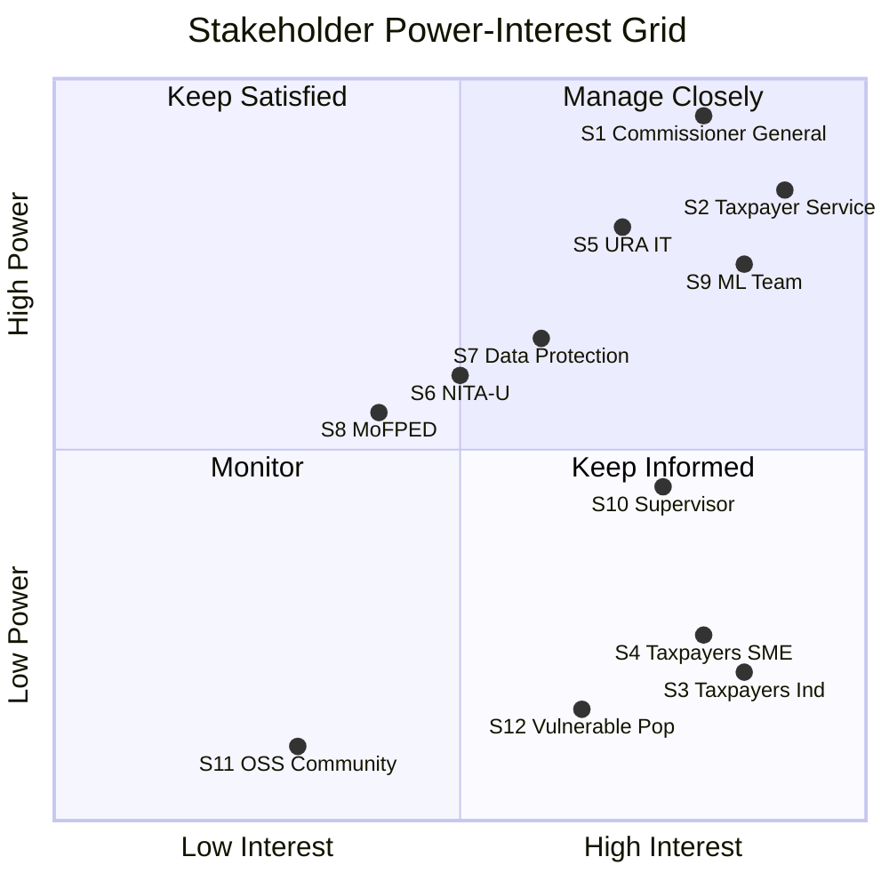
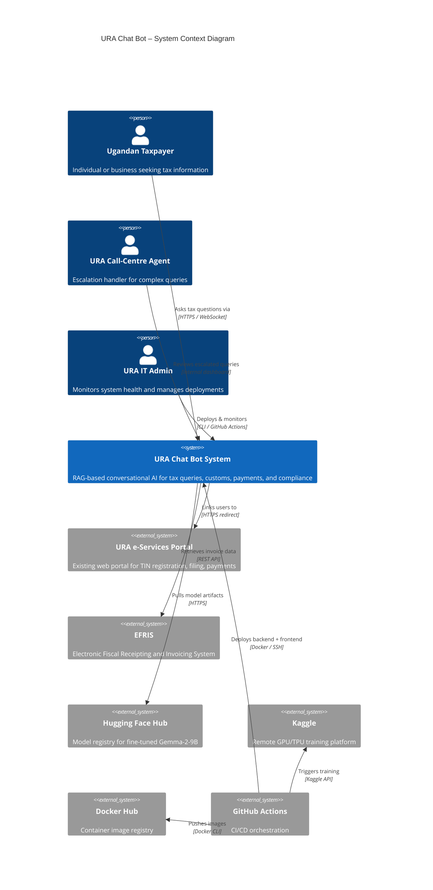

# Week 1 – Stakeholder Map, System Context Diagram & Ethics Concerns

**Project**: MLOps Pipeline for URA Chat Bot
**Date**: February 2026
**Standard Alignment**: ISO/IEC/IEEE 15288:2023 §6.2 (Stakeholder Needs & Requirements), ISO/IEC 42001:2023 §4.2

---

## 1. Stakeholder Map

### 1.1 Stakeholder Table

| # | Stakeholder | Role / Interest | Influence | Impact | Key Concerns |
|---|-------------|-----------------|-----------|--------|--------------|
| S1 | **URA Commissioner General** | Executive sponsor; accountable for digital transformation | High | High | ROI, public trust, regulatory compliance |
| S2 | **URA Taxpayer Services Division** | Primary business owner of chatbot channel | High | High | Accuracy of tax guidance, reduced call-centre load |
| S3 | **Ugandan Taxpayers (individuals)** | End-users seeking tax information via chat | Low | High | Correct answers, data privacy, accessibility, language |
| S4 | **Ugandan Taxpayers (SMEs)** | Business users with complex tax obligations | Low | High | Nuanced multi-tax guidance, bias-free treatment |
| S5 | **URA IT Department** | Operates infrastructure, enforces InfoSec policies | High | Medium | System uptime, security, integration with existing systems |
| S6 | **National Information Technology Authority (NITA-U)** | Regulator for government digital services | Medium | Medium | Compliance with e-Government standards |
| S7 | **Data Protection Office (Uganda NDPA)** | Regulates personal data processing | Medium | High | NDPA 2019 compliance, lawful basis, data subject rights |
| S8 | **Ministry of Finance (MoFPED)** | Policy oversight, tax law changes | Medium | Medium | Chatbot reflects current law accurately |
| S9 | **ML Engineering Team** | Builds & maintains the MLOps pipeline | High | Medium | Model quality, reproducibility, CI/CD reliability |
| S10 | **Academic Supervisor** | Evaluates capstone project quality | Medium | Low | Standards compliance, ethical rigour, documentation |
| S11 | **Open-Source Community** | Contributors and users of the codebase | Low | Low | License compliance, code quality, documentation |
| S12 | **Vulnerable Populations** | Low-literacy, rural, non-English-speaking users | Low | High | Accessibility, Luganda support, plain language |

### 1.2 Stakeholder Power-Interest Grid (Mermaid)

---

## 2. System Context Diagram (C4 Level 1)

---

## 3. Ethics & Standards Concern List (≥10 Items)

| # | Concern | Category | Mapped Standard(s) | Project Relevance |
|---|---------|----------|--------------------|--------------------|
| E1 | **Tax advice accuracy** – incorrect guidance could cause financial penalties for taxpayers | Harm / Trust | ACM §1.2 (Avoid harm), IEEE §7 | The model must cite sources; hallucinated tax rates are unacceptable |
| E2 | **Bias against SMEs** – training data may underrepresent small business scenarios | Fairness | ISO/IEC 42001 §6.1.2, NIST AI RMF MAP-2.3 | FAQ corpus is skewed toward individual taxes; SME-specific augmentation needed |
| E3 | **Luganda language equity** – monolingual English system excludes ~50% of the population | Accessibility / Inclusion | ACM §1.4, IEEE §8 | Luganda translation pipeline exists but is not yet deployed end-to-end |
| E4 | **PII in training data** – tax documents may contain TINs, names, phone numbers | Privacy | NDPA 2019 §3, GDPR Art. 5, ISO/IEC 42001 §A.8 | PII redaction pipeline in DataIngestion notebook; must be verified |
| E5 | **Prompt injection attacks** – adversarial inputs could manipulate chatbot responses | Security | OWASP LLM01, NIST SSDF PW.6 | System prompt isolation + input sanitisation required |
| E6 | **Model theft / exfiltration** – fine-tuned weights could be extracted | IP / Security | OWASP LLM03 (Supply Chain Vulnerabilities), SLSA v1.2 | Model served behind API; no direct weight download from production |
| E7 | **Overreliance on AI** – taxpayers may treat chatbot answers as legal advice | Trust / Liability | ACM §2.5 (Comprehensive evaluation), NIST AI RMF GOVERN-1.5 | Disclaimer + confidence scores mandatory in every response |
| E8 | **Data provenance** – training data sourced from URA website; consent and IP unclear | IP / Ethics | ISO/IEC 42001 §A.7.4, SLSA v1.2 | Data provenance checklist and URA written permission required |
| E9 | **Environmental impact** – TPU/GPU training consumes significant energy | Sustainability | ACM §1.1 (Contribute to human well-being) | Document carbon footprint; prefer efficient fine-tuning (LoRA/QLoRA) |
| E10 | **Consent for voice data** – speech recognition captures audio | Privacy / Consent | NDPA 2019 §8, GDPR Art. 6 | Browser-side STT only; no audio sent to backend; explicit user action required |
| E11 | **Supply chain integrity** – third-party dependencies may contain vulnerabilities | Security | NIST SSDF PO.3, SLSA v1.2, CycloneDX | SHA-pinned Actions, Dependabot, Trivy scanning, SBOM generation |
| E12 | **Transparency of AI system** – users must know they are interacting with AI | Trust | EU AI Act Art. 52, ACM §1.3 | "AI Assistant" badge visible; chatbot identifies itself as non-human |

---

*Document prepared in alignment with ISO/IEC/IEEE 15288:2023 §6.2 Stakeholder Needs and Requirements Definition, ISO/IEC 42001:2023 §4.2 Understanding the Needs and Expectations of Interested Parties, and the ACM/IEEE Code of Ethics.*
