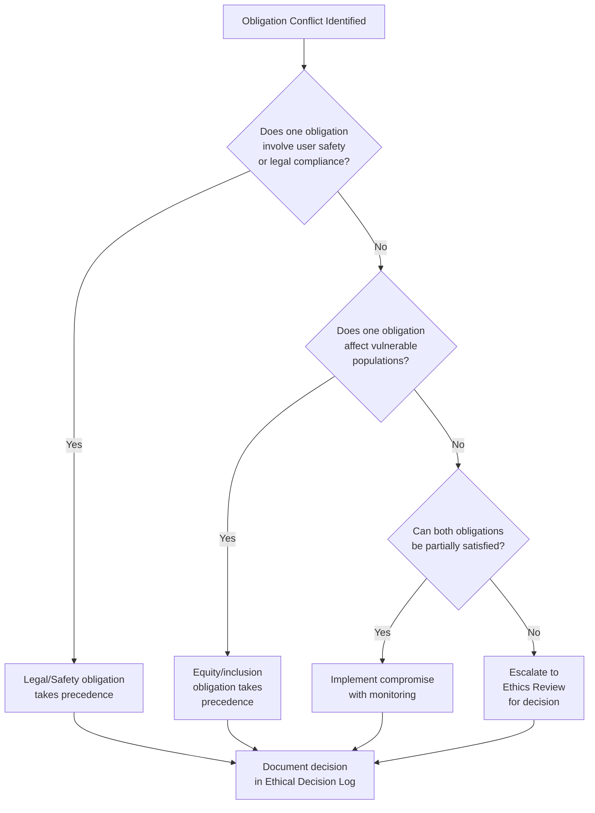

# Week 2 – Ethics Charter & Obligations Conflict Map

**Project**: MLOps Pipeline for URA Chat Bot
**Date**: February 2026
**Standard Alignment**: ACM Code of Ethics (2018), IEEE Code of Ethics (2020), ISO/IEC 42001:2023

---

## 1. Ethics Charter

### 1.1 Preamble

This Ethics Charter governs the design, development, deployment, and ongoing operation of the URA Chat Bot – an AI-powered conversational system that provides tax guidance to Ugandan taxpayers. As the system handles sensitive financial information and serves a public institution, it must meet the highest standards of ethical conduct, transparency, and accountability.

This charter is explicitly mapped to the ACM Code of Ethics and Professional Conduct (2018) and the IEEE Code of Ethics (2020).

### 1.2 Core Ethical Principles

#### Principle 1: Public Interest First (ACM §1.1, IEEE §1)

The URA Chat Bot exists to serve Ugandan taxpayers – individuals, SMEs, and organisations. Every design decision must prioritise the public's interest over convenience, cost savings, or technical elegance.

**Commitments:**
- Provide accurate, up-to-date tax information sourced from official URA publications
- Never present AI-generated content as authoritative legal advice
- Include disclaimers and confidence indicators in every response
- Maintain a human escalation path for complex queries

#### Principle 2: Avoid Harm (ACM §1.2, IEEE §9)

The system must not cause financial, psychological, or reputational harm to users.

**Commitments:**
- Implement quality gates that block deployment if accuracy drops below thresholds
- Test for bias against underrepresented groups (SMEs, rural taxpayers, Luganda speakers)
- Conduct adversarial testing for prompt injection and data poisoning
- Monitor production responses for harmful or misleading content

#### Principle 3: Honesty and Transparency (ACM §1.3, IEEE §3)

Users must know they are interacting with an AI system, understand its limitations, and have access to the sources behind every answer.

**Commitments:**
- Display "AI Assistant" branding prominently
- Provide source citations (document names) with every response
- Publish this Ethics Charter and the Privacy Notice publicly
- Open-source the codebase under Apache 2.0 with full documentation

#### Principle 4: Fairness and Non-Discrimination (ACM §1.4, IEEE §8)

The system must serve all Ugandan taxpayers equitably, regardless of language, literacy level, business size, or geographic location.

**Commitments:**
- Develop and test Luganda language support
- Ensure training data proportionally represents all tax categories
- Conduct bias audits comparing response quality across user segments
- Design the UI for low-bandwidth and mobile-first scenarios

#### Principle 5: Privacy and Data Protection (ACM §1.6, IEEE §1)

Personal data must be handled in strict accordance with the Uganda National Data Protection and Privacy Act (NDPA) 2019 and international best practices.

**Commitments:**
- Collect minimal data (message text only; no user accounts required)
- Process speech recognition client-side only (no audio leaves the browser)
- Redact PII from training data using automated pipelines with manual verification
- Implement data retention limits (conversation logs auto-deleted after 90 days)
- Provide a complaint mechanism for data subjects

#### Principle 6: Professional Competence (ACM §2.2, IEEE §5)

The development team must maintain competence in AI safety, MLOps, and the relevant legal/regulatory frameworks.

**Commitments:**
- Follow ISO/IEC 42001:2023 AI Management System requirements
- Apply NIST AI RMF 1.0 for risk identification and mitigation
- Use OWASP LLM Top 10 (2025) as the security baseline
- Engage in continuous learning about Ugandan tax law updates

#### Principle 7: Accountability (ACM §2.5, IEEE §7)

Clear ownership and accountability must exist for every aspect of the system.

**Commitments:**
- Assign CODEOWNERS for every directory in the repository
- Maintain an ethical decision log for all significant design choices
- Conduct post-deployment monitoring with alerting
- Establish an incident response plan for AI-specific failures

### 1.3 Scope

This charter applies to:
- All contributors to the URA Chat Bot codebase
- All data used for training, evaluation, and operation
- All deployment environments (development, staging, production)
- All interfaces (web frontend, API, future mobile/USSD channels)

### 1.4 Governance

- **Ethics Review**: The ML Engineering Team will review all model changes against this charter before deployment.
- **Annual Review**: This charter will be reviewed and updated at least annually, or upon significant regulatory changes.
- **Violation Reporting**: Ethical concerns can be reported via the repository's issue tracker (tagged `ethics`) or by email to the project maintainer.

---

## 2. Obligations Conflict Map

### 2.1 Conflict Table

| # | Obligation A | Obligation B | Nature of Conflict | Resolution Strategy | Precedence |
|---|-------------|-------------|-------------------|---------------------|------------|
| C1 | **Transparency** (publish all data sources) | **Security** (do not expose internal system architecture) | Publishing training data sources aids transparency but may reveal attack surfaces | Publish data source *names* and provenance metadata; withhold internal paths, API keys, and infrastructure details | Security takes precedence for infrastructure; transparency for data |
| C2 | **Accuracy** (provide correct tax guidance) | **Speed** (respond within 2 seconds) | Higher accuracy requires larger models / more retrieval passes, increasing latency | Use tiered retrieval: fast keyword search first, then semantic reranking; set quality gates so accuracy is never sacrificed for speed | Accuracy over speed |
| C3 | **Privacy** (minimise data collection) | **Personalisation** (remember user context across sessions) | Conversation history improves UX but creates a data retention liability | Offer ephemeral sessions by default; opt-in session persistence with explicit consent and 90-day TTL | Privacy by default |
| C4 | **Open Source** (Apache 2.0 license) | **Model Security** (prevent model theft) | Open-sourcing code aids reproducibility but could facilitate model weight extraction | Open-source the application code; serve model weights only behind the API (no direct download endpoint) | Balance: code open, weights protected |
| C5 | **Inclusivity** (serve Luganda speakers) | **Accuracy** (Luganda NLP has lower quality than English) | Providing Luganda responses could deliver lower-quality answers to already underserved users | Deploy Luganda with quality warnings; continuously improve with community feedback; fall back to English when confidence is low | Inclusivity with quality guardrails |
| C6 | **Automation** (reduce URA staff workload) | **Human Oversight** (keep humans in the loop) | Full automation improves efficiency but removes accountability checkpoints | Automate routine queries; escalate complex/high-stakes queries to human agents; maintain audit logs | Human oversight for high-risk |

### 2.2 Decision Matrix (Mermaid)

---

*This Ethics Charter is a living document. Version 1.0, February 2026. Aligned with ACM Code of Ethics (2018), IEEE Code of Ethics (2020), and ISO/IEC 42001:2023 AI Management System.*
