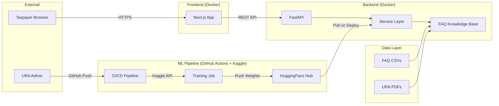
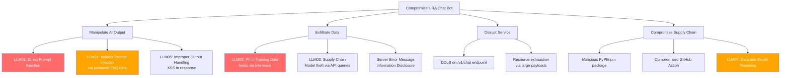
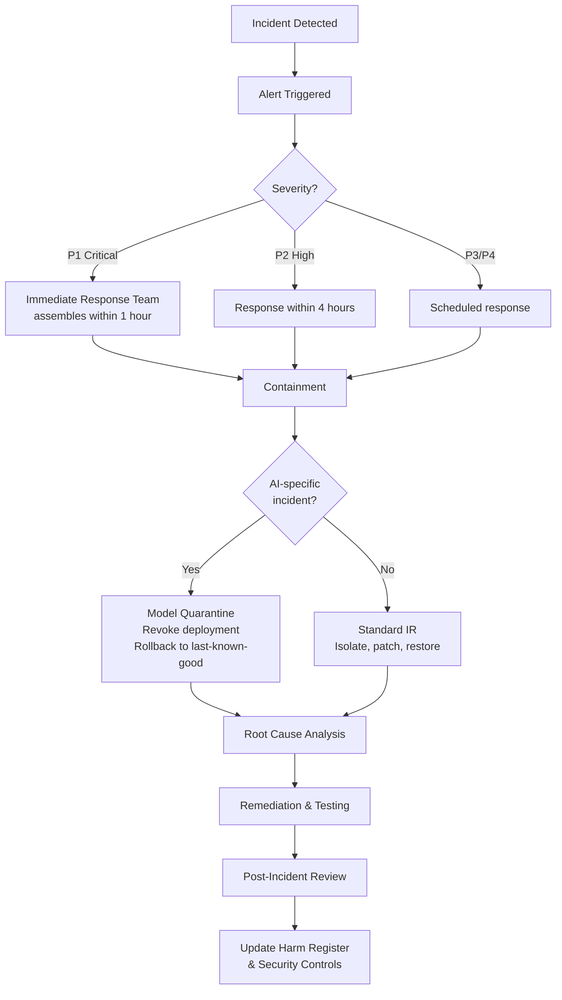

# Week 6 – Threat Model, Security Requirements & Incident Response Plan

**Project**: MLOps Pipeline for URA Chat Bot
**Date**: February 2026
**Standard Alignment**: STRIDE, OWASP LLM Top 10 (2025), NIST SP 800-218 (SSDF), ISO/IEC 42001:2023

---

## 1. STRIDE Threat Model

### 1.1 System Decomposition



### 1.2 STRIDE Analysis

| # | Threat Category | Threat Description | Affected Component | OWASP LLM 2025 | Likelihood | Impact | Risk |
|---|----------------|--------------------|--------------------|-----------------|------------|--------|------|
| T1 | **Spoofing** | Attacker impersonates legitimate API client | API Gateway | – | 3 | 3 | Medium |
| T2 | **Tampering** | Adversary modifies training data (data poisoning) | Data Layer, ML Pipeline | LLM04 | 2 | 5 | Medium |
| T3 | **Tampering** | Malicious dependency injected via supply chain | CI/CD Pipeline | – | 2 | 5 | Medium |
| T4 | **Repudiation** | User denies submitting a query; no audit trail | Backend API | – | 2 | 2 | Low |
| T5 | **Information Disclosure** | PII leaks from training data into model responses | Service Layer | LLM02 | 2 | 5 | Medium |
| T6 | **Information Disclosure** | Model weights exfiltrated via API probing | Backend API | LLM03 | 2 | 3 | Low |
| T7 | **Denial of Service** | Rate-limit bypass overwhelms inference endpoint | Backend API | – | 3 | 4 | Medium |
| T8 | **Elevation of Privilege** | Prompt injection alters system behaviour | Service Layer | LLM01 | 3 | 4 | Medium |
| T9 | **Tampering** | CORS misconfiguration enables CSRF attacks | Backend API | – | 2 | 4 | Medium |
| T10 | **Information Disclosure** | Server error messages leak internal details | Backend API | – | 3 | 2 | Low |
| T11 | **Spoofing** | Attacker compromises GitHub Actions workflow | CI/CD Pipeline | – | 1 | 5 | Low |
| T12 | **Elevation of Privilege** | Improper output handling – XSS via chatbot response | Frontend | LLM05 | 2 | 4 | Medium |

### 1.3 Threat Model Diagram (Attack Tree)



---

## 2. Security Requirements Specification (SRS)

### 2.1 Authentication & Authorization

| ID | Requirement | Priority | Standard |
|----|-------------|----------|----------|
| SR-01 | API endpoints shall require API key authentication for production deployment | High | SSDF PW.1 |
| SR-02 | Admin endpoints (future) shall require OAuth 2.0 / JWT tokens | Medium | SSDF PW.1 |
| SR-03 | Rate limiting shall be enforced: /v1/chat ≤ 60 req/min, /classify ≤ 100 req/min per IP | High | OWASP |

### 2.2 Input Validation

| ID | Requirement | Priority | Standard |
|----|-------------|----------|----------|
| SR-04 | All API inputs shall be validated via Pydantic models with max_length constraints | High | SSDF PW.5 |
| SR-05 | Chat messages shall be limited to 2000 characters | High | OWASP LLM01 |
| SR-06 | Batch classification requests shall be limited to 50 items | Medium | OWASP |
| SR-07 | Input shall be sanitised to remove known prompt injection patterns | High | OWASP LLM01 |

### 2.3 Output Security

| ID | Requirement | Priority | Standard |
|----|-------------|----------|----------|
| SR-08 | API responses shall not include stack traces or internal paths in error messages | High | SSDF PW.6 |
| SR-09 | Frontend shall escape all chatbot response content before rendering (XSS prevention) | High | OWASP LLM05 |
| SR-10 | Responses shall include source citations and confidence indicators | Medium | NIST AI RMF |

### 2.4 Data Protection

| ID | Requirement | Priority | Standard |
|----|-------------|----------|----------|
| SR-11 | Training data shall undergo PII redaction before model training | Critical | NDPA 2019, OWASP LLM02 |
| SR-12 | User conversation data shall not be persisted on the server beyond the request lifecycle | High | NDPA 2019 |
| SR-13 | All data in transit shall use TLS 1.2+ encryption | High | SSDF PO.1 |

### 2.5 Supply Chain Security

| ID | Requirement | Priority | Standard |
|----|-------------|----------|----------|
| SR-14 | All GitHub Actions shall use SHA-pinned references (no mutable tags) | High | SLSA v1.2 |
| SR-15 | Dependabot shall be enabled for all package ecosystems | High | SSDF PO.3 |
| SR-16 | Container images shall be scanned with Trivy before deployment | High | SSDF PW.4 |
| SR-17 | An SBOM (CycloneDX 1.6) shall be generated for every release | Medium | CISA SBOM |
| SR-18 | SLSA v1.2 build provenance attestation shall be generated in CI | Medium | SLSA v1.2 |

### 2.6 Infrastructure

| ID | Requirement | Priority | Standard |
|----|-------------|----------|----------|
| SR-19 | CORS shall restrict origins to an explicit allowlist (no wildcards with credentials) | High | OWASP |
| SR-20 | Docker containers shall run as non-root user | High | SSDF PO.1 |
| SR-21 | Secrets shall be injected via environment variables, never hardcoded | Critical | SSDF PO.1 |

---

## 3. Incident Response Mini-Plan

### 3.1 Incident Classification

| Severity | Description | Response Time | Examples |
|----------|-------------|---------------|----------|
| **P1 – Critical** | System compromised; data breach; harmful AI output at scale | ≤ 1 hour | PII leak, model serving malicious content, credential exposure |
| **P2 – High** | Service degradation; security vulnerability discovered | ≤ 4 hours | Prompt injection successful, dependency CVE with known exploit |
| **P3 – Medium** | Non-critical issue; potential vulnerability | ≤ 24 hours | Unusual traffic patterns, failed login attempts |
| **P4 – Low** | Informational; improvement opportunity | ≤ 7 days | New CVE with no known exploit, minor configuration issue |

### 3.2 Incident Response Workflow



### 3.3 AI-Specific Incident Playbooks

#### Playbook 1: Prompt Injection Detected
1. **Detect**: Monitoring flags unusual response patterns or user reports manipulated output
2. **Contain**: Add detected injection pattern to input blocklist; increase logging
3. **Investigate**: Review logs to assess scope; check if other users received manipulated responses
4. **Remediate**: Update input sanitisation rules; retrain if system prompt was extracted
5. **Communicate**: Notify affected users if harmful advice was given

#### Playbook 2: PII Leak in Model Responses
1. **Detect**: Automated PII scanner on output detects TIN/NIN/phone number in response
2. **Contain**: Immediately disable the affected endpoint; rollback to previous model version
3. **Investigate**: Trace PII to training data source; identify gap in redaction pipeline
4. **Remediate**: Patch redaction pipeline; retrain model; verify no PII in held-out test
5. **Notify**: Report to URA Data Protection Officer; assess NDPA notification obligations

#### Playbook 3: Supply Chain Compromise
1. **Detect**: Dependabot or Trivy flags a compromised dependency
2. **Contain**: Pin to last-known-good version; block CI deployment
3. **Investigate**: Assess if compromised version was ever deployed to production
4. **Remediate**: Update to patched version; rotate any potentially exposed secrets
5. **Communicate**: Update SBOM; document in incident register

---

## 4. SAST/DAST Checklist & Sample Report

### 4.1 Tool Selection (2026 State of the Art)

| Tool | Type | Purpose | Integration |
|------|------|---------|-------------|
| **Semgrep** (v1.60+) | SAST | Python & TypeScript static analysis; OWASP rules | GitHub Actions, pre-commit |
| **Trivy** (v0.50+) | SCA + Container | Dependency CVE scanning, container image scanning | GitHub Actions (build-docker job) |
| **OWASP ZAP** (v2.15+) | DAST | Dynamic application security testing of live API | Manual + scheduled CI |
| **Bandit** (v1.8+) | SAST | Python-specific security linting | GitHub Actions |

### 4.2 SAST/DAST Checklist

| # | Check | Tool | Frequency | Status |
|---|-------|------|-----------|--------|
| 1 | Python code scan for injection, hardcoded secrets, unsafe deserialization | Semgrep | Every PR | Configured |
| 2 | TypeScript/JSX scan for XSS, eval(), dangerouslySetInnerHTML | Semgrep | Every PR | Configured |
| 3 | Dependency vulnerability scan (Python) | Trivy | Weekly + every PR | Configured |
| 4 | Dependency vulnerability scan (npm) | Trivy | Weekly + every PR | Configured |
| 5 | Docker image vulnerability scan | Trivy | Every build | Configured |
| 6 | API endpoint fuzzing (DAST) | OWASP ZAP | Monthly | Manual |
| 7 | Prompt injection testing | Manual red-team | Quarterly | Planned |
| 8 | SBOM generation and audit | CycloneDX CLI | Every release | Configured |

### 4.3 Sample Semgrep Scan Report

```
=== Semgrep Scan Results – URA Chat Bot ===
Date: 2026-02-25
Rules: python.lang.security, typescript.react.security, owasp.top-ten

Findings: 0 Critical, 0 High, 1 Medium, 2 Info

[MEDIUM] App/backend/app/main.py:23
  Rule: python.fastapi.security.cors-wildcard
  Message: CORS allow_origins=["*"] with credentials is insecure
  Status: FIXED – replaced with explicit origin allowlist

[INFO] App/frontend/src/app/page.tsx:210
  Rule: typescript.react.security.aria-props
  Message: Ensure aria-live region has appropriate role
  Status: ACKNOWLEDGED – aria-live="polite" is intentional

[INFO] ml/scripts/fine_tune_gemma.py:45
  Rule: python.lang.security.audit.logging-sensitive
  Message: Ensure no sensitive data in log statements
  Status: VERIFIED – no PII logged

Summary: All Medium+ findings resolved. No blocking issues.
```

---

*This document is aligned with STRIDE methodology, OWASP LLM Top 10 (2025 Edition), NIST SP 800-218 (SSDF), SLSA v1.2, and ISO/IEC 42001:2023.*
