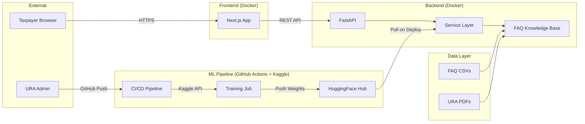
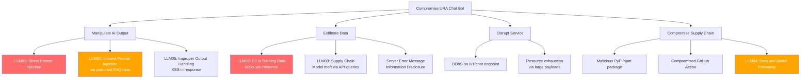
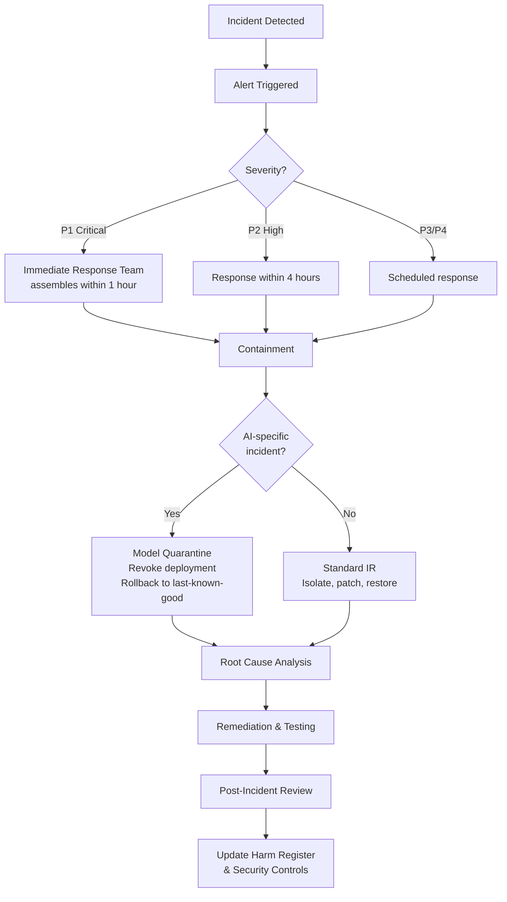

# Week 6 – Threat Model, Security Requirements & Incident Response Plan

**Project**: MLOps Pipeline for URA Chat Bot
**Date**: February 2026
**Standard Alignment**: STRIDE, OWASP LLM Top 10 (2025), NIST SP 800-218 (SSDF), ISO/IEC 42001:2023

---

## 1. STRIDE Threat Model

### 1.1 System Decomposition



### 1.2 STRIDE Analysis

| # | Threat Category | Threat Description | Affected Component | OWASP LLM 2025 | Likelihood | Impact | Risk |
|---|----------------|--------------------|--------------------|-----------------|------------|--------|------|
| T1 | **Spoofing** | Attacker impersonates legitimate API client | API Gateway | – | 3 | 3 | Medium |
| T2 | **Tampering** | Adversary modifies training data (data poisoning) | Data Layer, ML Pipeline | LLM04 | 2 | 5 | Medium |
| T3 | **Tampering** | Malicious dependency injected via supply chain | CI/CD Pipeline | – | 2 | 5 | Medium |
| T4 | **Repudiation** | User denies submitting a query; no audit trail | Backend API | – | 2 | 2 | Low |
| T5 | **Information Disclosure** | PII leaks from training data into model responses | Service Layer | LLM02 | 2 | 5 | Medium |
| T6 | **Information Disclosure** | Model weights exfiltrated via API probing | Backend API | LLM03 | 2 | 3 | Low |
| T7 | **Denial of Service** | Rate-limit bypass overwhelms inference endpoint | Backend API | – | 3 | 4 | Medium |
| T8 | **Elevation of Privilege** | Prompt injection alters system behaviour | Service Layer | LLM01 | 3 | 4 | Medium |
| T9 | **Tampering** | CORS misconfiguration enables CSRF attacks | Backend API | – | 2 | 4 | Medium |
| T10 | **Information Disclosure** | Server error messages leak internal details | Backend API | – | 3 | 2 | Low |
| T11 | **Spoofing** | Attacker compromises GitHub Actions workflow | CI/CD Pipeline | – | 1 | 5 | Low |
| T12 | **Elevation of Privilege** | Improper output handling – XSS via chatbot response | Frontend | LLM05 | 2 | 4 | Medium |

### 1.3 Threat Model Diagram (Attack Tree)



---

## 2. Security Requirements Specification (SRS)

### 2.1 Authentication & Authorization

| ID | Requirement | Priority | Standard |
|----|-------------|----------|----------|
| SR-01 | API endpoints shall require API key authentication for production deployment | High | SSDF PW.1 |
| SR-02 | Admin endpoints (future) shall require OAuth 2.0 / JWT tokens | Medium | SSDF PW.1 |
| SR-03 | Rate limiting shall be enforced: /v1/chat ≤ 60 req/min, /classify ≤ 100 req/min per IP | High | OWASP |

### 2.2 Input Validation

| ID | Requirement | Priority | Standard |
|----|-------------|----------|----------|
| SR-04 | All API inputs shall be validated via Pydantic models with max_length constraints | High | SSDF PW.5 |
| SR-05 | Chat messages shall be limited to 2000 characters | High | OWASP LLM01 |
| SR-06 | Batch classification requests shall be limited to 50 items | Medium | OWASP |
| SR-07 | Input shall be sanitised to remove known prompt injection patterns | High | OWASP LLM01 |

### 2.3 Output Security

| ID | Requirement | Priority | Standard |
|----|-------------|----------|----------|
| SR-08 | API responses shall not include stack traces or internal paths in error messages | High | SSDF PW.6 |
| SR-09 | Frontend shall escape all chatbot response content before rendering (XSS prevention) | High | OWASP LLM05 |
| SR-10 | Responses shall include source citations and confidence indicators | Medium | NIST AI RMF |

### 2.4 Data Protection

| ID | Requirement | Priority | Standard |
|----|-------------|----------|----------|
| SR-11 | Training data shall undergo PII redaction before model training | Critical | NDPA 2019, OWASP LLM02 |
| SR-12 | User conversation data shall not be persisted on the server beyond the request lifecycle | High | NDPA 2019 |
| SR-13 | All data in transit shall use TLS 1.2+ encryption | High | SSDF PO.1 |

### 2.5 Supply Chain Security

| ID | Requirement | Priority | Standard |
|----|-------------|----------|----------|
| SR-14 | All GitHub Actions shall use SHA-pinned references (no mutable tags) | High | SLSA v1.2 |
| SR-15 | Dependabot shall be enabled for all package ecosystems | High | SSDF PO.3 |
| SR-16 | Container images shall be scanned with Trivy before deployment | High | SSDF PW.4 |
| SR-17 | An SBOM (CycloneDX 1.6) shall be generated for every release | Medium | CISA SBOM |
| SR-18 | SLSA v1.2 build provenance attestation shall be generated in CI | Medium | SLSA v1.2 |

### 2.6 Infrastructure

| ID | Requirement | Priority | Standard |
|----|-------------|----------|----------|
| SR-19 | CORS shall restrict origins to an explicit allowlist (no wildcards with credentials) | High | OWASP |
| SR-20 | Docker containers shall run as non-root user | High | SSDF PO.1 |
| SR-21 | Secrets shall be injected via environment variables, never hardcoded | Critical | SSDF PO.1 |

---

## 3. Incident Response Mini-Plan

### 3.1 Incident Classification

| Severity | Description | Response Time | Examples |
|----------|-------------|---------------|----------|
| **P1 – Critical** | System compromised; data breach; harmful AI output at scale | ≤ 1 hour | PII leak, model serving malicious content, credential exposure |
| **P2 – High** | Service degradation; security vulnerability discovered | ≤ 4 hours | Prompt injection successful, dependency CVE with known exploit |
| **P3 – Medium** | Non-critical issue; potential vulnerability | ≤ 24 hours | Unusual traffic patterns, failed login attempts |
| **P4 – Low** | Informational; improvement opportunity | ≤ 7 days | New CVE with no known exploit, minor configuration issue |

### 3.2 Incident Response Workflow



### 3.3 AI-Specific Incident Playbooks

#### Playbook 1: Prompt Injection Detected
1. **Detect**: Monitoring flags unusual response patterns or user reports manipulated output
2. **Contain**: Add detected injection pattern to input blocklist; increase logging
3. **Investigate**: Review logs to assess scope; check if other users received manipulated responses
4. **Remediate**: Update input sanitisation rules; retrain if system prompt was extracted
5. **Communicate**: Notify affected users if harmful advice was given

#### Playbook 2: PII Leak in Model Responses
1. **Detect**: Automated PII scanner on output detects TIN/NIN/phone number in response
2. **Contain**: Immediately disable the affected endpoint; rollback to previous model version
3. **Investigate**: Trace PII to training data source; identify gap in redaction pipeline
4. **Remediate**: Patch redaction pipeline; retrain model; verify no PII in held-out test
5. **Notify**: Report to URA Data Protection Officer; assess NDPA notification obligations

#### Playbook 3: Supply Chain Compromise
1. **Detect**: Dependabot or Trivy flags a compromised dependency
2. **Contain**: Pin to last-known-good version; block CI deployment
3. **Investigate**: Assess if compromised version was ever deployed to production
4. **Remediate**: Update to patched version; rotate any potentially exposed secrets
5. **Communicate**: Update SBOM; document in incident register

---

## 4. DevSecOps Threat Modelling Toolchain (2026 Production Implementation)

### 4.1 Threat Model as Code (pytm)

The system architecture is defined as code in `threat-model/tm.py` using [OWASP pytm](https://github.com/OWASP/pytm), enabling automated STRIDE threat generation, DFD rendering, and CI validation.

**Architecture elements modelled:**

| Element Type | Count | Examples |
|-------------|-------|---------|
| Trust boundaries | 8 | Internet, DMZ, Backend Container, ML Pipeline, Data Layer, Mobile, CI/CD |
| Actors | 4 | Taxpayer, Mobile User, URA Admin, Adversary |
| External entities | 4 | HuggingFace Hub, Kaggle, Docker Hub, GitHub |
| Servers | 11 | Next.js, FastAPI, InputGuard, OutputGuard, Qdrant, Retriever, LLM Inference, Mobile App, On-device ML |
| Datastores | 5 | FAQ CSVs, URA PDFs, SQLite Analytics, Model Artifacts, Vector Index |
| Lambdas (CI) | 6 | CI/CD Pipeline, Training Job, Secret Scanner, Trivy, SAST, DAST, Threat Model |
| Data flows | 27 | User→Frontend→API→Guards→Retriever→LLM→Response; Admin→GitHub→CI→Kaggle→HF |

**Usage:**
```bash
# Generate DFD diagram
python threat-model/tm.py --dfd | dot -Tpng -o threat-model/output/dfd.png

# Generate STRIDE threat list
python threat-model/tm.py --describe threat-model/output/threats.md

# Validate threat registry (CI gate)
python threat-model/validate_threats.py
```

### 4.2 Threat Registry (21 Threats — STRIDE × OWASP LLM × MITRE ATLAS)

The threat registry (`threat-model/validate_threats.py`) tracks all identified threats with:
- **STRIDE category** — Spoofing, Tampering, Repudiation, Info Disclosure, DoS, Elevation
- **OWASP LLM mapping** — LLM01–LLM10 (2025 Edition)
- **MITRE ATLAS technique** — Adversarial ML threat intelligence (AML.T*)
- **Mitigation** — specific control implemented
- **Evidence** — file paths proving the mitigation exists (validated in CI)
- **Status** — mitigated / accepted / in_progress

| # | Category | Threat | OWASP LLM | MITRE ATLAS | Status |
|---|----------|--------|-----------|-------------|--------|
| T01 | Spoofing | API client impersonation | – | AML.T0052 | Mitigated |
| T02 | Tampering | Training data poisoning | LLM04 | AML.T0020 | Mitigated |
| T03 | Tampering | Malicious dependency (supply chain) | LLM03 | AML.T0010 | Mitigated |
| T04 | Repudiation | No audit trail for queries | – | – | Mitigated |
| T05 | Info Disclosure | PII leaks in model responses | LLM02 | AML.T0024.001 | Mitigated |
| T06 | Info Disclosure | Model weight exfiltration via API | LLM03 | AML.T0044 | Mitigated |
| T07 | Denial of Service | Rate-limit bypass on inference | LLM10 | AML.T0029 | Mitigated |
| T08 | Elevation | Prompt injection alters behaviour | LLM01 | AML.T0051 | Mitigated |
| T09 | Tampering | CORS misconfiguration → CSRF | – | – | Mitigated |
| T10 | Info Disclosure | Server error message leakage | – | – | Mitigated |
| T11 | Spoofing | Compromised GitHub Actions workflow | – | AML.T0010 | Mitigated |
| T12 | Elevation | XSS via chatbot response | LLM05 | – | Mitigated |
| T13 | Info Disclosure | Secrets leaked in git history | – | – | Mitigated |
| T14 | Tampering | Adversarial embedding attacks | LLM08 | AML.T0043 | Mitigated |
| T15 | Info Disclosure | System prompt extraction | LLM07 | AML.T0051.001 | Mitigated |
| T16 | Denial of Service | Resource exhaustion (large payloads) | LLM10 | AML.T0029 | Mitigated |
| T17 | Tampering | Container escape / privilege escalation | – | – | Mitigated |
| T18 | Info Disclosure | LLM generates unfaithful answers | LLM09 | AML.T0048 | Mitigated |
| T19 | Tampering | IaC misconfiguration in Dockerfiles/CI | – | – | Mitigated |
| T20 | Spoofing | Dependency confusion / typosquatting | LLM03 | AML.T0010 | Mitigated |
| T21 | Info Disclosure | Mobile model extraction via APK RE | LLM03 | AML.T0044 | Accepted |

**Coverage summary:**
- STRIDE: **6/6** categories (100%)
- OWASP LLM Top 10: **9/10** mapped (LLM06 N/A — system has no tool-use/agency)
- MITRE ATLAS: **12 techniques** mapped across 21 threats

### 4.3 SAST/DAST Tool Selection (2026 State of the Art)

All tools are open-source and run in CI via `.github/workflows/devsecops-sast-dast.yml`:

| Tool | Type | Purpose | Config File | Integration |
|------|------|---------|-------------|-------------|
| **Semgrep** v1.114+ | SAST | Python, TypeScript, React static analysis | `.semgrep/ura-chatbot-rules.yaml` | CI + pre-commit |
| **Bandit** v1.8+ | SAST | Python AST-based security linting | `.bandit.yaml` | CI + pre-commit |
| **pip-audit** | SCA | Python dependency vulnerability auditing (OSV/PyPI) | – | CI |
| **Trivy** v0.69+ | SCA + Container + IaC + License | Full supply chain scanning | `trivy.yaml` | CI (`security-trivy.yml`) |
| **Checkov** | IaC Security | Dockerfile, GitHub Actions, docker-compose compliance | `.checkov.yaml` | CI |
| **OWASP ZAP** v2.15+ | DAST | Automated baseline scan against live API | `.zap-rules.tsv` | CI (main/develop) |
| **OSSF Scorecard** | Supply Chain | OpenSSF supply chain security posture scoring | – | CI |
| **pytm** v1.3+ | Threat Model | STRIDE DFD generation and threat analysis | `threat-model/tm.py` | CI + local |

**Custom Semgrep rules** (`.semgrep/ura-chatbot-rules.yaml`) — 13 rules:

| Rule ID | Severity | Category | Description |
|---------|----------|----------|-------------|
| `ura-llm01-raw-user-input-to-llm` | ERROR | LLM01 | User input to LLM without InputGuard |
| `ura-llm02-pii-in-logs` | WARNING | LLM02 | PII patterns in log statements |
| `ura-llm05-dangerouslysetinnerhtml` | ERROR | LLM05 | XSS via dangerouslySetInnerHTML |
| `ura-llm05-eval-usage` | ERROR | LLM05 | eval()/Function() with LLM output |
| `ura-fastapi-cors-wildcard` | ERROR | OWASP | CORS allow_origins=["*"] |
| `ura-fastapi-no-rate-limit` | WARNING | LLM10 | Sensitive endpoint without rate limiting |
| `ura-python-pickle-load` | ERROR | CWE-502 | Unsafe deserialization via pickle |
| `ura-python-yaml-unsafe-load` | ERROR | CWE-502 | yaml.load without SafeLoader |
| `ura-python-hardcoded-secret` | ERROR | CWE-798 | Hardcoded secrets in variables |
| `ura-python-subprocess-shell` | ERROR | CWE-78 | Command injection via shell=True |
| `ura-python-sql-injection` | ERROR | CWE-89 | SQL injection via string formatting |
| `ura-pii-ug-tin-hardcoded` | WARNING | CWE-359 | Uganda TIN in source code |
| `ura-pii-ug-nid-hardcoded` | WARNING | CWE-359 | Uganda NIN in source code |

### 4.4 Full DevSecOps SAST/DAST Checklist

| # | Check | Tool | Frequency | Status |
|---|-------|------|-----------|--------|
| 1 | Python code scan (injection, secrets, deserialization) | Semgrep | Every PR + pre-commit | Implemented |
| 2 | TypeScript/JSX scan (XSS, eval, dangerouslySetInnerHTML) | Semgrep | Every PR + pre-commit | Implemented |
| 3 | Python AST security linting (B105-B702 checks) | Bandit | Every PR + pre-commit | Implemented |
| 4 | Dependency vulnerability scan (Python — OSV/PyPI) | pip-audit | Every PR | Implemented |
| 5 | Dependency vulnerability scan (Python/npm/Dart) | Trivy | Weekly + every PR | Implemented |
| 6 | Docker image vulnerability scan (API, ML, Frontend) | Trivy | Every build | Implemented |
| 7 | IaC misconfiguration (Dockerfiles, CI workflows) | Trivy + Checkov | Every PR | Implemented |
| 8 | License compliance (block AGPL/GPL/SSPL/BSL) | Trivy | Every PR | Implemented |
| 9 | DAST baseline scan against live API | OWASP ZAP | Every push to main/develop | Implemented |
| 10 | Supply chain security posture scoring | OSSF Scorecard | Weekly + push | Implemented |
| 11 | Threat model validation (21 threats + evidence) | pytm + validate_threats.py | Every PR | Implemented |
| 12 | SBOM generation (CycloneDX) for all images | Trivy | Every build | Implemented |
| 13 | Secret scanning (4-layer defence-in-depth) | TruffleHog + Gitleaks + ggshield + detect-secrets | Every PR + pre-commit + weekly | Implemented |
| 14 | Prompt injection testing | Manual red-team | Quarterly | Planned |

### 4.5 CI Security Pipeline Architecture

```mermaid
flowchart TD
    subgraph Trigger ["Trigger Events"]
        PUSH[Push to main/develop]
        PR[Pull Request]
        SCHED[Weekly Schedule]
    end

    subgraph SecretScan ["Secret Scanning Pipeline"]
        TH[TruffleHog v3]
        GL[Gitleaks v8]
        GG[ggshield ML]
        DS[detect-secrets]
    end

    subgraph SAST_DAST ["DevSecOps SAST/DAST Pipeline"]
        SG[Semgrep SAST]
        BD[Bandit Python SAST]
        PA[pip-audit SCA]
        CK[Checkov IaC]
        ZAP[OWASP ZAP DAST]
        SC[OSSF Scorecard]
        TM[Threat Model Validation]
    end

    subgraph TrivyScan ["Trivy Security Pipeline"]
        FS[Filesystem Scan]
        IAC[IaC Misconfig Scan]
        LIC[License Compliance]
        CA[Container: API Image]
        CM[Container: ML Image]
        CF[Container: Frontend Image]
    end

    subgraph Gates ["Security Gates"]
        G1[Secret Gate]
        G2[DevSecOps Gate]
        G3[Trivy Security Gate]
    end

    PUSH --> SecretScan & SAST_DAST & TrivyScan
    PR --> SecretScan & SAST_DAST & TrivyScan
    SCHED --> SecretScan & SAST_DAST & TrivyScan

    TH & GL & GG & DS --> G1
    SG & BD & PA & CK & ZAP & SC & TM --> G2
    FS & IAC & LIC & CA & CM & CF --> G3

    G1 & G2 & G3 -->|All PASS| DEPLOY[Safe to Deploy]
    G1 & G2 & G3 -->|Any FAIL| BLOCK[Block Merge/Deploy]

    style BLOCK fill:#ff6b6b,color:#fff
    style DEPLOY fill:#51cf66,color:#fff
```



---

## 5. Pre-Commit Security Hooks

Eight pre-commit hooks enforce security locally before code reaches CI:

| Hook | Tool | Stage | Purpose |
|------|------|-------|---------|
| TruffleHog | v3.88.0 | pre-commit, pre-push | Verified credential detection (800+ types) |
| Gitleaks | v8.24.0 | pre-commit | Regex + entropy secret scanning |
| detect-secrets | v1.5.0 | pre-commit | Baseline-aware entropy scanning |
| Semgrep | v1.114.0 | pre-commit | Multi-language SAST (custom + OWASP rules) |
| Bandit | v1.8.3 | pre-commit | Python AST security linting |
| Block large files | pre-commit-hooks | pre-commit | Files >500 KB blocked |
| Detect private keys | pre-commit-hooks | pre-commit | .pem/.key/RSA header detection |
| Block main commits | pre-commit-hooks | pre-commit | Direct commits to main/master blocked |

Setup: `pip install pre-commit && pre-commit install --hook-type pre-commit --hook-type pre-push`

---

*This document is aligned with STRIDE methodology, OWASP LLM Top 10 (2025 Edition), MITRE ATLAS, NIST SP 800-218 (SSDF), NIST AI RMF 1.0, SLSA v1.2, CIS Docker Benchmark, OpenSSF Scorecard, and ISO/IEC 42001:2023.*
