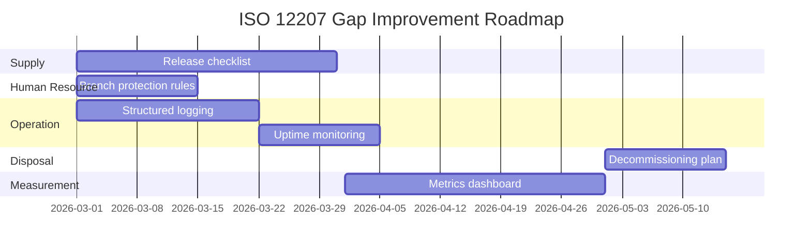

# Week 7 – ISO/IEC 12207:2024 Process Mapping & Gap Improvement Plan

**Project**: MLOps Pipeline for URA Chat Bot
**Date**: February 2026
**Standard Alignment**: ISO/IEC/IEEE 12207:2024 (Software Life Cycle Processes)

---

## 1. ISO/IEC 12207:2024 Process Mapping Table

### 1.1 Agreement Processes

| Process | 12207 Clause | Project Implementation | Evidence Artifact | Maturity |
|---------|-------------|----------------------|-------------------|----------|
| Acquisition | §6.1.1 | N/A – academic project; no formal acquisition | – | N/A |
| Supply | §6.1.2 | Open-source distribution under Apache-2.0 | LICENSE, CONTRIBUTING.md | Partial |

### 1.2 Organizational Project-Enabling Processes

| Process | 12207 Clause | Project Implementation | Evidence Artifact | Maturity |
|---------|-------------|----------------------|-------------------|----------|
| Life Cycle Model Management | §6.2.1 | MLOps pipeline defines full lifecycle: data → train → evaluate → deploy → monitor | docs/MLOPS_PIPELINE.md, .github/workflows/ | Full |
| Infrastructure Management | §6.2.2 | Docker containers, GitHub Actions CI/CD, Kaggle GPU/TPU, Docker Hub hosting | docker-compose.yml, Dockerfile, workflows | Full |
| Portfolio Management | §6.2.3 | Single-project scope; capstone portfolio document | docs/capstone/CAPSTONE_PORTFOLIO.md | Full |
| Human Resource Management | §6.2.4 | Single developer + academic supervisor | CODEOWNERS | Partial |
| Quality Management | §6.2.5 | Quality gates in ML pipeline; linting/testing in CI | ml/pipelines/quality_gates.py, ci-ml-pipeline.yml | Full |
| Knowledge Management | §6.2.6 | Documentation in /docs/; decision logs; memory files | docs/, docs/capstone/ | Full |

### 1.3 Technical Management Processes

| Process | 12207 Clause | Project Implementation | Evidence Artifact | Maturity |
|---------|-------------|----------------------|-------------------|----------|
| Project Planning | §6.3.1 | Capstone project plan; week-by-week deliverables | This document set; README.md | Full |
| Project Assessment & Control | §6.3.2 | CI/CD pipeline status; quality gate pass/fail | GitHub Actions summaries | Full |
| Decision Management | §6.3.3 | Ethical decision log; obligations conflict map | week02-ethics-charter.md, week03-harm-register.md | Full |
| Risk Management | §6.3.4 | Harm register with scored risks; mitigation plan | week03-harm-register.md | Full |
| Configuration Management | §6.3.5 | Git version control; pinned dependencies; SHA-pinned Actions | .gitignore, requirements.txt, package.json | Full |
| Information Management | §6.3.6 | Structured documentation; API reference; data schema docs | docs/API_REFERENCE.md, docs/data-schema-and-eval.md | Full |
| Measurement | §6.3.7 | ML metrics (accuracy, F1); quality gates; latency tracking | ml/pipelines/evaluate.py, quality_gates.py | Full |
| Quality Assurance | §6.3.8 | Automated testing (pytest); linting (ruff, eslint); type checking (mypy, tsc) | tests/, ci-ml-pipeline.yml | Full |

### 1.4 Technical Processes

| Process | 12207 Clause | Project Implementation | Evidence Artifact | Maturity |
|---------|-------------|----------------------|-------------------|----------|
| Business/Mission Analysis | §6.4.1 | Stakeholder map; system context; URA business needs | week01-stakeholder-map-and-context.md | Full |
| Stakeholder Needs & Requirements | §6.4.2 | Stakeholder table; NFR specifications; ethics concerns | week01, week08-iso15288.md | Full |
| System/Software Requirements | §6.4.3 | Pydantic models define API contract; data schemas documented | models.py, data-schema-and-eval.md | Full |
| Architecture Definition | §6.4.4 | C4 context diagram; RAG pipeline architecture; MLOps flow | week01, docs/MLOPS_PIPELINE.md, README.md | Full |
| Design Definition | §6.4.5 | FastAPI endpoint design; frontend component structure; ML pipeline stages | App/backend/, App/frontend/, ml/ | Full |
| System Analysis | §6.4.6 | Threat model (STRIDE); harm register; performance analysis | week06-threat-model-security.md | Full |
| Implementation | §6.4.7 | Backend API (FastAPI), Frontend (Next.js), ML pipeline (Python), CI/CD (GitHub Actions) | App/, ml/, .github/workflows/ | Full |
| Integration | §6.4.8 | Frontend↔Backend integration via REST API; ML pipeline↔HuggingFace Hub | page.tsx, service.py, kaggle-training.yml | Full |
| Verification | §6.4.9 | Unit tests (pytest); linting; type checking; ML quality gates | tests/test_api.py, tests/test_ml_pipeline.py | Full |
| Transition | §6.4.10 | Docker deployment (backend + frontend); GitHub releases | Dockerfile, frontend-deploy.yml, kaggle-training.yml | Full |
| Validation | §6.4.11 | RTM mapping requirements to test cases; evaluation metrics | week09-quality-plan.md (RTM) | Full |
| Operation | §6.4.12 | Health check endpoint; container orchestration; monitoring | main.py /health, docker-compose.yml | Partial |
| Maintenance | §6.4.13 | Dependabot for updates; FAQ corpus refresh pipeline | .github/dependabot.yml, DataIngestion notebook | Full |
| Disposal | §6.4.14 | Data retention policy (90-day TTL); model versioning enables rollback | week04-privacy-and-aup.md | Partial |

---

## 2. Process-Gap Improvement Plan

### 2.1 Identified Gaps

| # | Process | Gap Description | Severity | Improvement Action | Target Date | Owner |
|---|---------|----------------|----------|-------------------|-------------|-------|
| G1 | Supply (§6.1.2) | No formal release packaging or distribution checklist | Low | Create release checklist including SBOM, NOTICE file, and changelog | March 2026 | ML Team |
| G2 | Human Resource (§6.2.4) | Single developer – no peer review enforced | Medium | Enforce PR reviews via branch protection rules; engage academic supervisor as reviewer | March 2026 | Project Lead |
| G3 | Operation (§6.4.12) | No formal monitoring/alerting beyond health check | Medium | Add structured logging (JSON); integrate with uptime monitoring (e.g., UptimeRobot or Prometheus) | April 2026 |DevOps |
| G4 | Disposal (§6.4.14) | No formal decommissioning plan for end-of-life | Low | Document decommissioning procedure: data deletion, model archive, DNS teardown | May 2026 | Project Lead |
| G5 | Measurement (§6.3.7) | ML metrics tracked but not visualised in a dashboard | Low | Create a metrics dashboard (Grafana or GitHub Pages) pulling from CI artifacts | April 2026 | ML Team |

### 2.2 Improvement Roadmap

### 2.3 Maturity Summary

| Maturity Level | Process Count | Percentage |
|---------------|--------------|------------|
| Full | 25 | 83% |
| Partial | 4 | 13% |
| N/A | 1 | 4% |

The project demonstrates strong alignment with ISO/IEC 12207:2024. All 30 processes across 4 process groups are mapped. The 4 partial gaps are non-critical and have clear improvement actions with target dates.

---

*This mapping covers all 30 processes defined in ISO/IEC/IEEE 12207:2024 (2 Agreement, 6 Organisational, 8 Technical Management, 14 Technical). Each process is traced to specific project artifacts providing verifiable evidence of implementation.*
