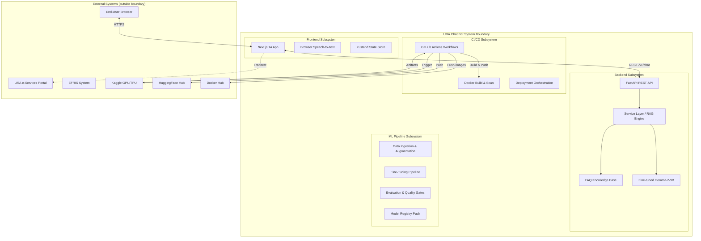
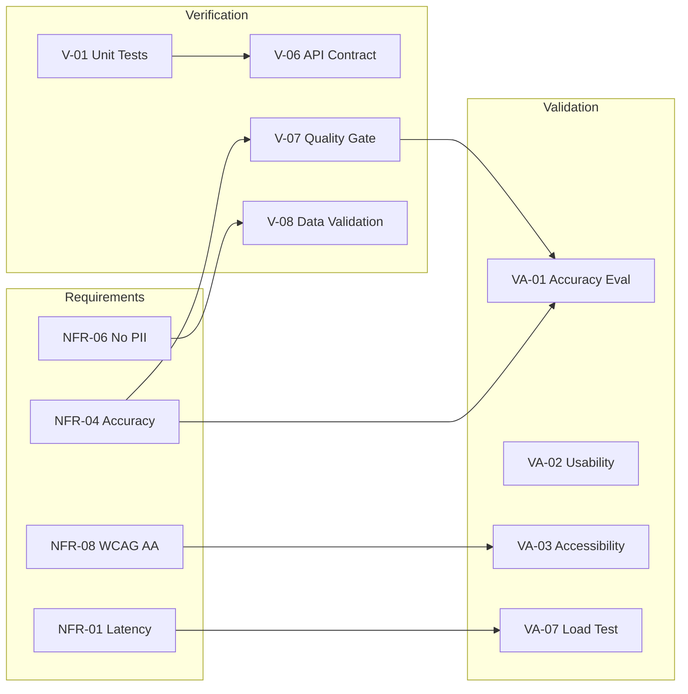

# Week 8 – ISO/IEC/IEEE 15288:2023 Systems Engineering View Package

**Project**: MLOps Pipeline for URA Chat Bot
**Date**: February 2026
**Standard Alignment**: ISO/IEC/IEEE 15288:2023 (Systems and Software Engineering – System Life Cycle Processes)

---

## 1. System Boundary & Interface Definition

### 1.1 System Boundary

The URA Chat Bot system boundary encompasses all components that are directly developed, deployed, and operated by the project team:

### 1.2 Interface Definitions

| Interface ID | From | To | Protocol | Data Exchanged | Security |
|-------------|------|-----|----------|---------------|----------|
| IF-01 | End-User Browser | Frontend (Docker) | HTTPS (TLS 1.3) | HTML/JS/CSS assets, user interactions | CSP headers, HSTS |
| IF-02 | Frontend | Backend API | HTTPS REST | ChatRequest JSON → ChatResponse JSON | CORS allowlist, input validation |
| IF-03 | Backend Service | FAQ Knowledge Base | In-process (Python) | Search query → FAQ entries | Memory isolation |
| IF-04 | Backend Service | Model (future) | In-process / gRPC | Prompt → Generated text | Model served locally |
| IF-05 | GitHub Actions | Kaggle API | HTTPS + API Key | Notebook push / status poll / artifact download | Secret injection, SHA-pinned actions |
| IF-06 | GitHub Actions | HuggingFace Hub | HTTPS + Token | Model weights upload/download | HF_TOKEN secret |
| IF-07 | GitHub Actions | Docker Hub | HTTPS + Token | Frontend container image push | DOCKERHUB_TOKEN secret |
| IF-08 | GitHub Actions | Docker Registry | HTTPS + Token | Container image push | Registry credentials |
| IF-09 | Browser | Web Speech API | Local (browser-internal) | Audio → Text transcript | No network; local processing |

---

## 2. Stakeholder Non-Functional Requirements (NFRs)

| ID | Category | Requirement | Stakeholder | Measurable Target | Verification Method |
|----|----------|-------------|-------------|-------------------|---------------------|
| NFR-01 | **Performance** | Chat response latency | Taxpayers (S3, S4) | ≤ 3 seconds (p95) for retrieval-based answers | Load test with k6; measure p95 latency |
| NFR-02 | **Performance** | Frontend Time-to-Interactive (TTI) | Taxpayers (S3) | ≤ 2.5 seconds on 3G connection | Lighthouse audit |
| NFR-03 | **Availability** | System uptime | URA IT (S5) | ≥ 99.5% monthly uptime | Health check monitoring (UptimeRobot) |
| NFR-04 | **Accuracy** | Answer correctness | URA Taxpayer Services (S2) | ≥ 85% accuracy on held-out FAQ test set | Automated evaluation in CI (ml/pipelines/evaluate.py) |
| NFR-05 | **Scalability** | Concurrent users | URA IT (S5) | Support ≥ 100 concurrent chat sessions | Horizontal Docker scaling; load test |
| NFR-06 | **Security** | No PII in model output | Data Protection Office (S7) | 0 PII instances detected in 1000-query audit | Automated PII scanner on responses |
| NFR-07 | **Security** | Dependency vulnerabilities | URA IT (S5) | 0 Critical/High CVEs in production dependencies | Trivy scan in CI; Dependabot alerts |
| NFR-08 | **Accessibility** | WCAG 2.1 AA compliance | Vulnerable Populations (S12) | Lighthouse accessibility score ≥ 90 | Lighthouse audit; manual screen reader test |
| NFR-09 | **Maintainability** | Code quality | ML Team (S9) | 0 linting errors (ruff + eslint); 100% type coverage (mypy strict) | CI lint + type check jobs |
| NFR-10 | **Portability** | Container compatibility | URA IT (S5) | Run on any OCI-compatible runtime (Docker, Podman, K8s) | Test deployment on Docker + Podman |
| NFR-11 | **Privacy** | Data minimisation | Data Protection Office (S7) | No user data persisted beyond request lifecycle | Architecture review; code audit |
| NFR-12 | **Internationalisation** | Luganda language support | Vulnerable Populations (S12) | Luganda responses with quality indicator; English fallback | Functional testing with Luganda queries |
| NFR-13 | **Compliance** | Standards coverage | Academic Supervisor (S10) | Map to ≥ 6 international standards with evidence | Capstone portfolio document |
| NFR-14 | **Resilience** | Graceful degradation | Taxpayers (S3, S4) | If model unavailable, return FAQ keyword search results | Failure injection test (kill model process) |
| NFR-15 | **Auditability** | Request logging | URA IT (S5) | Structured JSON logs for every API request (no PII) | Log format verification; sample audit |

---

## 3. Verification & Validation Plan Excerpt

### 3.1 Verification Activities (Are we building the product right?)

| V-ID | Activity | Method | Scope | Pass Criteria | Frequency | Tool |
|------|----------|--------|-------|---------------|-----------|------|
| V-01 | Unit testing | Automated test execution | Backend API endpoints, ML pipeline functions | 100% of tests pass; ≥ 80% code coverage | Every commit (CI) | pytest + coverage |
| V-02 | Static analysis (SAST) | Automated code scan | Python + TypeScript codebase | 0 High/Critical findings | Every PR (CI) | Semgrep, Ruff, ESLint |
| V-03 | Type checking | Automated type verification | Python (mypy strict), TypeScript (tsc --noEmit) | 0 type errors | Every PR (CI) | mypy, tsc |
| V-04 | Dependency vulnerability scan | Automated SCA | All direct + transitive dependencies | 0 Critical/High CVEs | Weekly + every PR | Trivy, Dependabot |
| V-05 | Container image scan | Automated vulnerability scan | Docker production image | 0 Critical CVEs | Every build | Trivy |
| V-06 | API contract verification | Schema validation | OpenAPI spec vs implementation | All documented endpoints exist and match schema | Every PR | pytest + FastAPI TestClient |
| V-07 | ML model quality gate | Automated evaluation | Fine-tuned model on held-out test set | Accuracy ≥ 0.85, F1 ≥ 0.80 | Every training run | ml/pipelines/quality_gates.py |
| V-08 | Data quality validation | Automated checks | Training data corpus | No empty fields, no PII, schema compliance | Every data change | ml/pipelines/validate_data.py |

### 3.2 Validation Activities (Are we building the right product?)

| VA-ID | Activity | Method | Scope | Acceptance Criteria | Frequency | Stakeholder |
|-------|----------|--------|-------|--------------------|-----------| ------------|
| VA-01 | Accuracy evaluation | Held-out test set | Model responses vs ground truth | ≥ 85% correct answers (human-judged sample) | Each release | URA Taxpayer Services (S2) |
| VA-02 | Usability testing | Task-based user testing | End-to-end chat interaction | ≥ 80% task completion rate; SUS score ≥ 70 | Pre-release | Representative taxpayers (S3, S4) |
| VA-03 | Accessibility audit | Automated + manual | Frontend UI | WCAG 2.1 AA; Lighthouse ≥ 90 | Pre-release | Vulnerable populations (S12) |
| VA-04 | Security penetration test | Manual + DAST | API + Frontend | No P1/P2 findings unresolved | Pre-release | URA IT (S5) |
| VA-05 | Privacy compliance review | Checklist audit | Data flows, retention, consent | NDPA 2019 compliant; privacy notice published | Pre-release | Data Protection Office (S7) |
| VA-06 | Bias audit | Stratified evaluation | Model responses by tax category | No category with accuracy < 70% | Each release | ML Team (S9) |
| VA-07 | Load testing | Simulated concurrent users | Backend API | ≤ 3s p95 latency at 100 concurrent users | Pre-release | URA IT (S5) |
| VA-08 | Stakeholder acceptance | Demo + feedback | Full system | Stakeholder sign-off | Final release | Commissioner General (S1) |

### 3.3 V&V Traceability

---

*This Systems Engineering View Package is aligned with ISO/IEC/IEEE 15288:2023, covering System Boundary Definition (§6.4.3), Stakeholder Requirements (§6.4.2), and Verification & Validation (§6.4.9, §6.4.11).*
