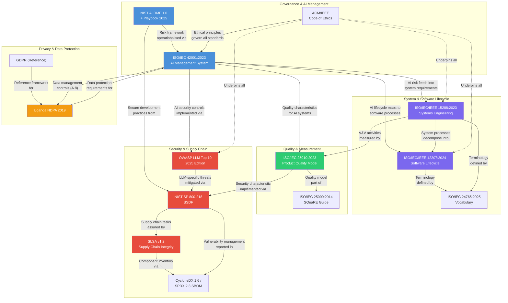

# Week 10 – Standards Relationship Map

**Project**: MLOps Pipeline for URA Chat Bot
**Date**: February 2026

---

## 1. Standards Relationship Diagram

---

## 2. Standards Relationship Table

| Standard A | Standard B | Relationship | How They Interlink in This Project |
|-----------|-----------|-------------|-----------------------------------|
| ISO/IEC 42001:2023 | ISO/IEC/IEEE 15288:2023 | AI risk assessment (42001 §6.1) feeds into system requirements (15288 §6.4.2) | Harm register (42001) becomes NFRs in 15288 stakeholder requirements |
| ISO/IEC 42001:2023 | ISO/IEC/IEEE 12207:2024 | AI lifecycle (42001 §3.3) maps to software lifecycle processes (12207 §6.4) | ML pipeline stages (data→train→evaluate→deploy) map 1:1 to 12207 technical processes |
| ISO/IEC 42001:2023 | ISO/IEC 25010:2023 | AI quality objectives (42001 §6.2) measured by quality characteristics (25010) | Model accuracy (functional suitability), latency (performance), PII protection (security) |
| ISO/IEC 42001:2023 | OWASP LLM Top 10 2025 | AI security controls (42001 Annex A) address LLM-specific threats (OWASP) | Prompt injection (LLM01), data poisoning (LLM04), PII leakage (LLM02) mitigated |
| ISO/IEC 42001:2023 | NIST AI RMF 1.0 | AI risk management (42001 §6.1) operationalises NIST MAP/MEASURE/MANAGE | Harm register uses NIST categories; mitigation plans follow MANAGE functions |
| ISO/IEC 42001:2023 | NDPA 2019 | Data management controls (42001 §A.8) implement NDPA requirements | PII redaction, data minimisation, consent, data subject rights |
| ISO/IEC/IEEE 15288:2023 | ISO/IEC/IEEE 12207:2024 | System processes (15288) decompose into software processes (12207) | System architecture (15288) decomposes into backend/frontend/ML software (12207) |
| ISO/IEC/IEEE 15288:2023 | ISO/IEC 25010:2023 | V&V activities (15288 §6.4.9/11) use quality characteristics (25010) as criteria | NFRs (latency, security, accessibility) verified against 25010 quality model |
| ISO/IEC/IEEE 12207:2024 | ISO/IEC 24765:2025 | Software processes use standardised vocabulary from 24765 | Project glossary terms (verification, validation, lifecycle) defined per 24765 |
| NIST SP 800-218 (SSDF) | SLSA v1.2 | SSDF secure supply chain tasks (PO.3, PS.3) implemented via SLSA levels | SHA-pinned Actions, build provenance attestation, SBOM generation |
| NIST SP 800-218 (SSDF) | OWASP LLM Top 10 2025 | SSDF secure coding practices (PW.*) mitigate OWASP LLM threats | Input validation (PW.5) prevents prompt injection; output handling (PW.6) prevents XSS |
| NIST SP 800-218 (SSDF) | CycloneDX 1.6 | SSDF component inventory (PO.3) materialised as machine-readable SBOM | sbom-cyclonedx.json generated per release with all dependencies |
| SLSA v1.2 | CycloneDX 1.6 | SLSA provenance complements SBOM component inventory | Build provenance attestation + SBOM provide full supply chain transparency |
| NIST AI RMF 1.0 | ACM/IEEE Ethics | AI RMF GOVERN function operationalises ethical principles | Ethics charter (ACM/IEEE) → GOVERN-1 policies → MAP/MEASURE/MANAGE activities |
| ISO/IEC 25010:2023 | NIST SP 800-218 | 25010 Security characteristic implemented via SSDF practices | Confidentiality, integrity, accountability measured; SSDF practices ensure them |
| NDPA 2019 | GDPR | NDPA modelled on GDPR principles; GDPR used as reference framework | Privacy notice follows GDPR structure; adapted for Ugandan legal context |

---

## 3. Project Coverage Matrix

| Standard | Artifact(s) Demonstrating Compliance | Gap Status |
|----------|--------------------------------------|------------|
| ISO/IEC 42001:2023 | Ethics charter, harm register, privacy notice, data provenance | Closed |
| NIST AI RMF 1.0 | Harm register (MAP/MEASURE/MANAGE categories), ethical decision log | Closed |
| ISO/IEC/IEEE 12207:2024 | week07 full 30-process mapping table | Closed |
| ISO/IEC/IEEE 15288:2023 | week08 system boundary, NFRs, V&V plan | Closed |
| ISO/IEC 25010:2023 | week09 quality plan with 8 characteristics mapped | Closed |
| ISO/IEC 24765:2025 | week09 glossary with 20 project-specific terms | Closed |
| NIST SP 800-218 (SSDF) | week06 security requirements mapped to SSDF tasks | Closed |
| OWASP LLM Top 10 2025 | week06 STRIDE + OWASP threat model | Closed |
| SLSA v1.2 | SHA-pinned Actions, attestation in kaggle-training.yml, SBOM | Closed |
| CycloneDX 1.6 | sbom-cyclonedx.json | Closed |
| NDPA 2019 / GDPR | week04 privacy notice, AUP, complaint workflow | Closed |
| ACM/IEEE Code of Ethics | week02 ethics charter with explicit ACM/IEEE mapping | Closed |

---

*All 12 standards/frameworks are now fully mapped with traceable artifacts in this project.*
