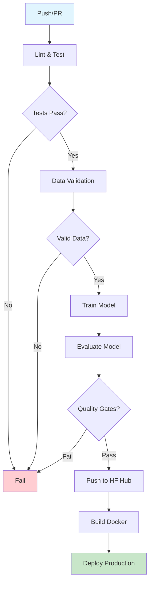
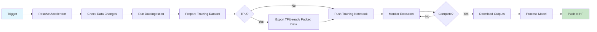

# MLOps CI/CD Workflows Documentation

## Overview

This project implements a comprehensive MLOps CI/CD pipeline following DataCamp best practices for ML systems. The pipeline automates model training, evaluation, deployment, and monitoring across multiple platforms.

```
┌─────────────────────────────────────────────────────────────────────────────┐
│                           MLOps Pipeline Architecture                        │
├─────────────────────────────────────────────────────────────────────────────┤
│                                                                             │
│  ┌─────────┐    ┌─────────┐    ┌─────────┐    ┌─────────┐    ┌─────────┐  │
│  │  Code   │───▶│  Test   │───▶│  Train  │───▶│  Eval   │───▶│ Deploy  │  │
│  │  Push   │    │  Lint   │    │  Model  │    │ Quality │    │  Prod   │  │
│  └─────────┘    └─────────┘    └─────────┘    └─────────┘    └─────────┘  │
│       │              │              │              │              │        │
│       ▼              ▼              ▼              ▼              ▼        │
│   GitHub         Ruff/Black     Kaggle/       Quality       Hugging Face  │
│   Actions        MyPy/Pytest    Local GPU/TPU  Gates         DockerHub    │
│                                                              Vercel       │
└─────────────────────────────────────────────────────────────────────────────┘
```

## Workflows

### 1. ML Pipeline CI/CD (`ci-ml-pipeline.yml`)

**Primary workflow** for ML model development, testing, and deployment.

#### Triggers
- **Push**: `main`, `develop`, `feat/*` branches
- **Pull Request**: `main`, `develop` branches
- **Manual Dispatch**: With options for training and deployment

#### Pipeline Stages

| Stage | Job Name | Description | Dependencies |
|-------|----------|-------------|--------------|
| 1 | `lint-and-test` | Code quality checks | None |
| 2 | `data-validation` | Validate dataset integrity | lint-and-test |
| 3 | `train-model` | Train ML model | data-validation |
| 4 | `evaluate-model` | Model performance evaluation | train-model |
| 5 | `push-to-huggingface` | Deploy model to HF Hub | evaluate-model |
| 6 | `build-docker` | Build and push Docker image | lint-and-test |
| 7 | `deploy-backend` | Deploy API to production | build-docker, push-to-huggingface |

#### Stage Details

##### Stage 1: Lint & Test
```yaml
Tools Used:
- Ruff: Fast Python linter
- Black: Code formatter
- isort: Import sorter
- MyPy: Type checker
- Pytest: Unit testing with coverage
```

##### Stage 2: Data Validation
```yaml
Tools Used:
- Pandas: Data manipulation
- Great Expectations: Data quality
- Pydantic: Schema validation

Output:
- Results/reports/data_validation_report.json
```

##### Stage 3: Model Training
```yaml
Execution:
- Local: GitHub Actions runner
- Remote: Kaggle notebooks (GPU/TPU)

Configuration:
- ml/configs/training_config.yaml

Output:
- Model/ directory
- Results/metrics/training_metrics.json
```

##### Stage 4: Model Evaluation
```yaml
Metrics Computed:
- Accuracy, Precision, Recall, F1
- Confusion Matrix
- Classification Report

Output:
- Results/evaluation/
```

##### Stage 5: Quality Gates
```yaml
Checks:
- Minimum accuracy threshold
- Maximum latency requirements
- Model size constraints

Script: ml/pipelines/quality_gates.py
```

##### Stage 6: Hugging Face Deployment
```yaml
Target: mpairweLandwind/ura-chatbot
Method: huggingface_hub Python SDK
```

##### Stage 7: Docker Build
```yaml
Features:
- Multi-stage builds
- Non-root runtime users
- Read-only filesystem + dropped Linux capabilities (compose runtime hardening)
- GitHub Actions cache (gha)
- Trivy security scanning
- Automatic tagging (branch, sha, latest)
```

---

### 2. Frontend CI/CD (`frontend-deploy.yml`)

**Handles Next.js frontend** deployment to Vercel.

#### Triggers
- **Push**: `main`, `develop` branches (frontend changes)
- **Pull Request**: `main` branch (frontend changes)
- **Manual Dispatch**

#### Pipeline Stages

| Stage | Job Name | Description | Environment |
|-------|----------|-------------|-------------|
| 1 | `lint-frontend` | ESLint + TypeScript checks | - |
| 2 | `build-frontend` | Next.js production build | - |
| 3 | `deploy-preview` | Deploy PR preview | preview |
| 4 | `deploy-production` | Deploy to production | production |

#### Features
- **Bun**: Fast JavaScript runtime and package manager
- **Preview Deployments**: Automatic PR preview URLs
- **PR Comments**: Bot comments with preview link
- **Production Gates**: Only `main` branch deploys to production

---

### 3. Kaggle Training (`kaggle-training.yml`)

**Remote Kaggle training** with accelerator-aware execution (GPU or TPU).

#### Triggers
- **Push**: `Notebooks/**`, `Data/**`, `ml/**`, workflow changes
- **Manual Dispatch**: Select notebook + accelerator options

#### Pipeline Stages

| Stage | Job Name | Description |
|-------|----------|-------------|
| 1 | `resolve-accelerator` | Resolve `gpu|tpu` mode (manual default: `tpu`) |
| 2 | `check-data-changes` | Detect if data pipeline should run |
| 3 | `upload-data-to-kaggle` | Upload `Data/` package to Kaggle dataset |
| 4 | `run-data-ingestion` | Run `DataIngestion_Augmentation` notebook |
| 5 | `prepare-kaggle` | Build training dataset + notebook metadata |
| 6 | `monitor-training` | Monitor kernel completion (accelerator-aware timeout) |
| 7 | `process-model` | Download and process outputs |
| 8 | `fine-tune-model` | Optional post-training fine-tune stage |

#### Manual Dispatch Inputs

| Input | Type | Default | Notes |
|-------|------|---------|-------|
| `notebook` | choice | `ura-training` | Target notebook |
| `accelerator` | choice | `tpu` | `gpu` or `tpu` |
| `gpu` | boolean | `true` | Deprecated compatibility flag |
| `run_data_eda` | boolean | `false` | Controls EDA execution in data-ingestion notebook |
| `run_data_pipeline_first` | boolean | `false` | Forces data-ingestion stage |
| `skip_data_upload` | boolean | `false` | Skip dataset upload stage |

#### Notebook Options
| Notebook | Description |
|----------|-------------|
| `ura-training` | Main classification model |
| `embedding-fine-tune` | Fine-tune embeddings |
| `full-pipeline` | Complete end-to-end training |

#### Features
- **Accelerator Switch**: Clean `gpu|tpu` selection at dispatch
- **TPU-Ready Export**: Fixed-length packed data blocks at `Data/processed/tpu_ready`
- **DataIngestion EDA Toggle**: Faster CI path by skipping heavy EDA unless requested
- **Output Monitoring**: Polls until completion
- **Automatic Upload**: Pushes to Hugging Face

---

## Required Secrets

Configure these in GitHub repository settings:

### ML Pipeline
| Secret | Description | Required For |
|--------|-------------|--------------|
| `HF_TOKEN` | Hugging Face API token | Model deployment |
| `DOCKERHUB_USERNAME` | DockerHub username | Image push |
| `DOCKERHUB_TOKEN` | DockerHub access token | Image push |
| `MLFLOW_TRACKING_URI` | MLflow server URL | Experiment tracking |
| `DEPLOY_KEY` | SSH key for production | Backend deployment |
| `API_HOST` | Production server address | Backend deployment |

### Kaggle
| Secret | Description | Required For |
|--------|-------------|--------------|
| `KAGGLE_USERNAME` | Kaggle account username | Kaggle API |
| `KAGGLE_API_TOKEN` | Kaggle API key | Kaggle API |

### Frontend
| Secret | Description | Required For |
|--------|-------------|--------------|
| `VERCEL_TOKEN` | Vercel API token | Deployments |
| `VERCEL_ORG_ID` | Vercel organization ID | Deployments |
| `VERCEL_PROJECT_ID` | Vercel project ID | Deployments |

---

## Required Variables

Configure these in GitHub repository settings:

| Variable | Default | Description |
|----------|---------|-------------|
| `HF_REPO` | `mpairweLandwind/ura-chatbot` | Hugging Face repo |
| `DOCKER_IMAGE` | `landwind/ura-chatbot-api` | Docker image name |
| `API_URL` | - | Production API URL |
| `NEXT_PUBLIC_API_URL` | - | API URL for frontend |
| `PRODUCTION_URL` | - | Production frontend URL |

---

## Directory Structure

```
FinalYearProject/
├── .github/
│   └── workflows/
│       ├── ci-ml-pipeline.yml    # Main ML CI/CD
│       ├── frontend-deploy.yml    # Frontend deployment
│       └── kaggle-training.yml    # Kaggle GPU/TPU training
├── ml/
│   ├── configs/
│   │   └── training_config.yaml   # Training hyperparameters
│   ├── pipelines/
│   │   ├── train.py              # Training script
│   │   ├── evaluate.py           # Evaluation script
│   │   ├── validate_data.py      # Data validation
│   │   ├── quality_gates.py      # Quality checks
│   │   └── push_to_hub.py        # HF deployment
│   ├── scripts/
│   │   ├── prepare_kaggle_notebook.py
│   │   ├── monitor_kaggle.py
│   │   ├── export_tpu_ready_data.py
│   │   └── process_kaggle_output.py
│   └── huggingface/
│       ├── README.md
│       └── app.py
├── Model/                         # Trained model artifacts
├── Results/
│   ├── metrics/                   # Training metrics
│   ├── reports/                   # Validation reports
│   └── plots/                     # Visualization outputs
└── Data/
    └── dataset/                   # Training CSV files
```

---

## Workflow Diagrams

### CI/CD Pipeline Flow



### Kaggle Training Flow



---

## Manual Workflow Dispatch

### Run Full Training
```bash
gh workflow run ci-ml-pipeline.yml \
  -f run_training=true \
  -f deploy_model=true
```

### Run Kaggle Training
```bash
gh workflow run kaggle-training.yml \
  -f notebook=ura-training
```

### Run Kaggle Training on TPU (recommended)
```bash
gh workflow run kaggle-training.yml \
  -f notebook=ura-training \
  -f accelerator=tpu \
  -f run_data_eda=false
```

### Run Kaggle Training on GPU
```bash
gh workflow run kaggle-training.yml \
  -f notebook=ura-training \
  -f accelerator=gpu
```

### Deploy Frontend Only
```bash
gh workflow run frontend-deploy.yml
```

---

## Monitoring & Observability

### Artifacts Generated
Each workflow run produces artifacts downloadable from GitHub Actions:

| Artifact | Workflow | Contents |
|----------|----------|----------|
| `data-validation-report` | ci-ml-pipeline | JSON validation results |
| `trained-model` | ci-ml-pipeline | Model files, metrics |
| `evaluation-results` | ci-ml-pipeline | Evaluation reports |
| `frontend-build` | frontend-deploy | Next.js build output |
| `data-pipeline-outputs` | kaggle-training | Processed data + EDA outputs from data-ingestion |
| `kaggle-training-outputs` | kaggle-training | Kaggle notebook outputs |
| `tpu-ready-data` | kaggle-training | Packed fixed-length training shards |

### GitHub Step Summary
Each job posts summaries to the GitHub Actions summary tab:
- Training metrics
- Evaluation results
- Deployment URLs
- Error reports

---

## Troubleshooting

### Common Issues

| Issue | Solution |
|-------|----------|
| HF push fails | Check `HF_TOKEN` secret is valid |
| Kaggle timeout | Increase `--timeout` in monitor script |
| Docker build fails | Check Dockerfile syntax, base image availability |
| Vercel deploy fails | Verify `VERCEL_*` secrets are configured |
| Tests fail | Run `pytest tests/ -v` locally first |

### Debugging Commands
```bash
# View workflow runs
gh run list --workflow=ci-ml-pipeline.yml

# View specific run logs
gh run view <run-id> --log

# Re-run failed jobs
gh run rerun <run-id> --failed
```

---

## Best Practices Implemented

1. **Staged Pipeline**: Fail fast with early linting/testing
2. **Quality Gates**: Automated model quality checks before deployment
3. **Caching**: GitHub Actions cache for pip, npm, Docker layers
4. **Security**: Trivy scanning, secret management
5. **Preview Deployments**: PR previews for frontend changes
6. **On-Change Retraining**: Push/manual-triggered Kaggle data+training runs
7. **Multi-environment**: Separate preview/production deployments
8. **Artifact Management**: Preserved build outputs for debugging

---

## References

- [DataCamp: CI/CD for Machine Learning](https://www.datacamp.com/tutorial/ci-cd-for-machine-learning)
- [GitHub Actions Documentation](https://docs.github.com/en/actions)
- [Hugging Face Hub Documentation](https://huggingface.co/docs/hub)
- [Vercel Documentation](https://vercel.com/docs)
- [Kaggle API Documentation](https://github.com/Kaggle/kaggle-api)
